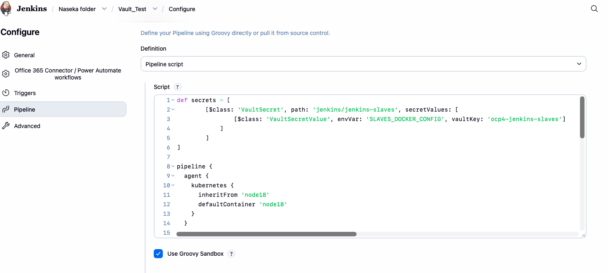
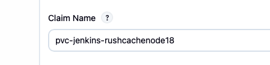
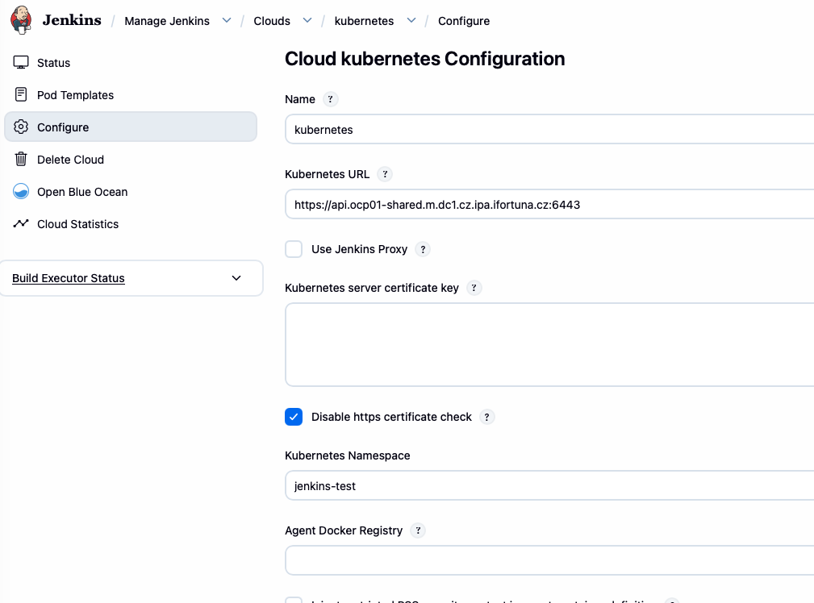
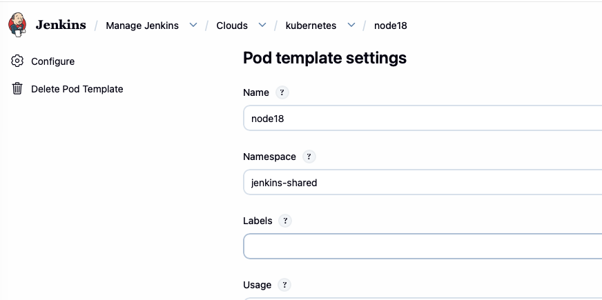
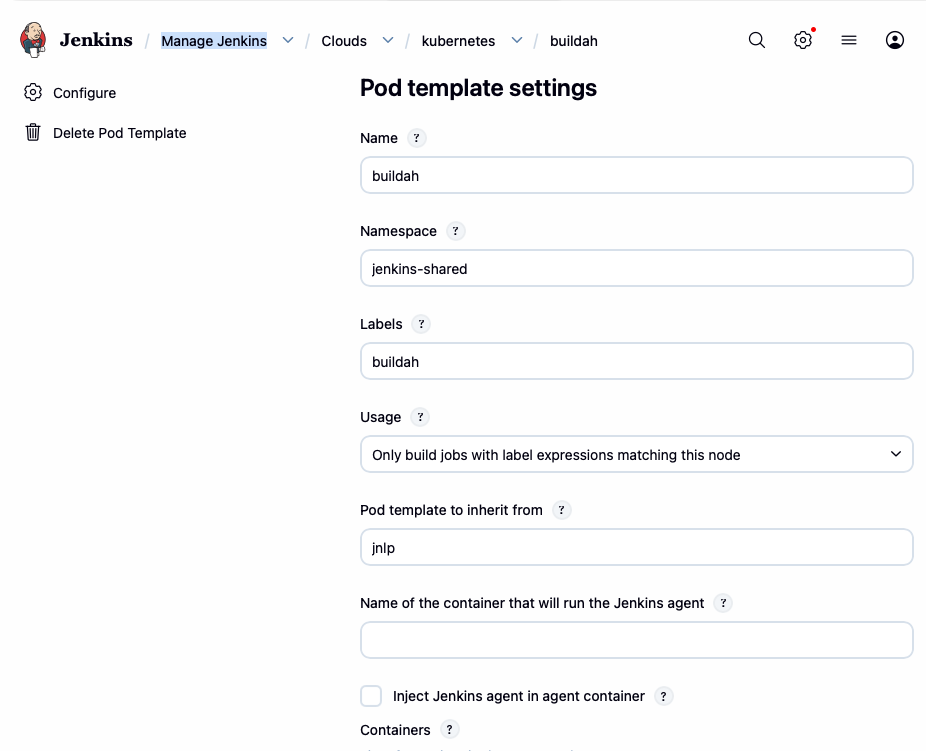
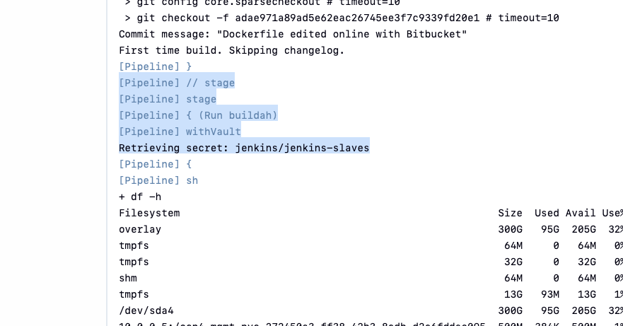

# pipeline to test Vault

I copied Jenkinsfile from romantest repo: https://app-bitb-shared.o.dc1.cz.ipa.ifortuna.cz/projects/OS/repos/romantest/browse/Jenkinsfile


I pasted it to my new item simple pipeline: 




# explanation of pipline test

pipeline runs buildah step with vault secrets:

```groovy
stage('Run buildah') {
      steps {
        withVault(vaultSecrets: secrets) {
            // sh 'whoami'
            // sh 'pwd'
            // sh 'echo \"${SLAVES_DOCKER_CONFIG}\" | base64 -d > ~/jsconfig.json'
            // sh 'cat ~/jsconfig.json'
            // sh 'buildah build -f Dockerfile -t czdcm-quay.lx.ifortuna.cz/ocp4-jenkins-slaves/romantest:latest .'
            // sh "buildah push --authfile ~/jsconfig.json czdcm-quay.lx.ifortuna.cz/ocp4-jenkins-slaves/romantest:latest"
            sh 'df -h'
            sh 'sleep 6000'
            // sh 'du -hs /home/jenkins/rushcache/build-cache/*'
        }
      }
```

on the top of jenkinsfile secrets are defined:

```groovy
def secrets = [
        [$class: 'VaultSecret', path: 'jenkins/jenkins-slaves', secretValues: [
                [$class: 'VaultSecretValue', envVar: 'SLAVES_DOCKER_CONFIG', vaultKey: 'ocp4-jenkins-slaves']
            ]
        ]
]
```

# issue: pipeline runs forever:

console ouput

```text
Pod [Pending][Unschedulable] 0/75 nodes are available: persistentvolumeclaim "pvc-jenkins-rushcachenode18" not found. preemption: 0/75 nodes are available: 75 Preemption is not helpful for scheduling.
```

reason: jenkins tries to use node18. in the pod template there is PVC configured:



but that pvc doesnt exist in namespace jenkins-test

so the pod cannot start

i need to abort the job

## extras from jenkins

for jenkisn test we have this namespace configured: jenkins-test




and for pod template we have jenkins-shared (which is ignored)





# possible solution:

use another pod template, where there is no pvc. 

will use `buildah`



my new full pipeline for testing vault (modified node18 into buildah):

```groovy
def secrets = [
        [$class: 'VaultSecret', path: 'jenkins/jenkins-slaves', secretValues: [
                [$class: 'VaultSecretValue', envVar: 'SLAVES_DOCKER_CONFIG', vaultKey: 'ocp4-jenkins-slaves']
            ]
        ]
]

pipeline {
  agent {
    kubernetes {
      inheritFrom 'buildah'
      defaultContainer 'buildah'
    }
  }

  stages {
    stage('Checkout Source'){
      steps {
        checkout scm: [$class: 'GitSCM', userRemoteConfigs: [[url: "ssh://git@app-bitb-shared.o.dc1.cz.ipa.ifortuna.cz:7999/os/prorom-sonar-test.git", credentialsId: 'bitbucket-global']], branches: [[name: "master"]]], poll: false
      }
    }
    stage('Run buildah') {
      steps {
        withVault(vaultSecrets: secrets) {
            // sh 'whoami'
            // sh 'pwd'
            // sh 'echo \"${SLAVES_DOCKER_CONFIG}\" | base64 -d > ~/jsconfig.json'
            // sh 'cat ~/jsconfig.json'
            // sh 'buildah build -f Dockerfile -t czdcm-quay.lx.ifortuna.cz/ocp4-jenkins-slaves/romantest:latest .'
            // sh "buildah push --authfile ~/jsconfig.json czdcm-quay.lx.ifortuna.cz/ocp4-jenkins-slaves/romantest:latest"
            sh 'df -h'
            sh 'sleep 6000'
            // sh 'du -hs /home/jenkins/rushcache/build-cache/*'
        }
      }
    }
    // stage('Upload') {
    //     steps {
    //         // some instructions here
    //         office365ConnectorSend webhookUrl: 'https://efortuna.webhook.office.com/webhookb2/e0d51f2f-4ee6-42cd-a9c6-9843f23cb754@2acba9fe-1f29-49de-a1ee-45b3b7aff8f5/JenkinsCI/6b7822104f7c4e648cd25274eac6e3e1/a1a0d31f-79c5-4cf9-bd84-f7a43f9a1157',
    //         message: 'Application has been [deployed](https://ifortuna.cz)',
    //         status: 'Success'
    //     }
    // }
  }
}
```

i ran the job => it succesfully reached vault and continued to shell step:



