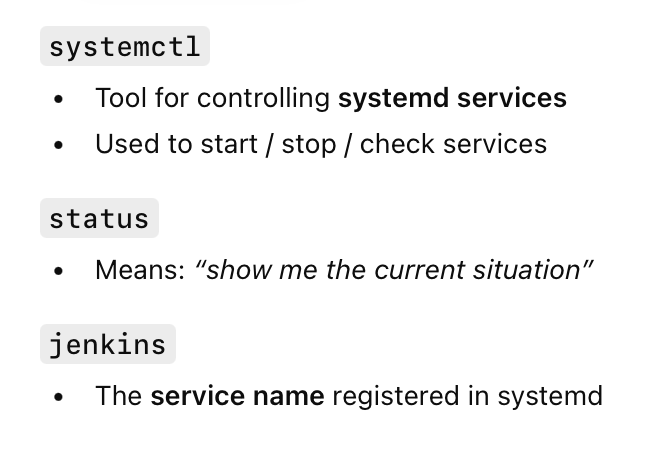
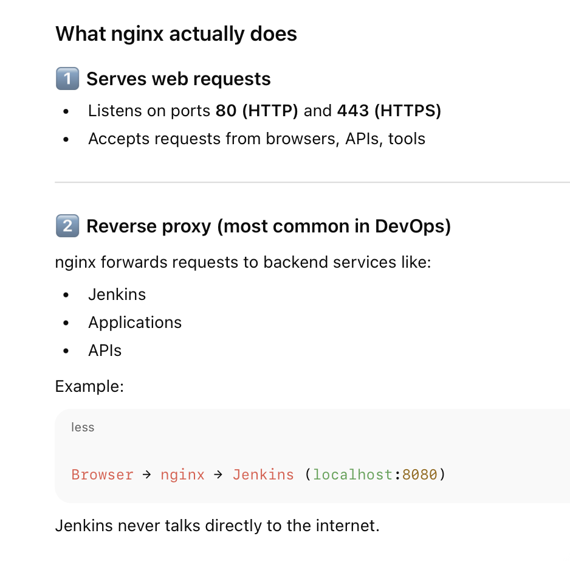
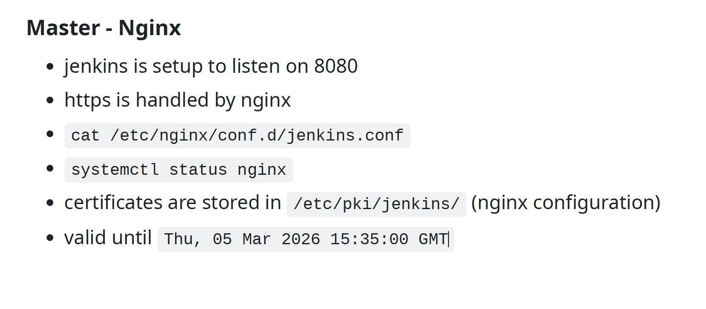
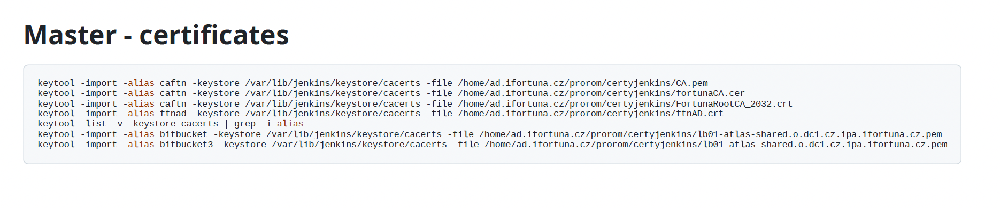
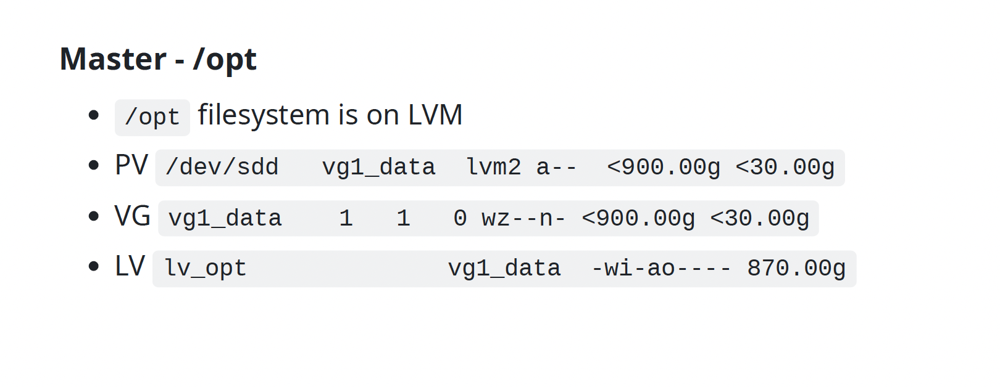
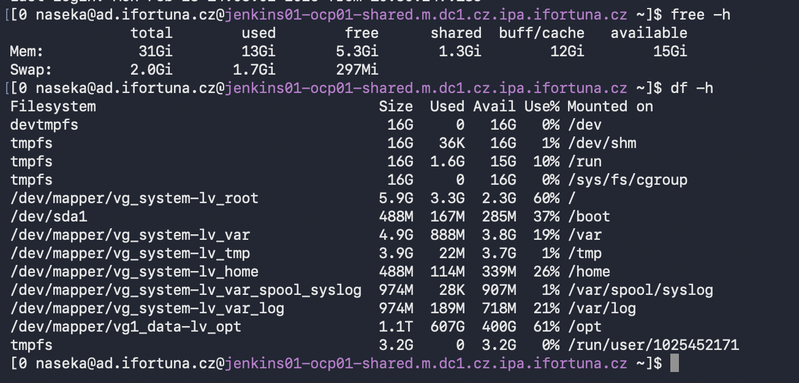
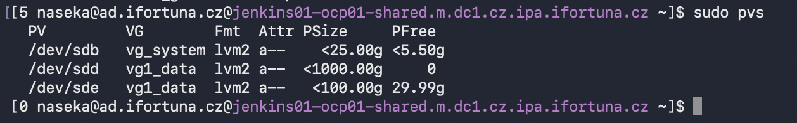
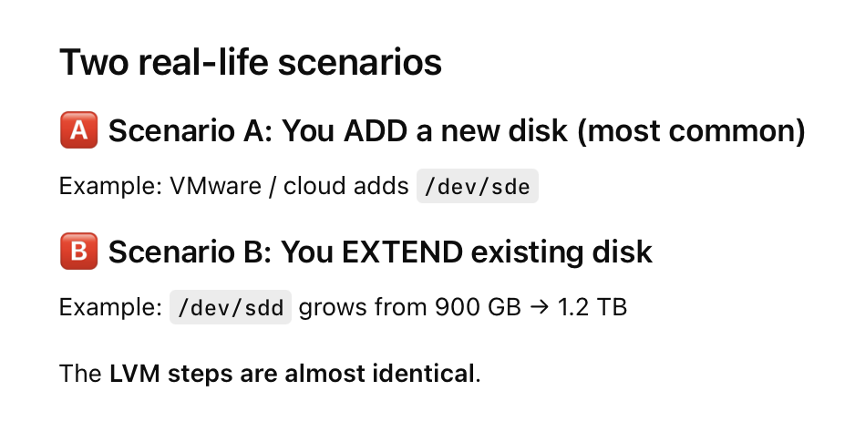
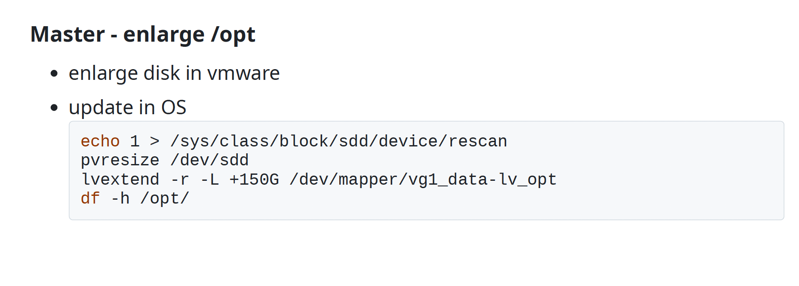

Jenkins hardware
    master
    openshift
    nodes
    test

Master
    master
    https://ci.svc.ifortuna.cz/
    you can encounter address without certifi cate
    http://jenkins01-ocp01-shared.m.dc1.cz.ipa.ifortuna.cz:8080
    (some developers still use this URL)
    ssh -l ${USER}@ad.ifortuna.cz jenkins01-ocp01-shared.m.dc1.cz.ipa.ifortuna.cz
    in vmware, CZDC1-INTERNAL

Master - Jenkins
    jenkins is installed from jenkins repo `/etc/yum.repos.d/jenkins.repo`


    ```bash
    [jenkins]
    name=Jenkins-stable
    baseurl=http://pkg.jenkins.io/redhat-stable
    gpgcheck=0
    proxy=http://czdcm-proxy-infra.lx.ifortuna.cz:3128
    ```
    
`systemctl status jenkins`

## systemd

systemd = service manager of modern Linux systems

👉 systemd is the boss that starts, stops, and watches programs on Linux.


`systemctl status jenkins`: This command checks the current state of the Jenkins service on a Linux system that uses systemd.

It tells you whether Jenkins is running, stopped, or broken, and how it was started




## master - nginx






## master - certificates




## /opt




### What “Master – /opt” means

    Master = Jenkins master server

    /opt = directory where:
    Jenkins data
    jobs
    builds
    plugins
    are stored
    So:
    Jenkins data lives under /opt

here we can see division on disk:



Why /opt matters for Jenkins

    Builds produce a lot of data
    Logs, workspaces, artifacts grow fast
    /opt is intentionally put on its own disk


`sudo pvs` -> will show the volumes



### PV = Physical Volume

```bash
PV
/dev/sdd   vg1_data   lvm2   a--   <900.00g   <30.00g
```

Meaning:

    /dev/sdd → real physical disk
    Size ≈ 900 GB
    Part of volume group vg1_data
    <30 GB free → still space available
    👉 This is the raw storage

### VG = Volume Group

```css
VG
vg1_data   1   1   0   wz--n-   <900.00g   <30.00g
```

Meaning:

    Volume group name: vg1_data
    Combines physical disks
    Total size ≈ 900 GB
    Still has free space
    👉 Think of this as a storage pool

### LV - Logical Volume

```bash
LV
lv_opt   vg1_data   -wi-ao----   870.00g
```

Meaning:

    Logical volume name: lv_opt
    Used for /opt
    Size = 870 GB
    Comes from volume group vg1_data
    👉 This is what the filesystem actually sits on


## final structure of the disk

```bash
/dev/sdd (physical disk)
   ↓
vg1_data (volume group ~900 GB)
   ↓
lv_opt (logical volume 870 GB)
   ↓
filesystem
   ↓
/opt
   ↓
Jenkins data
```

## Can /opt be enlarged later?

Yes — and that’s the point.

    Typical steps:
    Add disk or extend /dev/sdd
    Extend PV
    Extend LV
    Grow filesystem
    All without reinstalling Jenkins




we are using scenarior B



