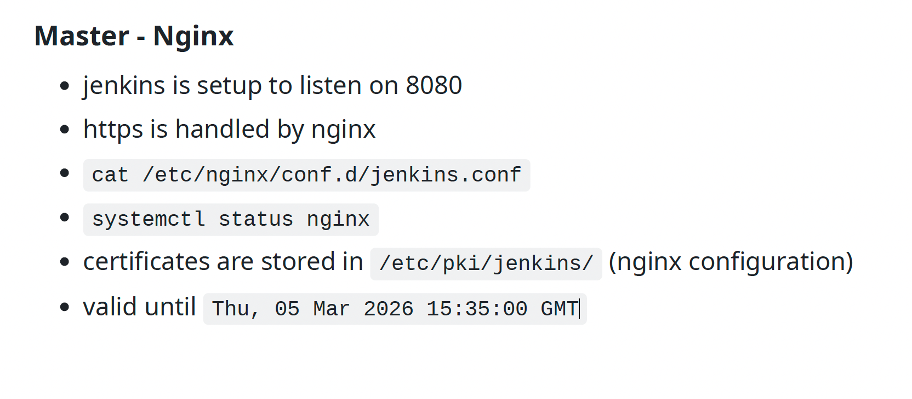

on 5th of march nginx certificates will be expired:

[9. jenkin_hardware](../9.%20jenkins_hardware_nginx_certificates_disk_volumes.md)



# TLS:

| Port | Service      |
| ---- | ------------ |
| 80   | HTTP         |
| 443  | HTTPS        |
| 8080 | Jenkins HTTP |


HTTP request
↓
TLS encrypts it - encryption lock. TLS makes HTTP -> HTTPS
↓
TCP transports it
↓
Internet

1. Step 1 = TCP connection -> computer connects: `jenkins.company.com:443` 
2. Step 2 = TLS handshake -> before sending data, the client and server negotiate security. They exchange:
    * supported encryption algorithms
    * certificate -> so during this step *server sends certificate*. This certificate proves the idenity of the server. For ex.:
            This server belongs to jenkins.company.com
            Issued by DigiCert
            Valid until Mar 5 2026
    * keys

# SSL = Secure Sockets Layer

its a technology that encrypts communication between two computers on internet.

* Without SSL:

browser → internet → server

* With SSL:

browser → 🔒 encrypted data → server

## Technically:

SSL = old protocol
TLS = modern replacement

Today when people say: SSL certificate or SSL connection

they actually mean: TLS

The "S" in HTTPS means: HTTP + SSL/TLS encryption

# check certificate expiration 

It connects to Jenkins HTTPS endpoint, grabs the server certificate that Jenkins/Nginx presents during the TLS handshake, and prints only the certificate’s valid-from and valid-until dates.

```bash
openssl s_client -connect <jenkins-domain>:443 -servername <jenkins-domain> 2>/dev/null | openssl x509 -noout -dates
```

## openssl s_client

`openssl` = program used for cryptography and certificates. it can:
* create certificates
* inspect certificates
* create keys
* test TLS connections

`s_client` = subcommand of openssl. meaning SSL client. It acts like a simple HTTPS client (similar to a browser) and connects to a server to perform a TLS handshake. Purpose:
* test TLS connections
* inspect certificates
* debug HTTPS problems

so far command means: *Use openssl to act as a TLS client*

## -connect HOST:PORT

`-connect` = option telling the client where to connect. Format:
`-connect HOST:PORT` -> example: `-connect jenkins.company.com:443` meaning `open TCP connection to this host and port`

## -servername

`-servername` = This sends SNI (Server Name Indication) during TLS handshake. Why needed: One server can host multiple domains. For ex.:

        IP: 10.10.10.5

        jenkins.company.com
        git.company.com
        docs.company.com

Without SNI the server might return the wrong certificate.

`-servername jenkins.company.com` means I want the certificate for this hostname

## 2>/dev/null

| Number | Meaning |
| ------ | ------- |
| 0      | stdin   |
| 1      | stdout  |
| 2      | stderr  |


File descriptor 2 = stderr (error output).

`2>/dev/null` means discard all error messages. Because openssl s_client prints a lot of debug noise.
We only want the certificate part.

## |

openssl s_client
      ↓
certificate output
      ↓
openssl x509

## openssl x509

run openssl again with a different subcommand -> work with X.509 certificates. X.509 = standard format used by TLS certificates.

## -noout

`-noout` do not print full certificate

## -dates

`-dates` extract only two fields

notBefore
notAfter

example output:

```bash
notBefore=Mar 5 15:35:00 2025 GMT # meaning certificates valid from 
notAfter=Mar 5 15:35:00 2026 GMT # certificates valid until
```

## recap of the command:

1 open TLS connection to jenkins-domain:443
2 request certificate for that hostname
3 discard TLS debug output
4 take the returned certificate
5 extract validity dates
6 print them

## its useful to use echo

`echo | openssl s_client -connect jenkins-domain:443 -servername jenkins-domain 2>/dev/null | openssl x509 -noout -enddate`

Why echo | is added:
* openssl s_client normally waits for input and may hang.
* echo sends an empty line so the connection closes immediately after the handshake.


# if you already have the certificate file on the server:

If you're SSHed to the Jenkins machine and know the cert file:

`openssl x509 -in /etc/pki/jenkins/jenkins.crt -noout -dates`

# Tip

Always check both perspectives:

What users see
`openssl s_client ...`

What server has installed

`openssl x509 -in certfile`

Because sometimes: new cert installed, but nginx not reloaded

So users still see the old certificate.

If you manage many services:

```bash
for host in jenkins.company.com git.company.com nexus.company.com; do
  echo "=== $host ==="
  echo | openssl s_client -connect $host:443 -servername $host 2>/dev/null | openssl x509 -noout -enddate
done
```

# actual commands

from the slide: `cat /etc/nginx/conf.d/jenkins.conf`

```bash
[0 naseka@ad.ifortuna.cz@jenkins01-ocp01-shared.m.dc1.cz.ipa.ifortuna.cz ~]$ cat /etc/nginx/conf.d/jenkins.conf
    server {
        listen       443 ssl default_server;
        ssl_certificate "/etc/pki/jenkins/jenkins01-ocp01-shared.m.dc1.cz.ipa.ifortuna.cz.pem"; #this is our certificate file used by nginx
        ssl_certificate_key "/etc/pki/jenkins/jenkins01-ocp01-shared.m.dc1.cz.ipa.ifortuna.cz.key";
        ssl_session_cache shared:SSL:1m;
        ssl_session_timeout  10m;
        ssl_ciphers HIGH:!aNULL:!MD5;
        ssl_prefer_server_ciphers on;
        client_max_body_size 10M;
        proxy_connect_timeout       300;
        proxy_send_timeout          300;
        proxy_read_timeout          300;
        send_timeout                300;
        proxy_request_buffering off;
        server_name ci.svc.ifortuna.cz;
	access_log /var/log/nginx/jenkins.log combined;
	error_log /var/log/nginx/jenkins_error.log error;       
 
        location / {
          proxy_pass        http://localhost:8080;
          #proxy_redirect     off;
          proxy_redirect	http:// https://;
          proxy_set_header   Host $host;
          proxy_set_header   X-Real-IP $remote_addr;
          proxy_set_header   X-Forwarded-For $proxy_add_x_forwarded_for;
          proxy_set_header   X-Forwarded-Host $server_name;
          proxy_set_header   X-Forwarded-Proto $scheme;
        }
    }

[0 naseka@ad.ifortuna.cz@jenkins01-ocp01-shared.m.dc1.cz.ipa.ifortuna.cz ~]$ 
```

verify validity dates with openssl:
`openssl x509 -in /etc/pki/jenkins/jenkins01-ocp01-shared.m.dc1.cz.ipa.ifortuna.cz.pem -noout -dates`

```bash
[0 naseka@ad.ifortuna.cz@jenkins01-ocp01-shared.m.dc1.cz.ipa.ifortuna.cz ~]$ openssl x509 -in /etc/pki/jenkins/jenkins01-ocp01-shared.m.dc1.cz.ipa.ifortuna.cz.pem -noout -dates
notBefore=Mar  4 15:35:00 2024 GMT
notAfter=Mar  5 15:35:00 2026 GMT
[0 naseka@ad.ifortuna.cz@jenkins01-ocp01-shared.m.dc1.cz.ipa.ifortuna.cz ~]$ 
```
verify what is actually served by nginx, maybe its not reloaded?

`echo | openssl s_client -connect ci.svc.ifortuna.cz:443 -servername ci.svc.ifortuna.cz 2>/dev/null | openssl x509 -noout -dates`

live certificate indeed expires tomorrow!!!!

```bash
[0 naseka@ad.ifortuna.cz@jenkins01-ocp01-shared.m.dc1.cz.ipa.ifortuna.cz ~]$ echo | openssl s_client -connect ci.svc.ifortuna.cz:443 -servername ci.svc.ifortuna.cz 2>/dev/null | openssl x509 -noout -dates
notBefore=Mar  4 15:35:00 2024 GMT
notAfter=Mar  5 15:35:00 2026 GMT
[0 naseka@ad.ifortuna.cz@jenkins01-ocp01-shared.m.dc1.cz.ipa.ifortuna.cz ~]$ 
```

maybe we have new certificates?


```bash
[1 naseka@ad.ifortuna.cz@jenkins01-ocp01-shared.m.dc1.cz.ipa.ifortuna.cz ~]$ cd /etc/pki/jenkins
[0 naseka@ad.ifortuna.cz@jenkins01-ocp01-shared.m.dc1.cz.ipa.ifortuna.cz jenkins]$ ls
jenkins01-ocp01-shared.m.dc1.cz.ipa.ifortuna.cz.key  master-jenkins-b-shared.m.dc1.cz.ipa.ifortuna.cz.key     master-jenkins-b-shared.m.dc1.cz.ipa.ifortuna.cz.pem
jenkins01-ocp01-shared.m.dc1.cz.ipa.ifortuna.cz.pem  master-jenkins-b-shared.m.dc1.cz.ipa.ifortuna.cz.keyOLD  master-jenkins-b-shared.m.dc1.cz.ipa.ifortuna.cz.pemOLD
```

i cannot see any new ones.. tell roman