# Node = 

"machines" on which agents run

* Jenkins monitors each attached node for disk space, free temp space, free swap, clock time/sync, and response time. 
* A node is taken offline if any of these values go outside the configured threshold. 
* each agent is a process with its own PID on the host machine. 
* in practice node = agent. but conseptually different.

# Executor =

slot for the execution of tasks.

* its a thread in the agent
* The number of executors on a node defines the number of concurrent tasks that can run
    * In other words, this determines the number of concurrent Pipeline stages that can execute at the same time. 
* Determine the correct number of executors per build node must be determined based on 
    * the resources available on the node AND
    * the resources required for the workload

## how many executors to run on a node

1) consider CPU
2) consider amount of I/O
3) consider network activity

* One executor per node is the safest configuration.
* One executor per CPU core can work well, if the tasks running are small.

## important to monitor when running multiple executors

* I/O performance (disk speed)
    * how to check:
        * `iostat` shows high disk wait
        * `top` shows high `%wa` (%wa = I/O wait - how much time cpu is waiting for data.)
            ```bash
            %Cpu(s): 5 us, 2 sy, 60 id, 33 wa # user, systenm, idle (=doing nothing), wait
            ```

                5% working for apps
                2% working for OS
                60% completely free
                33% blocked waiting for disk/network

* CPU load:
    * how to check:
        * `top` shows CPU %
        * load averate compaired to number of CPU corese
    * symptomps of a problem:
        * compilation slows down
        * tests hang
        * builds timeout
        * agents appear "offline" or laggy
* memory usage (RAM):
    * how to check:
        * free -h
        * swap usage increases
        * Jenkins logs show `OutOfMemoryError`
    * symptomps of a problem:
        * system starts swapping (very low)
        * Java agents freeze
        * builds crash with OOM erors
        * node disconnects
* I/O throughput = how much data the disk/network can move per second
    * symptopms of a problem:
        * builds queue even when CPU is free
        * network bottlenecks appear


# HTOP explanation

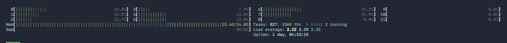

## CPU Cores info

on the top of htop i can see i have 12 cores (0-11) 

### What to use this for:
* If many cores are constantly high (lots of red/green filled bars) → the node is CPU busy.
* If only 1–2 cores are high and others idle → single-thread bottleneck (common in some builds/tests).

## Load average

on the right top side i can see load average

### what to use this for:

we are compairing load average towards number of cores:

* Load ≈ cores → you’re fully utilized.
* Load > cores (sustained) → you’re overloaded (CPU or I/O wait).
* Load much lower than cores → plenty of headroom.

## Mem

RAM used / total RAM

## Swap line

* On Linux: swap usage increasing = memory pressure.
* On macOS: for real memory pressure you should use `memory_pressure` (more reliable than htop).

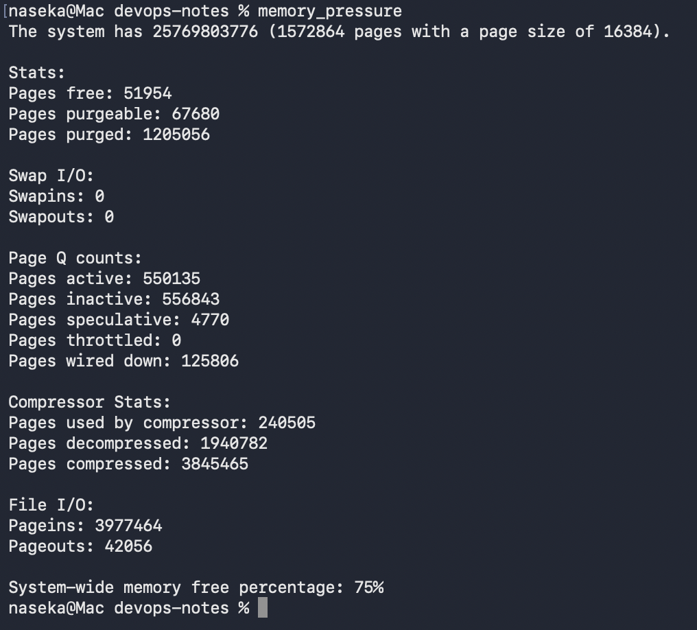

## Tasks/threads/running

This tells you how many processes/threads exist and how many are actively running right now.

* If “running” is often high and CPU is also high → heavy compute.
* If tasks explode during builds → some tool is spawning a lot (browsers, test runners, etc.).

## Process table

This is where you find the culprit when something is slow.

Columns you should care about (for node health)
* CPU%: which process is burning CPU
* MEM%: which process is using RAM (relative)
* RES: “resident memory” = real RAM used (more meaningful than VIRT)
* TIME+: total CPU time consumed so far (long-running hogs)
* Command: what it is

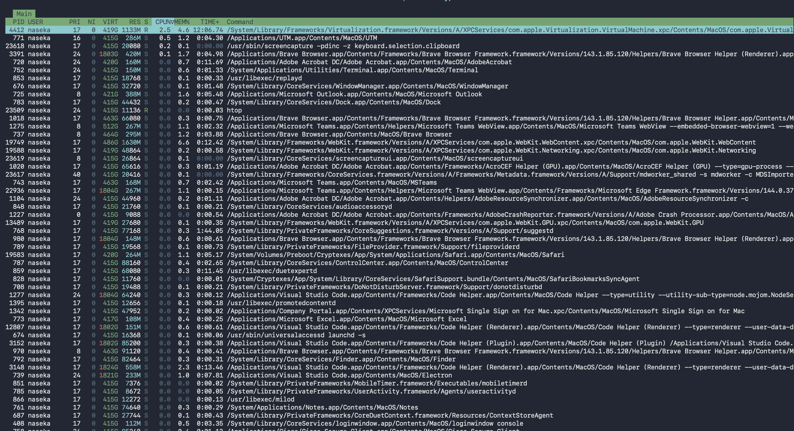

# how to verify things through jenkins:

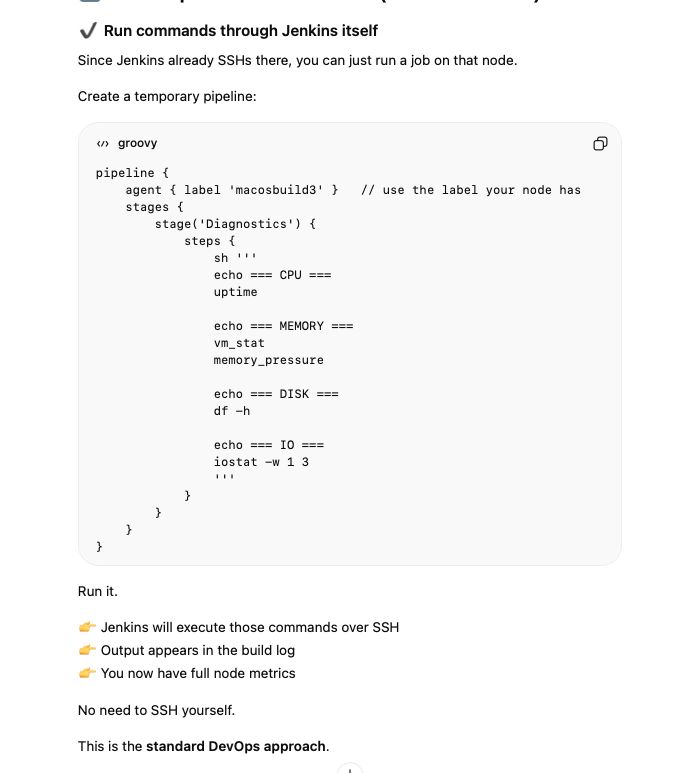

# video from handbook: Creating a macOS agent for Jenkins

i can verify java version on the mac via system information of the node.


# java version:

👉 Controller Java version = minimum Java version for all agents

agents can have newer java potentially, but not older

how to check versions:

Jenkins: dashboard -> manage jenkins -> system information:
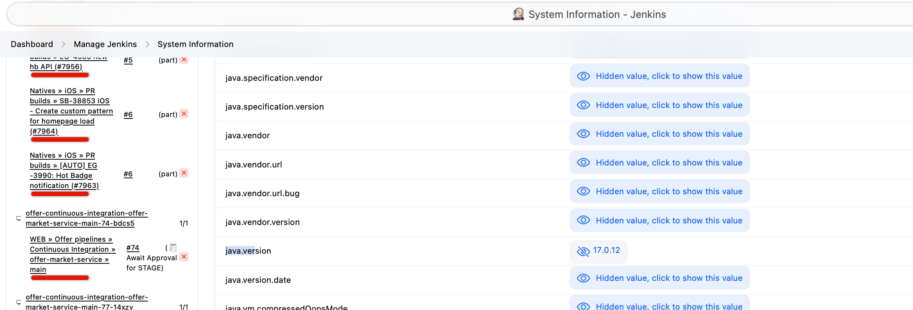
MAC: node -> system information
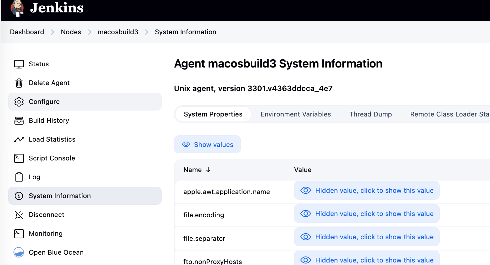

# when we ssh to mac, we dont have sufficient rights to work with directories on mac

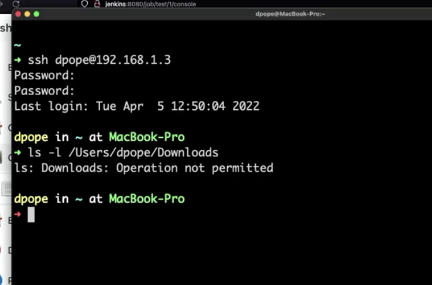

check security and privacy of mac: full disc access:

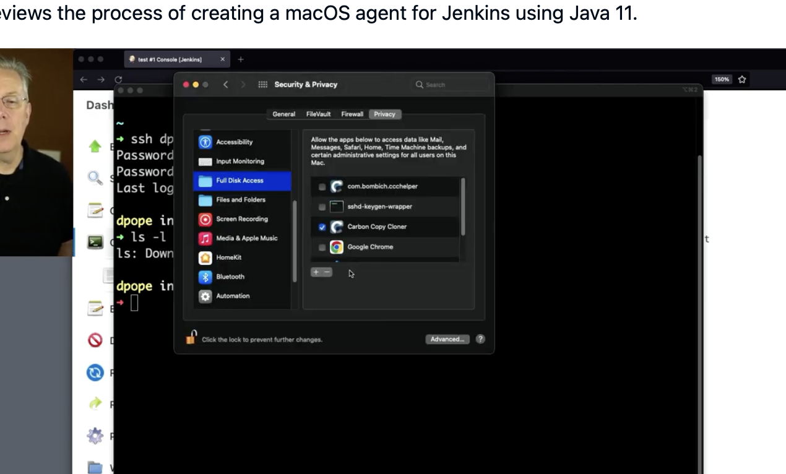

unlock it => once unlocked select sshd-keygen-wrapper

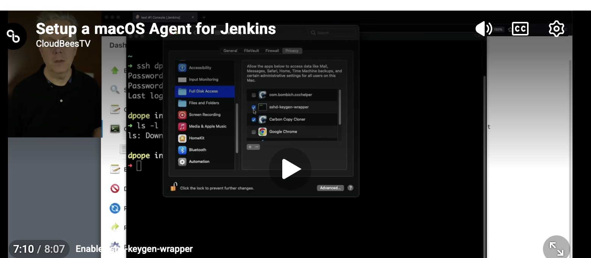

then it will work

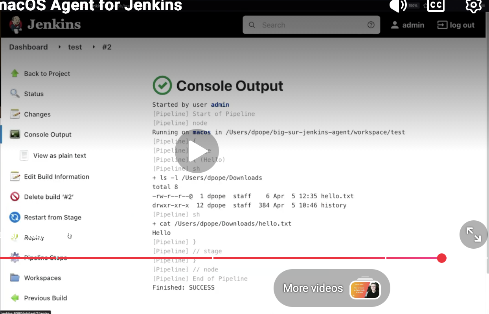

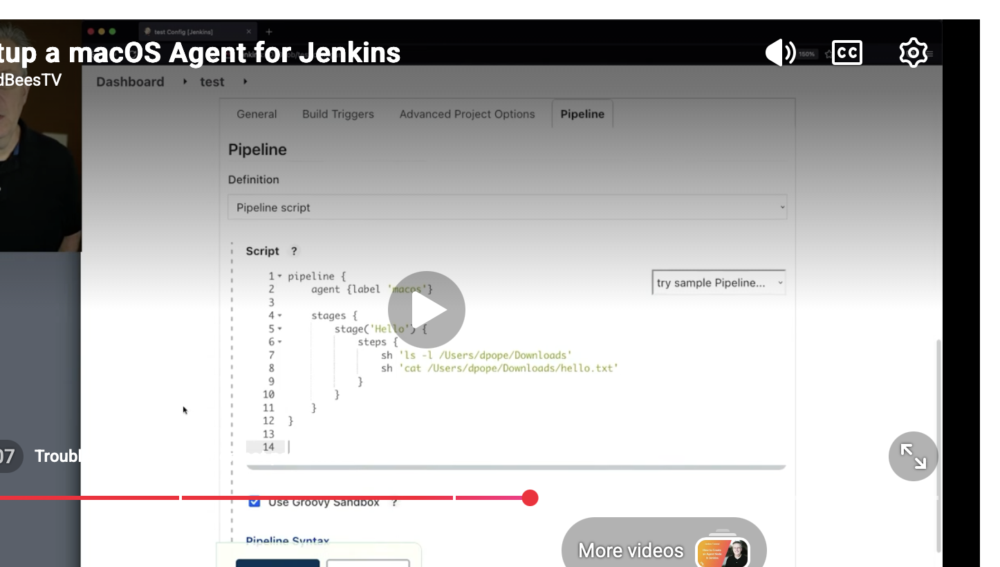

