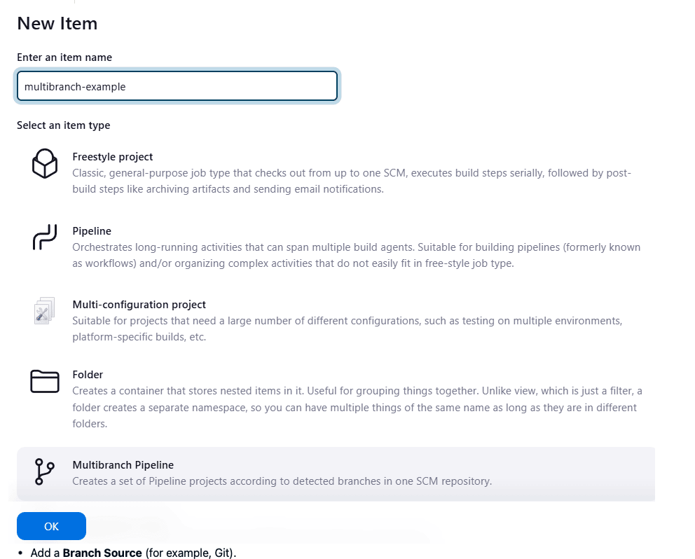
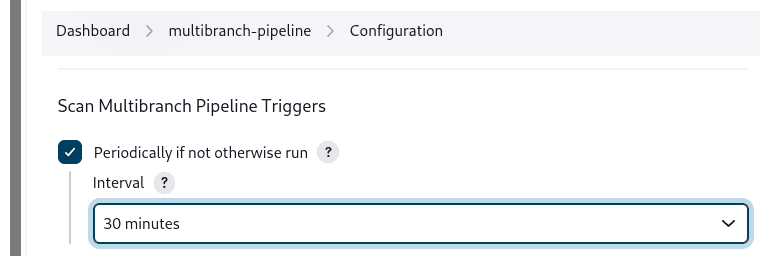

By default, Jenkins will not automatically re-index the repository for branch additions or deletions (unless using an Organization Folder), so it is often useful to configure a Multibranch Pipeline to periodically re-index in the configuration:

# additional env variables

Multibranch Pipelines expose additional information about the branch being built through the env global variable, such as:

* BRANCH_NAME
Name of the branch for which this Pipeline is executing, for example master.

* CHANGE_ID
An identifier corresponding to some kind of change request, such as a pull request number

# Organization Folders

Organization Folders enable Jenkins to monitor an entire GitHub Organization, Bitbucket Team/Project, GitLab organization, or Gitea organization and automatically create new Multibranch Pipelines for repositories which contain branches and pull requests containing a Jenkinsfile.

Organization folders are implemented for:

GitHub in the GitHub Branch Source plugin
Bitbucket in the Bitbucket Branch Source plugin
GitLab in the GitLab Branch Source plugin
Gitea in the Gitea plugin