# pipeline as a code is a plugin:

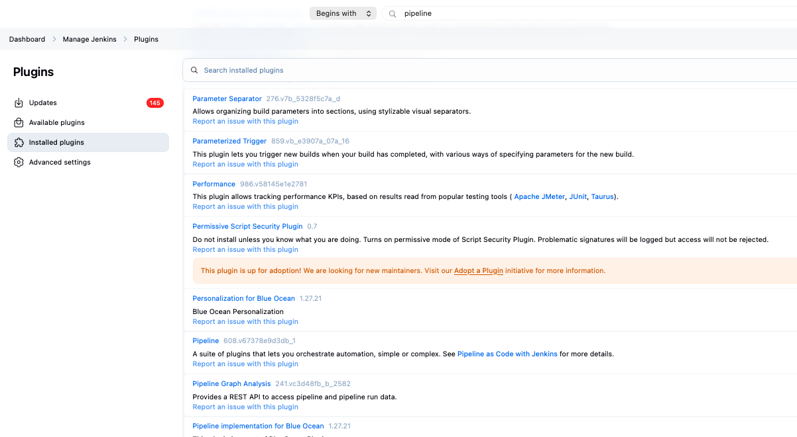

**Domain-Specific Language (DSL)**: A programming language or specification language dedicated to a particular problem domain, providing specialized syntax and semantics tailored to that domain.

Pipeline provides an extensible set of tools for modeling simple-to-complex delivery pipelines "as code" via the Pipeline domain-specific language (DSL) syntax.


# declarative vs scripted pipeline:

## declarative 

more modern, has 

`pipeline{}` block

for ex. our pipeline:

has Groovy code preparing variables:


```groovy
def call(Map callParams) {
    String appName = callParams.get('APP_NAME')
    String branchName = callParams.get('BRANCH') ?: "master"
    ...
}
```

then we have declarative pipeline block:

```groovy
pipeline {
    agent { ... }
    options { ... }
    stages { ... }
}
```

## scripted 

harder to read. usually starts with 

`node {}`

Its easier to write Jenkins file in Blueocian -> GUI UI navigate you how to create a pipeline there. Good for beginners


# To test pipeline

Defining a Pipeline through the classic UI is convenient for testing Pipeline code snippets, or for handling simple Pipelines or Pipelines that do not require source code to be checked out/cloned from a repository.

so test pipeline snippets here:

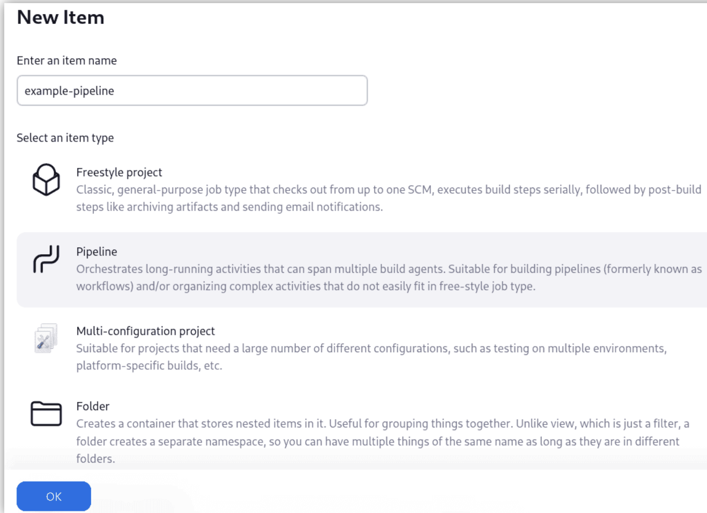


# for complex pipelines - use SCM

To configure your Pipeline project to use a Jenkinsfile from source control:

From the Definition field, choose the Pipeline script from SCM option.

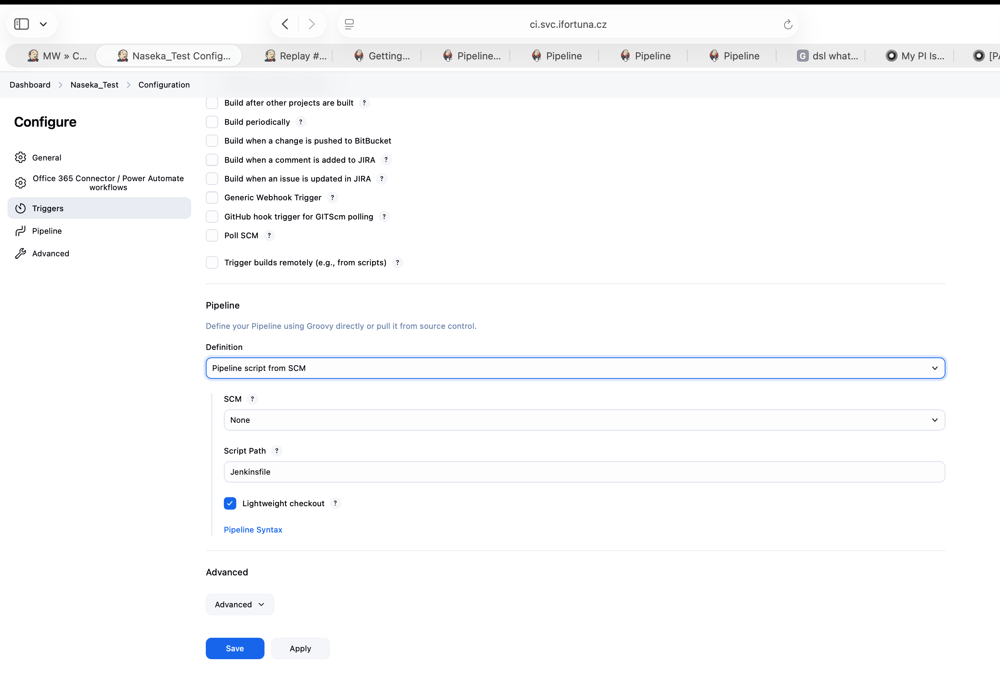

# Pipeline syntax

The built-in documentation can be found globally at ${YOUR_JENKINS_URL}/pipeline-syntax. The same documentation is also linked as Pipeline Syntax in the side-bar for any configured Pipeline project.


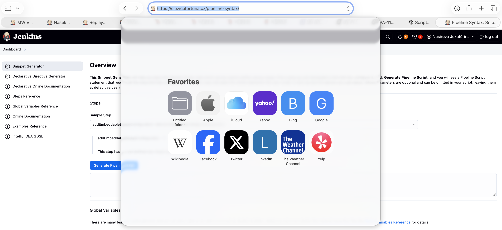

# Snippet generator

same link, which explains pipeline syntax: https://ci.svc.ifortuna.cz/pipeline-syntax/

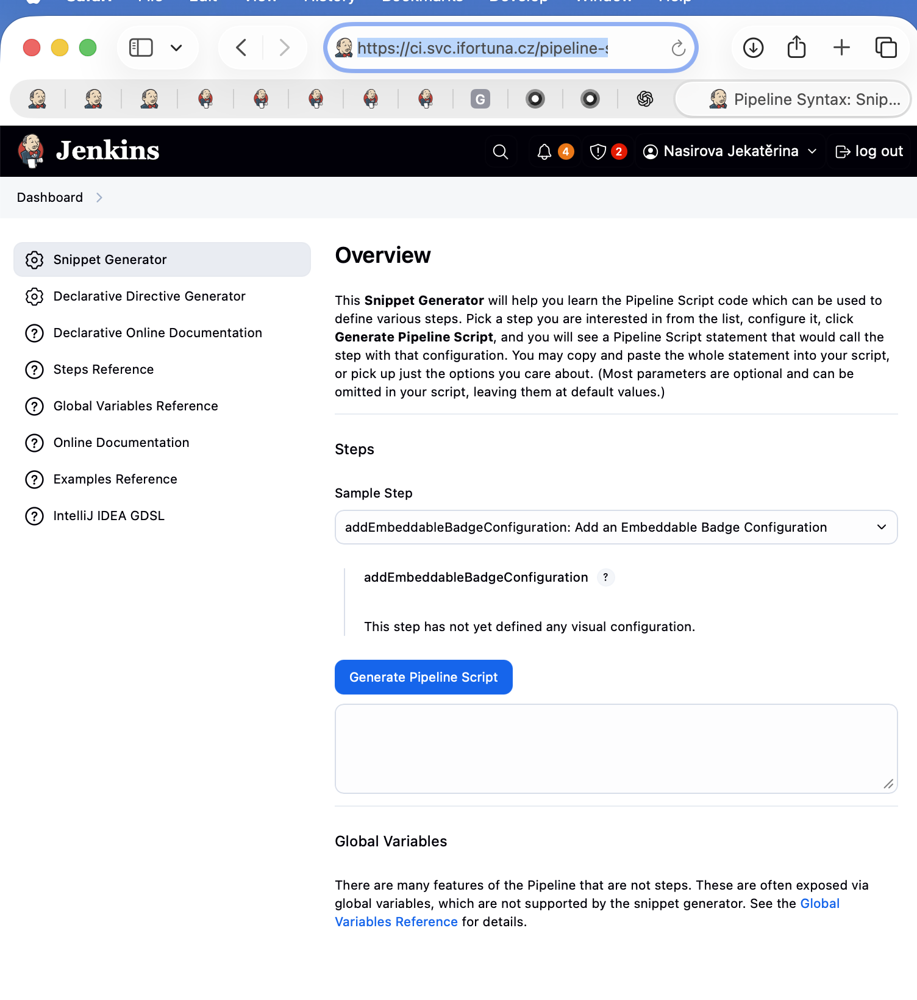

The built-in "Snippet Generator" utility is helpful for creating bits of code for individual steps, discovering new steps provided by plugins, or experimenting with different parameters for a particular step.

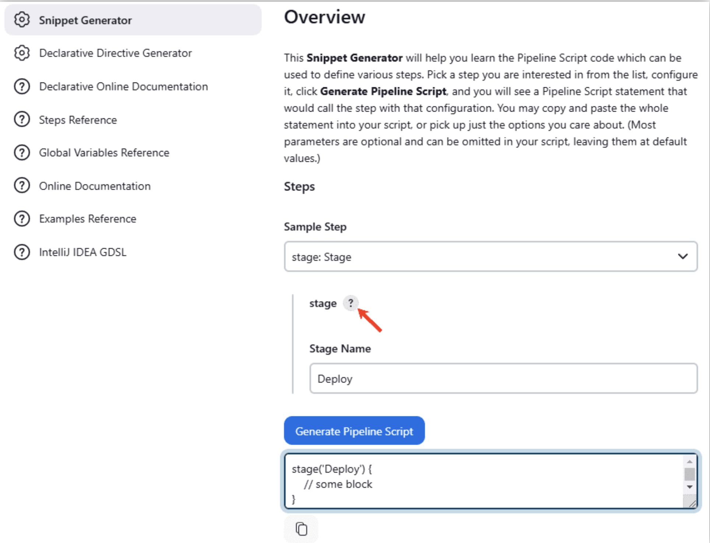

here you select a sample step and click ? to read more about the step:

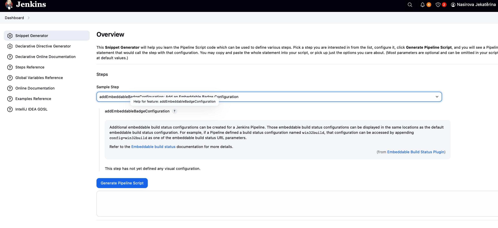

# Global variable reference

same link, which explains pipeline syntax: https://ci.svc.ifortuna.cz/pipeline-syntax/

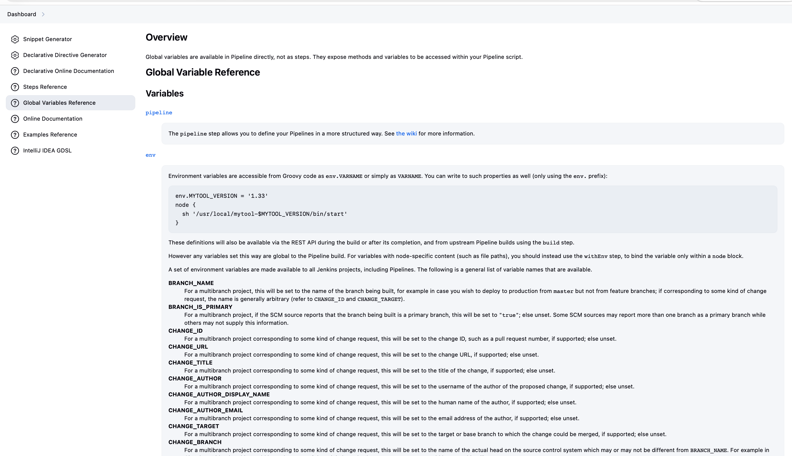

accessed via `pipeline.`, `env.`,`params` or `currentBuild`


```groovy
env.MYTOOL_VERSION = '1.33'
node {
  sh '/usr/local/mytool-$MYTOOL_VERSION/bin/start'
}
```

## env
Exposes environment variables, for example: env.PATH or env.BUILD_ID. Consult the built-in global variable reference at ${YOUR_JENKINS_URL}/pipeline-syntax/globals#env for a complete, and up to date, list of environment variables available in Pipeline.

## params
Exposes all parameters defined for the Pipeline as a read-only Map, for example: params.MY_PARAM_NAME.

## currentBuild
May be used to discover information about the currently executing Pipeline, with properties such as currentBuild.result, currentBuild.displayName, etc. Consult the built-in global variable reference at ${YOUR_JENKINS_URL}/pipeline-syntax/globals for a complete, and up to date, list of properties available on currentBuild.

# Declarative Directive Generator -> here https://www.jenkins.io/doc/book/pipeline/getting-started/#directive-generator

**Directives** = the structural keywords that define the pipeline configuration. They are special instructions understood by the declarative pipeline engine.

for ex.:

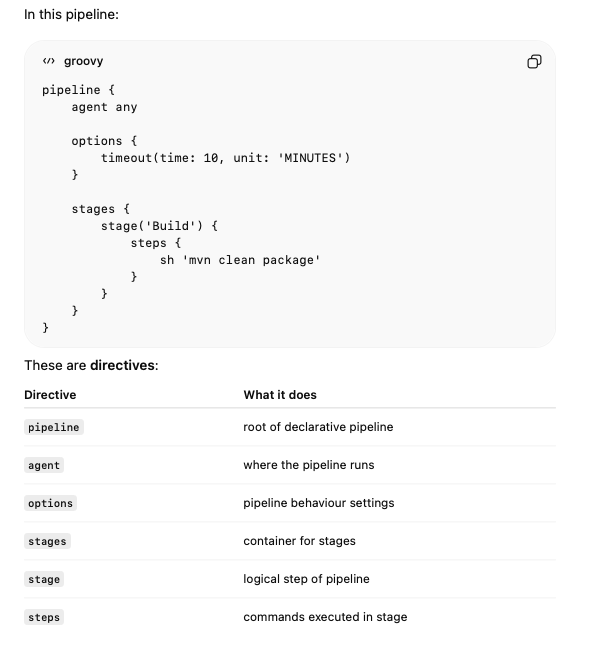


more on topic directives: https://www.jenkins.io/doc/book/pipeline/syntax/#declarative-directives

# further reading

## more on steps - different plugins:

https://www.jenkins.io/doc/pipeline/steps/

for ex.:

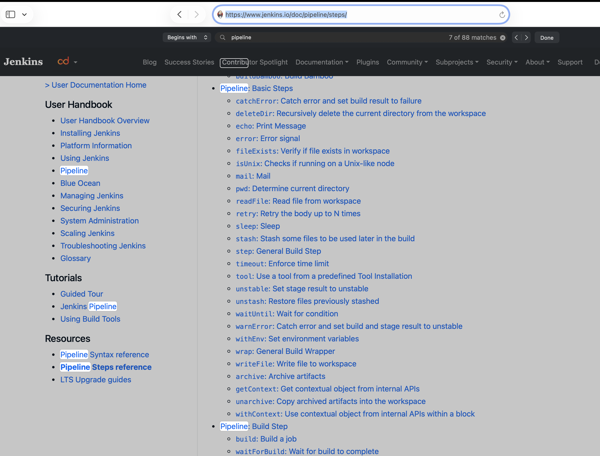

## examples of pipelines:

https://www.jenkins.io/doc/pipeline/examples/

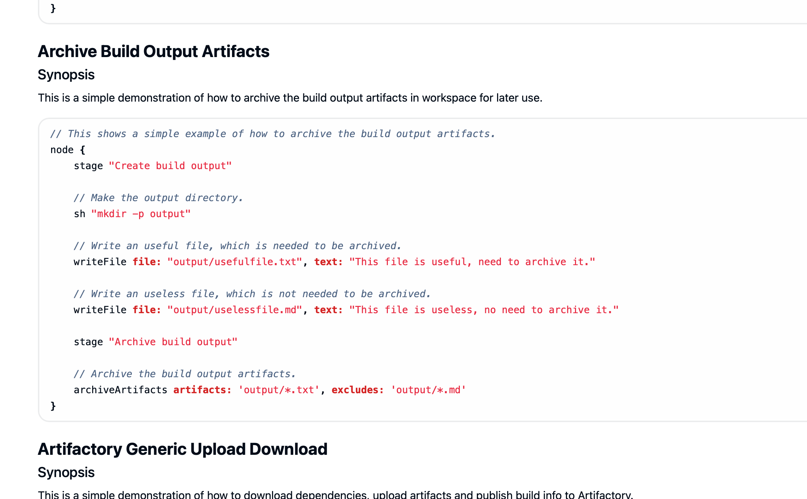

