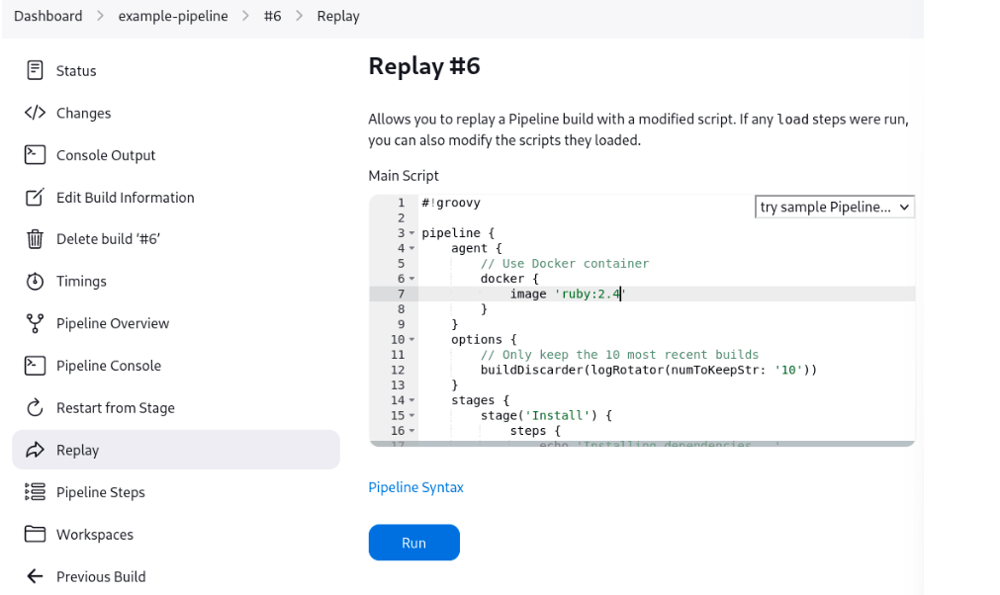

... read before

# Replay

The "Replay" feature allows for quick modifications and execution of an existing Pipeline without changing the Pipeline configuration or creating a new commit.

Make modifications and click "Run". In this example, we changed "ruby-2.3" to "ruby-2.4".

Once you are satisfied with the changes, you can use Replay to view them again, copy them back to your Pipeline job or Jenkinsfile, and then commit them using your usual engineering processes.

## shared library 
Referenced Shared Library code is also modifiable - If a Pipeline run references a Shared Library, the code from the shared library will also be shown and modifiable as part of the Replay page.

Limitations
Pipeline runs with syntax errors cannot be replayed - meaning their code cannot be viewed and any changes made in them cannot be retrieved. When using Replay for more significant modifications, save your changes to a file or editor outside of Jenkins before running them. See JENKINS-37589
Replayed Pipeline behavior may differ from runs started by other methods - For Pipelines that are not part of a Multi-branch Pipeline, the commit information may differ for the original run and the Replayed run. See JENKINS-36453

# Command-line Pipeline Linter:

Linting = checking whether the pipeline syntax is valid.

more on Jenkins CLI: https://www.jenkins.io/doc/book/managing/cli/