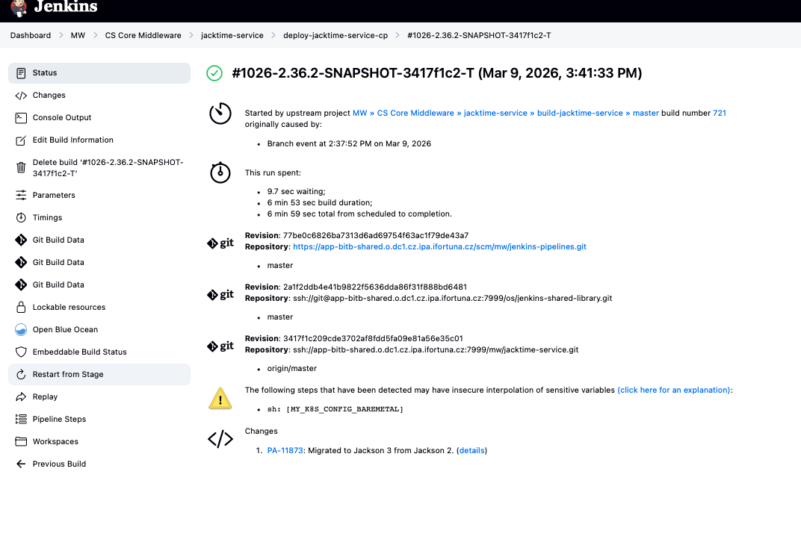

# Replay

[More on replay](../Jenkins_hanbook/Pipeline_Pipeline_development_tools.md)

# Restart from a stage

## What "Restart from Stage" Means

**Restart from Stage** allows Jenkins to rerun a pipeline **starting from a specific stage**, instead of executing the entire pipeline again.

The pipeline code **does not change**.

Jenkins simply:

```
1. Uses the same pipeline definition
2. Uses the same Git commit
3. Uses the same parameters
4. Skips stages that already completed
5. Starts execution from the selected stage
```

---

## Example Pipeline

```groovy
pipeline {
    agent any

    stages {

        stage('Build') {
            steps {
                sh 'mvn package'
            }
        }

        stage('Test') {
            steps {
                sh 'mvn test'
            }
        }

        stage('Deploy') {
            steps {
                sh './deploy.sh'
            }
        }

    }
}
```

---

## Example Pipeline Run

```
Build     ✔ success
Test      ✔ success
Deploy    ❌ failed
```

Possible reasons:

- network issue
- external service unavailable
- registry timeout
- temporary infrastructure problem

---

## Without Restart from Stage

The pipeline must run again from the beginning:

```
Build
Test
Deploy
```

This may waste time if earlier stages take long.

---

## With Restart from Stage

User clicks:

```
Restart from Stage → Deploy
```

Pipeline run becomes:

```
Build     skipped
Test      skipped
Deploy    runs again
```

This saves time and compute resources.

---

## Typical Use Case

Restart from Stage is useful when failure was caused by **transient or environmental issues**, for example:

| Problem | Example |
|------|------|
Network glitch | cannot reach artifact repository |
External service unavailable | integration environment down |
Docker registry timeout | image push failed |
Temporary Kubernetes issue | pod scheduling error |

After the environment is fixed, you can restart from the failing stage.

---

## Important Rules

Restart from Stage works only when:

```
Pipeline is Declarative
+
Pipeline execution finished
+
Stage boundaries are known
```

Restart is possible from **top-level stages only**.

Example:

```
stage('Build')
stage('Test')
stage('Deploy')
```

You cannot restart from individual steps like:

```
sh 'mvn package'
```

---

## Difference Between Restart and Replay

These two features are often confused.

| Feature | Purpose |
|------|------|
Replay | modify pipeline code and run modified version |
Restart from Stage | run the same pipeline again starting from a later stage |

```
Replay = change code
Restart = reuse existing code
```

---

## Important Behavior

When restarting Jenkins keeps:

```
same pipeline script
same Git revision
same parameters
```

Earlier stages are assumed to have already produced valid results.

---

## Why Restart Sometimes Does Not Appear

Even if a pipeline uses `pipeline {}`, restart may not be available in cases such as:

```
multibranch / pull request pipelines
shared library wrappers
Kubernetes or dynamic agents
pipeline aborted before stage completion
complex scripted logic
```

Large enterprise pipelines often disable or limit restart capability.

---

## Key Idea

```
Restart from Stage allows rerunning only the failing part
of a pipeline instead of the entire pipeline.
```

This improves debugging speed and reduces wasted build time.



Once you choose a stage to restart from and click submit, a new build, with a new build number, will be started. All stages before the selected stage will be skipped, and the Pipeline will start executing at the selected stage. From that point on, the Pipeline will run as normal.