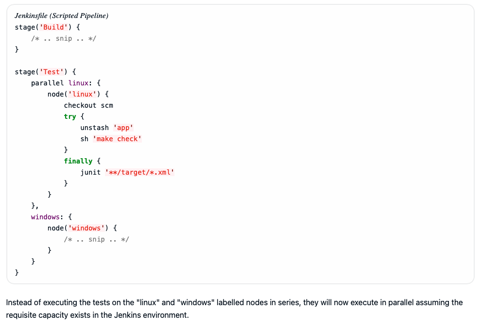

# secrets

declarative Pipeline syntax has the `credentials()` helper method (used within the `environment` directive)

example (here credentials are valid for all stages globally):

```groovy
pipeline {
    agent {
        // Define agent details here
    }
    environment {
        AWS_ACCESS_KEY_ID     = credentials('jenkins-aws-secret-key-id')
        AWS_SECRET_ACCESS_KEY = credentials('jenkins-aws-secret-access-key')
    }
    stages {
        stage('Example stage 1') {
            steps {
                //
            }
        }
        stage('Example stage 2') {
            steps {
                //
            }
        }
    }
}
```

# usernames and passwords

In this example, username and password credentials are assigned to environment variables to access a Bitbucket repository in a common account or team for your organization; these credentials would have been configured in Jenkins with the credential ID jenkins-bitbucket-common-creds.

When setting the credential environment variable in the environment directive:

```groovy
environment {
    BITBUCKET_COMMON_CREDS = credentials('jenkins-bitbucket-common-creds')
}
```

this actually sets the following three environment variables:

* BITBUCKET_COMMON_CREDS - contains a username and a password separated by a colon in the format username:password.
* BITBUCKET_COMMON_CREDS_USR - an additional variable containing the username component only.
* BITBUCKET_COMMON_CREDS_PSW - an additional variable containing the password component only.

here credential env variables are inside the she stage level and valid for this stage only:

```groovy
pipeline {
    agent {
        // Define agent details here
    }
    stages {
        stage('Example stage 1') {
            environment {
                BITBUCKET_COMMON_CREDS = credentials('jenkins-bitbucket-common-creds')
            }
            steps {
                //
            }
        }
        stage('Example stage 2') {
            steps {
                //
            }
        }
    }
}
```

# credentials in a secret file:

```groovy
pipeline {
    agent {
        // Define agent details here
    }
    environment {
        // The MY_KUBECONFIG environment variable will be assigned the value of a temporary file.
        // For example:
        //   /home/user/.jenkins/workspace/cred_test@tmp/secretFiles/546a5cf3-9b56-4165-a0fd-19e2afe6b31f/kubeconfig.txt
        MY_KUBECONFIG = credentials('my-kubeconfig')
    }
    stages {
        stage('Example stage 1') {
            steps {
                sh("kubectl --kubeconfig $MY_KUBECONFIG get pods")
            }
        }
    }
}
```

# other credential types

for other credential tyles use Snippet Generator for yorur pipeline project/item -> it will generate withCredentials(){} pipeline step snippet for the credentials you specify.

more details: https://www.jenkins.io/doc/book/pipeline/jenkinsfile/#for-other-credential-types


## certificate:

[link](../33.certificates.md)


### example ssh user privat key:

```groovy
withCredentials(bindings: [sshUserPrivateKey(credentialsId: 'jenkins-ssh-key-for-abc', \
                                             keyFileVariable: 'SSH_KEY_FOR_ABC', \
                                             passphraseVariable: '', \
                                             usernameVariable: '')]) {
  // some block
}

```
### example certificate

```groovy
withCredentials(bindings: [certificate(aliasVariable: '', \
                                       credentialsId: 'jenkins-certificate-for-xyz', \
                                       keystoreVariable: 'CERTIFICATE_FOR_XYZ', \
                                       passwordVariable: 'XYZ-CERTIFICATE-PASSWORD')]) {
  // some block
}
```

## example pipeline:

```groovy
pipeline {
    agent {
        // define agent details
    }
    stages {
        stage('Example stage 1') {
            steps {
                withCredentials(bindings: [sshUserPrivateKey(credentialsId: 'jenkins-ssh-key-for-abc', \
                                                             keyFileVariable: 'SSH_KEY_FOR_ABC')]) {
                  //
                }
                withCredentials(bindings: [certificate(credentialsId: 'jenkins-certificate-for-xyz', \
                                                       keystoreVariable: 'CERTIFICATE_FOR_XYZ', \
                                                       passwordVariable: 'XYZ-CERTIFICATE-PASSWORD')]) {
                  //
                }
            }
        }
        stage('Example stage 2') {
            steps {
                //
            }
        }
    }
}
```

# String interpolation:

```groovy
def username = 'Jenkins'
echo 'Hello Mr. ${username}'
echo "I said, Hello Mr. ${username}" // correct one
```

## this will expose the token in ps!!!

Groovy GStrings (double-quoted or triple-double-quoted strings) expand ${TOKEN} before the command is sent to the agent. WRONG:

```groovy
pipeline {
    agent any
    environment {
        API_TOKEN = credentials('example-token-id')
    }
    stages {
        stage('Example') {
            steps {
                /* WRONG */
                    sh "curl -H 'Authorization: Bearer ${API_TOKEN}' https://example.com"
                """
            }
        }
    }
}
```

### Interpolation = 

**Interpolation** means inserting the value of a variable **directly inside a string**.

Instead of manually joining strings, Groovy automatically replaces a placeholder with the variable’s value.

Example idea:

    Hello ${name}

If:

    name = John

Result becomes:

    Hello John

Groovy replaces `${name}` with the variable value.

## this is correct:

Any Groovy construct that avoids interpolation (for example, sh(script: 'curl …​ $API_TOKEN', label: 'call API')) is safe; the key is keeping secrets out of GStrings so only the shell expands them.

```groovy
pipeline {
    agent any
    environment {
        API_TOKEN = credentials('example-token-id')
    }
    stages {
        stage('Example') {
            steps {
                /* CORRECT */
                sh 'curl -H "Authorization: Bearer ${API_TOKEN}" https://example.com'
            }
        }
    }
}
```

# Injection via Interpollation

when you run shell commmands, you can access the machine and do things that were not intended. 

Ex. WRONG:

```groovy
pipeline {
  agent any
  parameters {
    string(name: 'STATEMENT', defaultValue: 'hello; ls /', description: 'What should I say?')
  }
  stages {
    stage('Example') {
      steps {
        /* WRONG! */
        sh("echo ${STATEMENT}") //here instead of echoing the value hello; ls / -> only hello will be echoed and then  entire root directory of the agent will be listed. use single quotes to avoid it!!!
      }
    }
  }
}
```
CORRECT:

```groovy
pipeline {
  agent any
  parameters {
    string(name: 'STATEMENT', defaultValue: 'hello; ls /', description: 'What should I say?')
  }
  stages {
    stage('Example') {
      steps {
        /* CORRECT */
        sh('echo ${STATEMENT}')
      }
    }
  }
}
``` 

# Credentials Mangling

## What is mangling (simple idea)

**Mangling means modifying something automatically so it fits a system’s rules.**

In simple terms:

Mangling = changing a name or data format internally so the system can work with it.

The key idea:

- the original value exists
- the system transforms it
- the transformed version is used internally

---

## Real life analogy

Imagine airport baggage.

Your suitcase says:

    John Smith

But the airport system converts it to something like:

    JS-48291-LHR

The system **mangled the name** so it fits its internal tracking system.

The original information still exists, but the system uses its **own modified format**.


## Mangling in Jenkins / DevOps

In DevOps you may see mangling when systems **sanitize names**.

Example:

A branch name:

    feature/new-payment-system

But Docker image tags cannot contain `/`.

So the system mangles it to:

    feature-new-payment-system

The name is **modified to follow system rules**.


Dangerous with special characters in secrets:

WRONG: When the credential value is mangled, it is no longer valid and will no longer be masked in the console log and can create a security risk.

```groovy
pipeline {
  agent any
  environment {
    EXAMPLE_KEY = credentials('example-credentials-id') // Secret value is 'sec%ret'
  }
  stages {
    stage('Example') {
      steps {
          /* WRONG! */
          bat "echo ${EXAMPLE_KEY}"
      }
    }
  }
}
```


CORRECT:

```groovy
pipeline {
  agent any
  environment {
    EXAMPLE_KEY = credentials('example-credentials-id') // Secret value is 'sec%ret'
  }
  stages {
    stage('Example') {
      steps {
          /* CORRECT */
          bat 'echo %EXAMPLE_KEY%'
      }
    }
  }
}
```

# Handling parameters

Declarative Pipeline supports parameters out-of-the-box, allowing the Pipeline to accept user-specified parameters at runtime via the parameters directive.


```groovy
pipeline {
    agent any
    parameters {
        string(name: 'Greeting', defaultValue: 'Hello', description: 'How should I greet the world?')
    }
    stages {
        stage('Example') {
            steps {
                echo "${params.Greeting} World!"
            }
        }
    }
}
```

# Handling failure

failure handling by default via `post` section which allows declaring a number of different "post conditions" such as: always, unstable, success, failure, and changed. 

```groovy
pipeline {
    agent any
    stages {
        stage('Test') {
            steps {
                sh 'make check'
            }
        }
    }
    post {
        always {
            junit '**/target/*.xml'
        }
        failure {
            mail to: team@example.com, subject: 'The Pipeline failed :('
        }
    }
}
```

# Error handling steps:

https://www.jenkins.io/doc/book/pipeline/jenkinsfile/#error-handling-steps

Jenkins Pipelines provide dedicated steps for flexible error handling, allowing you to control how your Pipeline responds to errors and warnings. These steps help you surface errors and warnings clearly in Jenkins, giving you control over whether the Pipeline fails, continues, or simply reports a warning. For more information, refer to:

* catchError
* error
* unstable
* warnError

# Using multiple agents

can be helpful for more advanced use-cases such as executing builds/tests across multiple platforms.

In the example below, the "Build" stage will be performed on one agent and the built results will be reused on two subsequent agents, labelled "linux" and "windows" respectively, during the "Test" stage:

```groovy
pipeline {
    agent none
    stages {
        stage('Build') {
            agent any
            steps {
                checkout scm
                sh 'make'
                stash includes: '**/target/*.jar', name: 'app' //The stash step allows capturing files matching an inclusion pattern (**/target/*.jar) for reuse within the same Pipeline. Once the Pipeline has completed its execution, stashed files are deleted from the Jenkins controller.
            }
        }
        stage('Test on Linux') {
            agent {
                label 'linux' //The parameter in agent/node allows for any valid Jenkins label expression. foe x. when we were creating new mac nodes we were specifying label - its referened here
            }
            steps {
                unstash 'app'
                sh 'make check'
            }
            post {
                always {
                    junit '**/target/*.xml'
                }
            }
        }
        stage('Test on Windows') {
            agent {
                label 'windows'
            }
            steps {
                unstash 'app'//unstash will retrieve the named "stash" from the Jenkins controller into the Pipeline’s current workspace.
                bat 'make check' //The bat script allows for executing batch scripts on Windows-based platforms.
            }
            post {
                always {
                    junit '**/target/*.xml'
                }
            }
        }
    }
}
```

# Parallel execution (scripted pipeline)

In the example below we neeed instead of waiting for a test on linux and then performing a test on winodws -> we use `parallel` step



