# example from bitbucket test problem:


in the configuration of multibranch pipeline we can see this script path: Jenkinsfile

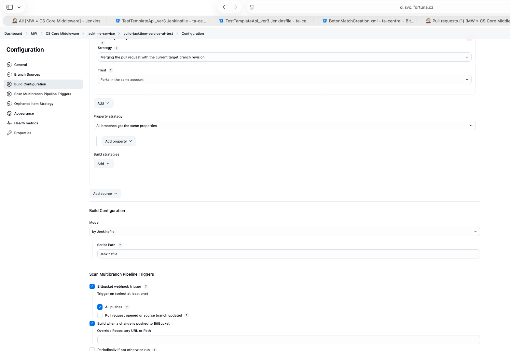


in bitbucket test we check jenkins file at the repositorry root and we can see its shared liberary:

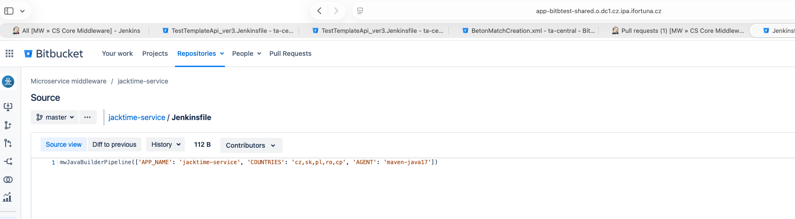

this shared library configred in the hierarchy above:

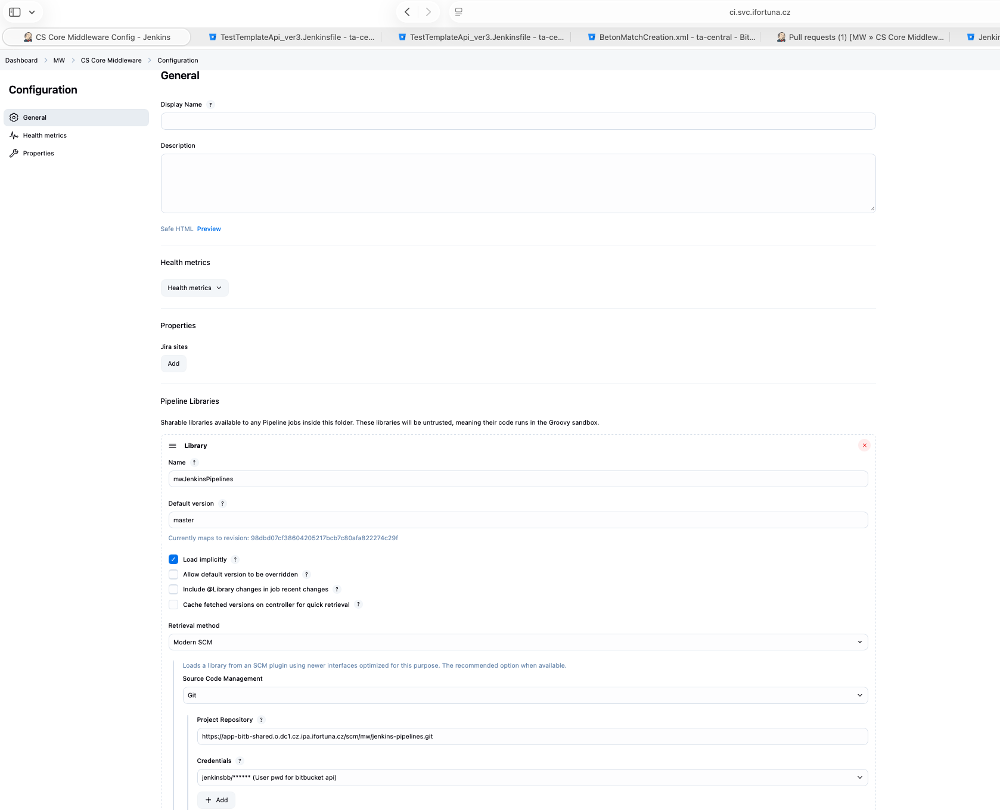

so we can see that bitbucket test using pipeline logic from bitbucket prod

we can see the shared pipelines location in bitbucket prod repo indicated here in the hierarchy above:

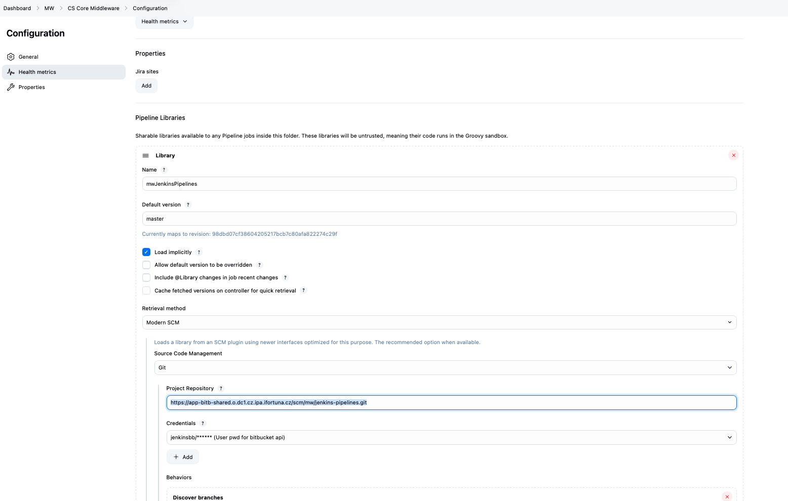

if i go to that repo -> i go to vars:

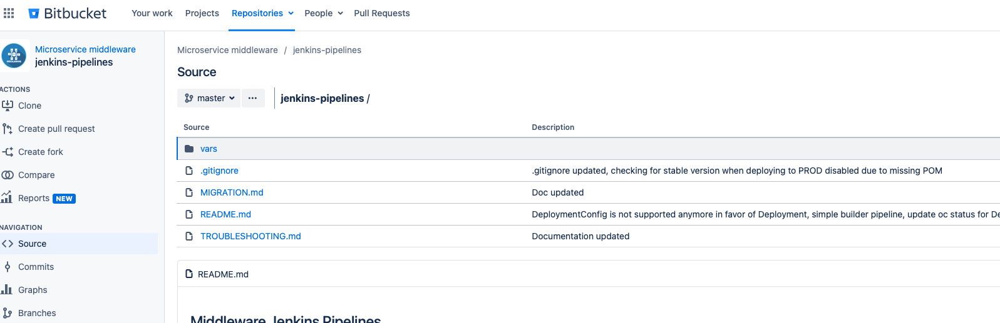

then i select one indicated in my tiny jenkinsfile in test bitbucket:

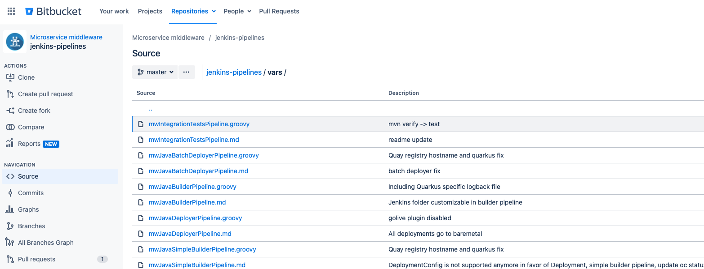

here is the full shared library file:

```groovy

def call(Map callParams) {

  String appName = callParams.get('APP_NAME')
  String gitUrl = callParams.getOrDefault('GIT_URL', "ssh://app-bitb-shared.o.dc1.cz.ipa.ifortuna.cz:7999/mw/${appName}.git")
  String vaultPath = callParams.getOrDefault('VAULT_PATH', 'jenkins/mw')
  String quayNamespace = callParams.getOrDefault('QUAY_ORG', 'mw')
  String framework = callParams.getOrDefault('FRAMEWORK', 'springboot') //use 'quarkus' for Quarkus based app
  String[] countries = callParams.getOrDefault('COUNTRIES', 'cp,cz,hr,pl,ro,sk').split(',')
  String pipelineAgent = callParams.getOrDefault('AGENT', 'maven-java17')
  String branchName = callParams.getOrDefault('BRANCH', 'master')
  Boolean wantTriggerDeploy = callParams.getOrDefault('TRIGGER_DEPLOY', true)
  Boolean wantMavenDeploy = callParams.getOrDefault('MAVEN_DEPLOY', false)
  String onlyMavenModule = callParams.get('ONLY_MAVEN_MODULE')
  String deployJobName = callParams.getOrDefault('DEPLOY_JOB_NAME', (onlyMavenModule) ? onlyMavenModule : appName)
  String mavenLifecycle = callParams.getOrDefault('MAVEN_LIFECYCLE', 'install')
  Boolean mavenForceUpdate = callParams.getOrDefault('MAVEN_FORCE_UPDATE', false)
  Boolean withNpm = callParams.getOrDefault('WITH_NPM', false)
  Integer timeoutMinutes = callParams.getOrDefault('TIMEOUT_MINUTES', 30)
  String globalsGitUrl = "ssh://app-bitb-shared.o.dc1.cz.ipa.ifortuna.cz:7999/mw/middleware-commons.git"
  String jenkinsFolder = callParams.getOrDefault('JENKINS_FOLDER', 'MW/CS Core Middleware')
  
  def quayRegistryHostname = mwUtils.quayRegistryHostname()
  def quayRegistry = "https://" + quayRegistryHostname
  def quayApiToken = mwUtils.quayApiToken()
  def imageTag = 'UNKNOWN'
  def commitId = ''
  def tagExists = true
  def targetEnv = 'tst'
  List<String> mavenModulesList = []
  if (onlyMavenModule != null) {
    mavenModulesList.add(onlyMavenModule)
  }
  String mavenModuleParam = (onlyMavenModule != null) ? "-pl ${onlyMavenModule}" : ""
  String mavenAlsoMakeParam = (onlyMavenModule != null) ? "-am " : ""
  String mavenForceUpdateParam = mavenForceUpdate ? "-U " : ""
  String sonarModuleParam = mavenModuleParam.length() > 0 ? mavenModuleParam + ",." : ""

  def secrets = [
    [$class: 'VaultSecret', path: vaultPath, secretValues: [
      [$class: 'VaultSecretValue', envVar: 'CONTENT_DOCKER_CONFIG', vaultKey: 'docker-config-new'],
      [$class: 'VaultSecretValue', envVar: 'QUAY_API_TOKEN', vaultKey: quayApiToken]
    ]
    ]
  ]

  pipeline {

    agent {
      kubernetes {
        inheritFrom "${pipelineAgent} dockerindocker"
        defaultContainer "${pipelineAgent}"
      }
    }

    environment {
      HTTP_PROXY = "http://10.8.68.20:3128"
      HTTPS_PROXY = "http://10.8.68.20:3128"
      NO_PROXY = "nexus.svc.ifortuna.cz,0,1,2,3,4,5,6,7,8,9,czdcm-quay.lx.ifortuna.cz,.ux.ifortuna.cz,localhost,127.0.0.1"
      NPM_NEXUS_REGISTRY = "https://nexus.svc.ifortuna.cz/repository/npmjs_org/"
    }

    options {
      timeout(time: timeoutMinutes, unit: 'MINUTES')
      timestamps()
      buildDiscarder(logRotator(numToKeepStr: '10'))
      skipDefaultCheckout()
    }

    stages {
      stage('Clean') {
        steps {
          deleteDir()
        }
      }

      stage('Checkout Source') {
        when {
          not {
            changeRequest()
          }
        }
        steps {
          checkout scm: [$class: 'GitSCM', userRemoteConfigs: [[url: "${gitUrl}", credentialsId: 'bitbucket-global']], branches: [[name: "${env.BRANCH_NAME}"]]], poll: false
          script {
            commitId = sh script: 'git rev-parse --short HEAD', returnStdout: true
            currentBuild.displayName = "${currentBuild.displayName}-${commitId}"
          }
        }
      }

      stage('Checkout Source & Merge PR with target') {
        when {
          changeRequest()
        }
        steps {
          checkout scm: [$class: 'GitSCM', userRemoteConfigs: [[url: "${gitUrl}", credentialsId: 'bitbucket-global', refspec: "pull-requests/${CHANGE_ID}/from", name: "origin"]], branches: [[name: "${env.CHANGE_BRANCH}"]], extensions: [[$class: 'PreBuildMerge', options: [fastForwardMode: 'FF', mergeRemote: 'origin', mergeStrategy: 'DEFAULT', mergeTarget: "${env.CHANGE_TARGET}"]], [$class: 'LocalBranch', localBranch: "${env.CHANGE_TARGET}"]]], poll: false
          script {
            commitId = sh script: 'git rev-parse --short HEAD', returnStdout: true
            currentBuild.displayName = "${currentBuild.displayName}-${commitId}"
          }
        }
      }

      stage('Set logging') {
        steps {
          script {
            dir('external-etc') {
              git credentialsId: 'jenkins-secret-bitbucket', url: globalsGitUrl, branch: "master"
            }

            if (onlyMavenModule == null) {
              //get all maven modules ONLY if ONLY_MAVEN_MODULE param is not provided, otherwise use just single module
              String modules = sh script: 'cat pom.xml | grep "<module>" | sed \'s/\\s*<.*>\\(.*\\)<.*>/\\1/\'\n', returnStdout: true
              String[] mavenModules = modules.split('\n')
              if (mavenModules.length > 0 && mavenModules[0].length() > 0) {
                mavenModulesList = java.util.Arrays.asList(mavenModules)
              }
            }

            (mavenModulesList.size() == 0 ? ['.'] : mavenModulesList).each {
              def targetDir = "${it}/src/main/resources/"
              def targetDirExists = fileExists(targetDir)

              if (framework != "quarkus" && targetDirExists && fileExists('external-etc/logback/logback.xml')) {
                sh "cp external-etc/logback/logback.xml ${targetDir}"
              }

              if (framework == "quarkus" && targetDirExists && fileExists('external-etc/logback/logback-quarkus.xml')) {
                sh "cp external-etc/logback/logback-quarkus.xml ${targetDir}/logback.xml"
              }

              if (framework != "quarkus" && targetDirExists && fileExists('external-etc/logback/logback-spring.xml')) {
                sh "cp external-etc/logback/logback-spring.xml ${targetDir}"
              }

              if (framework != "quarkus" && targetDirExists && fileExists('external-etc/logback-access-spring.xml')) {
                sh "cp external-etc/logback/logback-access-spring.xml ${targetDir}"
              }
            }
          }
        }
      }

      stage('Build jar') {
        steps {
          withVault(vaultSecrets: secrets) {
            sh "mkdir -p ~/.docker"
            sh 'echo \"${CONTENT_DOCKER_CONFIG}\" | base64 -d > ~/.docker/config.json'
            sh "mvn clean ${mavenLifecycle} ${mavenForceUpdateParam} ${mavenAlsoMakeParam} ${mavenModuleParam} -Dmaven.wagon.http.ssl.insecure=true -Dmaven.wagon.http.ssl.allowall=true -Dmaven.wagon.http.ssl.ignore.validity.dates=true"
          }
        }
      }

      stage('Quality control') {
        parallel {
          stage("OWASP dependency check") {
            steps {
              sh "mvn org.owasp:dependency-check-maven:check ${mavenModuleParam}"
            }
          }

          stage("Sonar") {
            stages {
              stage('SonarQube analysis') {
                when {
                  not {
                    changeRequest()
                  }
                }
                steps {
                  withSonarQubeEnv('sonar-prod') {
                    sh "mvn sonar:sonar ${sonarModuleParam} -Dsonar.branch.name=${env.BRANCH_NAME}"
                  }
                }
              }

              stage('SonarQube analysis PR') {
                when {
                  changeRequest()
                }
                steps {
                  withSonarQubeEnv('sonar-prod') {
                    script {
                      GIT_COMMIT_HASH = sh(script: "git log -n 1 --pretty=format:'%H'", returnStdout: true)
                    }
                    sh "mvn sonar:sonar ${sonarModuleParam} -Dsonar.scm.revision=${GIT_COMMIT_HASH} -Dsonar.pullrequest.key=${env.CHANGE_ID} -Dsonar.pullrequest.branch=${env.CHANGE_BRANCH} -Dsonar.pullrequest.base=${env.CHANGE_TARGET}"
                  }
                }
              }
              stage("Quality Gate") {
                steps {
                  timeout(time: 2, unit: 'MINUTES') {
                    // Just in case something goes wrong, pipeline will be killed after a timeout
                    waitForQualityGate abortPipeline: "true"
                    // Reuse taskId previously collected by withSonarQubeEnv
                  }
                }
              }
            }
          }
        }
      }

      stage('Check Quay image exist') {
        steps {
          withVault(vaultSecrets: secrets) {
            script {
              //imageTag = readMavenPom().getVersion()
              imageTag = sh script: "mvn help:evaluate ${mavenModuleParam} -Dexpression=project.version -q -DforceStdout", returnStdout: true
              def artifactId = deployJobName //sh script: "mvn help:evaluate ${mavenModuleParam} -Dexpression=project.artifactId -q -DforceStdout", returnStdout: true
              def quayRepository = quayNamespace + "/" + artifactId //readMavenPom().getArtifactId()
              echo "Params: imageTag = ${imageTag}, quayRepository = ${quayRepository}"

              if (mwUtils.isUnstableVersion()) {
                echo "Building unstable version (-SNAPSHOT). Overwrite in Quay is allowed."
                tagExists = false
              } else {
                tagExists = quayCheckTagExist(QUAY_REGISTRY: "${quayRegistry}", REPOSITORY: "${quayRepository}", IMAGE_TAG: "${imageTag}", API_TOKEN: "${QUAY_API_TOKEN}")
                echo "Tag exists in Quay: ${tagExists}"
                if (!tagExists && mwUtils.isReleaseCandidateVersion()) {
                  targetEnv = 'stg'
                }
              }
              echo "Branch name: $branchName"
              echo "Image tag: $imageTag"
              echo "Branch name in ENV: ${env.BRANCH_NAME}"
              echo "Target ENV: $targetEnv"
              echo "Tag exists: $tagExists"
            }
          }
        }
      }

      stage('Build and Tag Image') {
        when {
          beforeAgent true
          expression { !tagExists }
          branch "${branchName}"
        }
        steps {
          withVault(vaultSecrets: secrets) {
            script {
              if (withNpm) {
                echo "NPM support is enabled (Agent is '${pipelineAgent}'), setting up NPM registry..."
                sh "mkdir -p ~/.npm/node_modules"
                sh "ln -snfT ~/.npm/node_modules ~/node_modules"
                sh "npm config set registry ${NPM_NEXUS_REGISTRY}"
              }
              sh "mkdir -p ~/.docker"
              sh 'echo \"${CONTENT_DOCKER_CONFIG}\" | base64 -d > ~/.docker/config.json'
              env.EXPIRES_AFTER = mwUtils.isSnapshotVersion() ? "-Djib.container.labels=quay.expires-after=\"30d\"" : ""
              if (framework == "quarkus") {
                env.EXPIRES_AFTER = mwUtils.isSnapshotVersion() ? "-Dquarkus.container-image.labels.\"quay.expires-after\"=\"30d\"" : ""
                //TODO replace hardcoded registry with variable
                env.BUILD_COMMAND = "mvn quarkus:build -Dquarkus.container-image.build=true -Dquarkus.container-image.push=true -Dquarkus.container-image.registry=${quayRegistryHostname} -Dquarkus.container-image.name=${appName} ${EXPIRES_AFTER}"
                //this is another possibility: env.BUILD_COMMAND = "mvn ${mavenModuleParam} -Djib.alwaysCacheBaseImage=true ${EXPIRES_AFTER} install -Dquarkus.container-image.push=true"
              } else {
                env.BUILD_COMMAND = "mvn ${mavenModuleParam} -Djib.alwaysCacheBaseImage=true ${EXPIRES_AFTER} jib:build"
                //env.BUILD_COMMAND = "mvn ${mavenModuleParam} -X -DproxySet=true -Dhttp.proxyHost=czdcm-proxy-infra.lx.ifortuna.cz -Dhttp.proxyPort=3128 -Dhttp.nonProxyHosts=\"*.local|registry.svc.ifortuna.cz\" -Dhttps.nonProxyHosts=\"*.local|registry.svc.ifortuna.cz\" -Dhttps.proxyHost=czdcm-proxy-infra.lx.ifortuna.cz -Dhttps.proxyPort=3128 -DsendCredentialsOverHttp=true -Djib.alwaysCacheBaseImage=true ${EXPIRES_AFTER} jib:build"
              }
            }
            //just for debugging...
            //sh "sleep 30m"
            //sh "export no_proxy='quay-registry-quay-app.quay-shared.svc.cluster.local,registry.svc.ifortuna.cz'"
            //sh "mvn help:effective-pom"
            sh "${BUILD_COMMAND}"
          }
        }
      }

      stage('Trigger Deployment') {
        when {
          beforeAgent true
          expression { !tagExists && wantTriggerDeploy }
          branch "${branchName}"
        }
        steps {
          echo 'Triggering deployment pipelines...'
          script {
            commitId = sh script: 'git rev-parse --short HEAD', returnStdout: true
          }
          echo "Commit ID is ${commitId}"
          script {
            if (wantMavenDeploy) {
              echo "Deploying to Nexus repository..."
              sh "mvn deploy ${mavenModuleParam} -Dmaven.test.skip=true"
            }
            countries.each {
              String jobName = "${jenkinsFolder}/${appName}/deploy-${deployJobName}-${it}"
              echo "Triggering pipeline deploy-${deployJobName}-${it}..."
              build job: jobName,
                parameters: [
                  string(name: 'IMAGE_TAG', value: imageTag),
                  string(name: 'COMMIT_ID', value: commitId),
                  string(name: 'TARGET_ENV', value: targetEnv),
                ],
                wait: false
            }
          }
        }
      }

    }

    post {
      success {
        script {
          if (mavenModulesList.isEmpty()) {
            junit "target/surefire-reports/*.xml"
          } else {
            mavenModulesList.each {
              junit "${it}/target/surefire-reports/*.xml"
            }
          }
        }
      }
    }
  }

}

```

# Defining a shared library

The best way to specify the SCM is using an SCM plugin which has been specifically updated to support a new API for checking out an arbitrary named version (Modern SCM option) -> we have it.

here its configured: manage jenkins -> system:

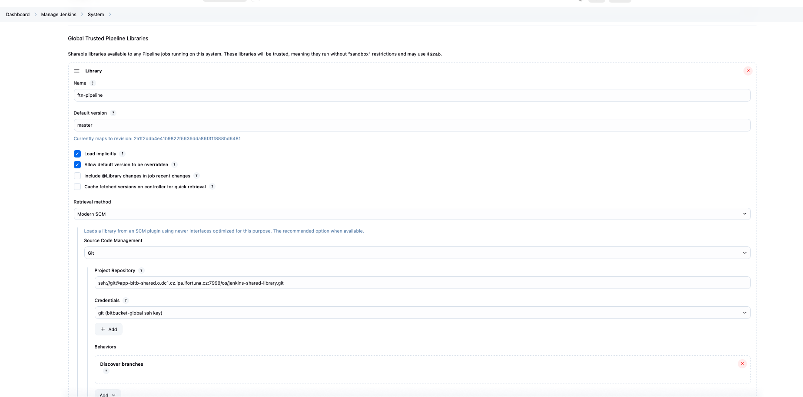

# Directory structure of Shared Library repository

```css

(root)
+- src                     # Groovy source files
|   +- org
|       +- foo
|           +- Bar.groovy  # for org.foo.Bar class
+- vars
|   +- foo.groovy          # for global 'foo' variable
|   +- foo.txt             # help for 'foo' variable
+- resources               # resource files (external libraries only)
|   +- org
|       +- foo
|           +- bar.json    # static helper data for org.foo.Bar


```


in my case in MW we have vars only:

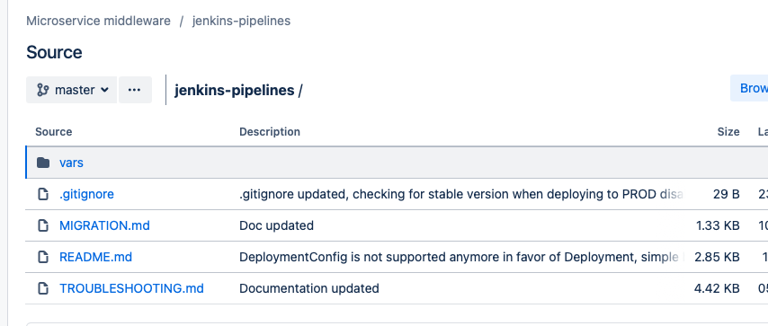

so inside the Jenkins file for my build i only mention the variables, which are indicated in the vars above


The vars directory hosts script files that are exposed as a variable in Pipelines. The name of the file is the name of the variable in the Pipeline.

The basename of each .groovy file should be a Groovy (~ Java) identifier, conventionally camelCased. The matching .txt, if present, can contain documentation, processed through the system’s configured markup formatter (so may really be HTML, Markdown, etc., though the .txt extension is required). 

**This documentation will only be visible on the Global Variable Reference pages that are accessed from the navigation sidebar of Pipeline jobs that import the shared library. In addition, those jobs must run successfully once before the shared library documentation will be generated.**


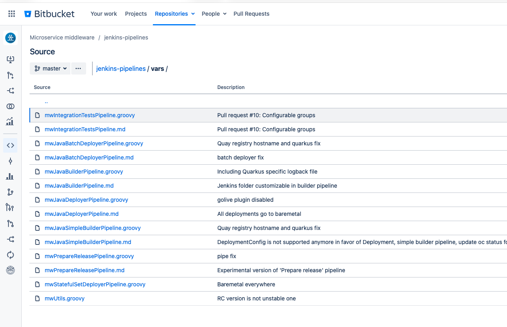

so our vars should appear here after succcessful pipeline execution:

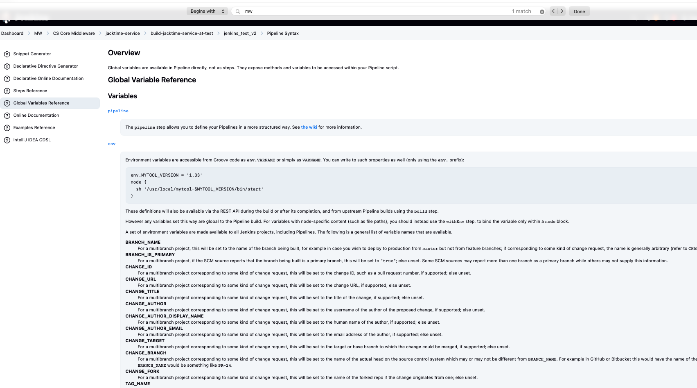

# Trusted vs Untrusted libraries

## trusted

In global manage jenkins -> system -> trusted  meaning they can run any methods in Java, Groovy, Jenkins internal APIs, Jenkins plugins, or third-party libraries. This allows you to define libraries that encapsulate individually unsafe APIs in a higher-level wrapper that is safe for use from any pipeline.

## untrusted

Any Folder created can have Shared Libraries associated with it. This mechanism allows scoping of specific libraries to all the Pipelines inside of the folder or subfolder.

Folder-scoped libraries are always “untrusted”.

### folder level


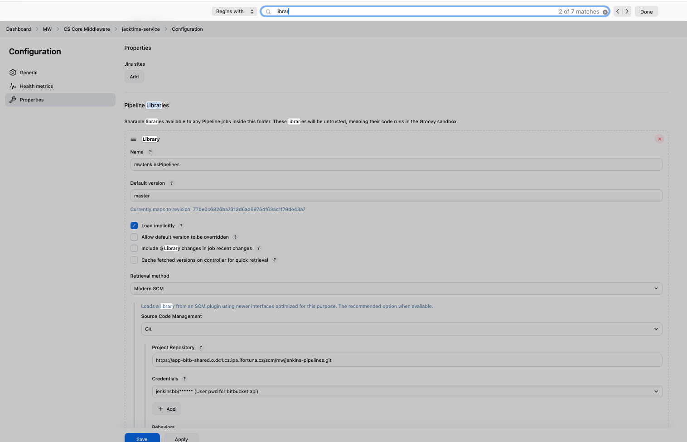

Shared Libraries marked Load implicitly allows Pipelines to immediately use classes or global variables defined by any such libraries. To access other shared libraries, the Jenkinsfile needs to use the @Library annotation, specifying the library’s name.

we have load implicity -> so we dont need to write @Library in our code

```groovy
@Library('my-shared-library') _
/* Using a version specifier, such as branch, tag, etc */
@Library('my-shared-library@1.0') _
/* Accessing multiple libraries with one statement */
@Library(['my-shared-library', 'otherlib@abc1234']) _
```

more on it here: https://www.jenkins.io/doc/book/pipeline/shared-libraries/#using-libraries

### default version

we have master:

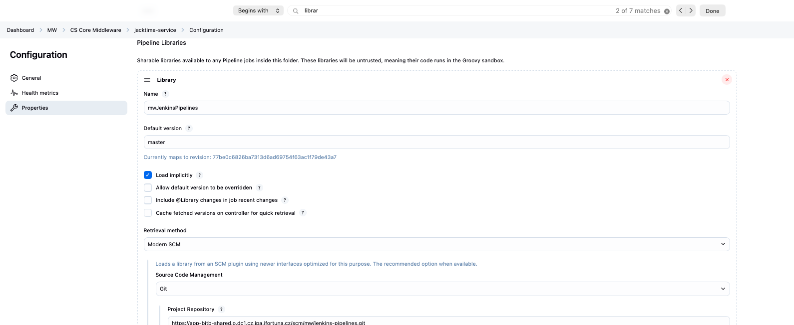


If a "Default version" is not defined, the Pipeline must specify a version, for example `@Library('my-shared-library@master') _.`

.. more to read theare

# Pretesting library changes with Replay

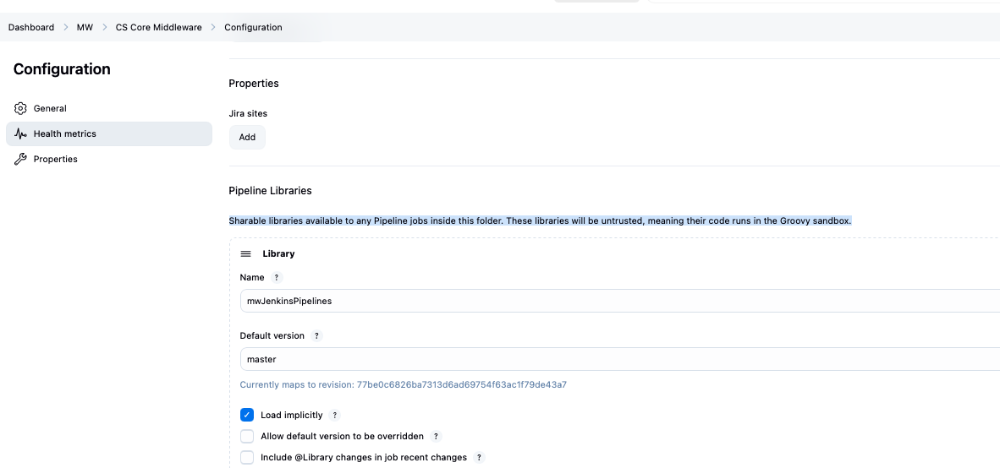

our library is untrusted (cause its on the folder level) -> 

If you notice a mistake in a build using an untrusted library, simply click the Replay link to try editing one or more of its source files, and see if the resulting build behaves as expected. Once you are satisfied with the result, follow the diff link from the build’s status page, and apply the diff to the library repository and commit.

(Even if the version requested for the library was a branch, rather than a fixed version like a tag, replayed builds will use the exact same revision as the original build: library sources will not be checked out again.)

Replay is not currently supported for trusted libraries. Modifying resource files is also not currently supported during Replay.

# Testing Jenkins Shared Library Pull Requests (Bitbucket)

## Problem

When a Jenkins pipeline uses a **Shared Library**, it normally loads the library from the **default branch** (for example `main` or `master`).

Example:

```groovy
@Library('mw-shared-library') _
```

Pipeline execution:

```
Jenkinsfile
   ↓
Load shared library
   ↓
Git repository (default branch)
   ↓
Pipeline runs library code
```

If you open a **Pull Request** with changes to the library, Jenkins will still use the **old version** until the PR is merged.

This means you **cannot test the new library code in pipelines before merging**.

---

## Solution

You can tell Jenkins to **load the library from a specific pull request**.

Example:

```groovy
@Library('mw-shared-library@refs/pull-requests/57/from') _
```

Meaning:

```
Load shared library
↓
Use code from Pull Request #57
↓
Instead of default branch
```

This allows you to **test library changes before merging them**.

---

## How Bitbucket Pull Requests Work

Bitbucket exposes special Git references for pull requests.

Typical reference:

```
refs/pull-requests/<PR_ID>/from
```

Example:

```
refs/pull-requests/57/from
```

Meaning:

```
PR number: 57
Branch: source branch of the pull request
```

So Jenkins loads the library code from that PR.

---

## Example Workflow

### 1 Create a branch in the library repository

Example:

```
feature/debug-pipeline
```

Modify a library file:

```
vars/mwJavaBuilderPipeline.groovy
```

---

### 2 Create Pull Request

Example:

```
PR #57
```

---

### 3 Modify pipeline Jenkinsfile

Use the PR reference:

```groovy
@Library('mw-shared-library@refs/pull-requests/57/from') _
```

---

### 4 Run pipeline

Pipeline execution:

```
Jenkinsfile
   ↓
Load shared library
   ↓
Bitbucket repository
   ↓
refs/pull-requests/57/from
   ↓
Library code from PR
```

Now Jenkins runs **your new library code**.

---

## Why This Is Useful

Without this feature:

```
Change library
↓
Merge PR
↓
Pipelines start using new code
↓
Risk of breaking builds
```

With PR library testing:

```
Change library
↓
Open PR
↓
Run pipelines using PR reference
↓
Verify behavior
↓
Merge safely
```

---

## Relation to Replay

This mechanism is **not related to Replay**.

Replay allows temporary editing of pipeline code in Jenkins UI.

| Feature | Purpose |
|---|---|
Replay | quick debugging of Jenkinsfile |
PR library reference | testing changes to shared libraries |

Replay **cannot modify trusted shared libraries**, but PR references allow testing them safely.

---

## Practical Use Case

Example pipeline using a shared library function:

```groovy
@Library('mw-shared-library@refs/pull-requests/57/from') _

mwJavaBuilderPipeline(
    APP_NAME: 'example-service',
    TARGET_ENV: 'tst'
)
```

The pipeline will execute:

```
vars/mwJavaBuilderPipeline.groovy
```

from **Pull Request #57** instead of the main branch.

---

## Summary

```
Normal pipeline
↓
@Library('mw-shared-library')
↓
Loads library from default branch
```

```
Testing PR
↓
@Library('mw-shared-library@refs/pull-requests/57/from')
↓
Loads library from Pull Request
```

This allows **safe testing of shared library changes before merging them**. 

## Example

### Application repository

Pull request:

```
PR #84
feature/add-footer
```

This PR contains:

```
application code
Jenkinsfile
```

This PR triggers the **multibranch pipeline**.

---

### Shared library repository

Pull request:

```
PR #57
feature/debug-pipeline
```

This PR modifies library code:

```
vars/mwJavaBuilderPipeline.groovy
```

---

## Which PR Number Goes Into `@Library(...)`?

You must use the **shared library PR number**, not the application PR number.

Example:

| Repository | Pull Request | Purpose |
|---|---|---|
Application repo | PR #84 | feature: add footer |
Shared library repo | PR #57 | modify pipeline logic |

In the Jenkinsfile you reference:

```groovy
@Library('mw-shared-library@refs/pull-requests/57/from') _
```

Notice that **57 (library PR)** is used, not **84 (app PR)**.

---

## Step-by-Step Workflow

### 1 Create shared library branch

Example:

```
feature/debug-pipeline
```

Modify a library file:

```
vars/mwJavaBuilderPipeline.groovy
```

---

### 2 Create shared library pull request

Example:

```
PR #57
```

Now the PR number is known.

---

### 3 Modify Jenkinsfile in application repo

In the application branch:

```
feature/add-footer
```

Edit the Jenkinsfile:

```groovy
@Library('mw-shared-library@refs/pull-requests/57/from') _
```

---

### 4 Create application pull request

Example:

```
PR #84
```

This PR triggers the pipeline.

---

### 5 Pipeline execution

Pipeline now runs with:

```
Application code → PR #84
Jenkinsfile → PR #84
Shared library → PR #57
```


