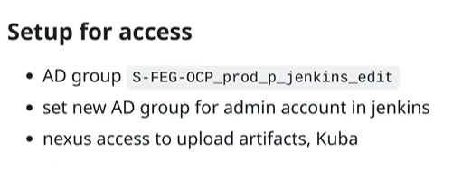
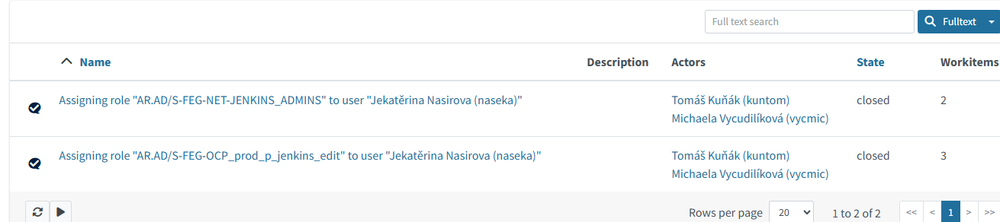

# Check my permissions

- i got this:
  

# give someone permissions: GUI -> YAML

# get a personal Linux account

Step 1 — You get a personal Linux account

The instructor / infra team must:

- create a user for you (e.g. eka)
- add your SSH public key
- grant limited or sudo access

✅ SSH access allowed from your network

✅ Linux user created

✅ Your SSH key added

✅ sudo permission (maybe limited)

5️⃣ What you should ask the instructor (copy–paste friendly)

You can ask clearly and professionally like this:

Hi,
I saw you editing Jenkins configuration directly on
jenkins01-ocp01-shared.m.dc1.ipa.ifortuna.cz.

Could you please let me know:

whether I can get read-only SSH access to this server

or if there is a safe way to practice Jenkins Configuration as Code
(test instance / test VM / walkthrough)?

I’d like to understand the process properly, not change anything in prod.

# get openshift CLI

7️⃣ Can you access this?

Right now: probably NO, and that’s normal.

To access this, you need:

OpenShift access granted

a user (like prorom)

correct project permissions

VPN (often)

This is usually handled by:

instructor

platform / infra team
