# Docker + Jenkins (local on Mac) — concise notes

## 1) Verify Docker works

After installing Docker Desktop, open Terminal and run:

```bash
docker run hello-world
```

## 2) Download Jenkins Docker setup (clone teacher repo)

Copy repo HTTPS URL from GitHub (green Code button), e.g. https://github.com/username/repository-name.git

Open Terminal

Go to where you want the repo:

```bash
cd ~/Documents
```

Create folder:

```bash
mkdir Devops
```

Clone:

```bash
git clone https://github.com/username/repository-name.git
```

Enter repo folder:

```bash
cd repository-name
```

Verify files:

```bash
ls
```

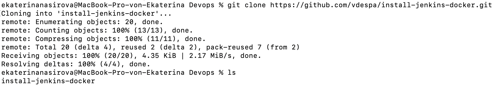

Change to directory of the cloned docker file:
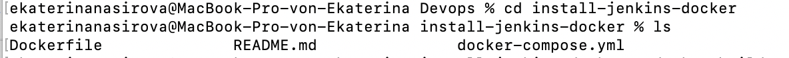

## 3) Build Jenkins Docker image

Then we build Jenkins Docker Image:

```bash
docker build -t my-jenkins .
```

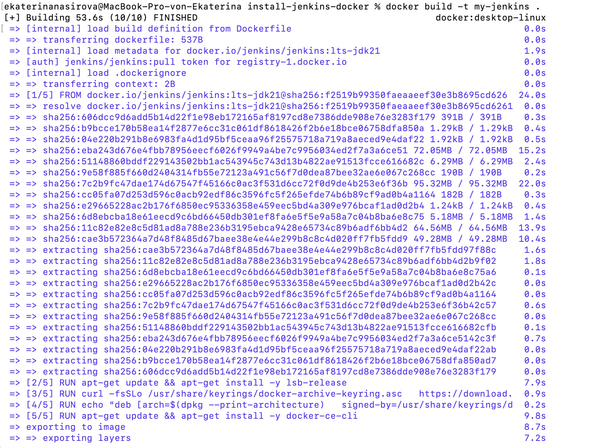

## 4) Start Jenkins

Then we start Jenkins via docker compose command:

```bash
docker compose up -d # -d means detached mode: runs containers in the background and terminal is free, meaning logs are not streamed
```

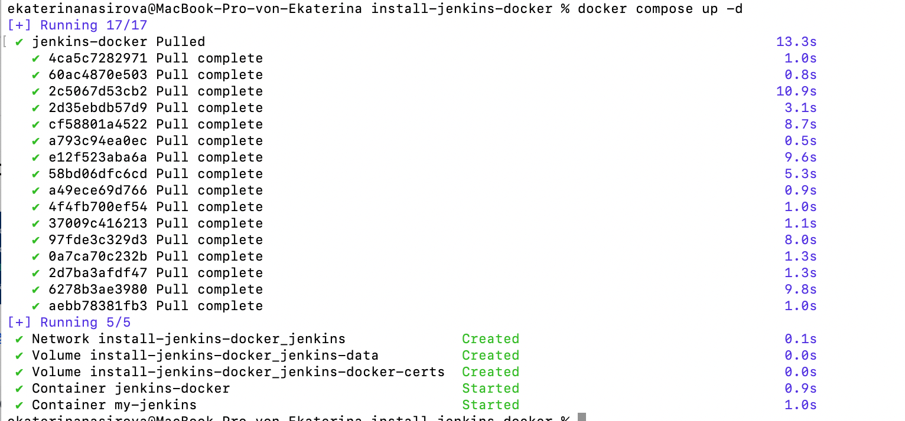

### Then we can go to local host in the browser: http://localhost:8080/

- localhost = your own computer

- 8080 = Jenkins default port

- Docker config maps Jenkins container port → your machine’s port 8080
  So you access Jenkins at:
  http://localhost:8080/

## 5) Unlock Jenkins (initial admin password)

when you go to localhost:8080 -> on the page it shows the path, where your password is stored:
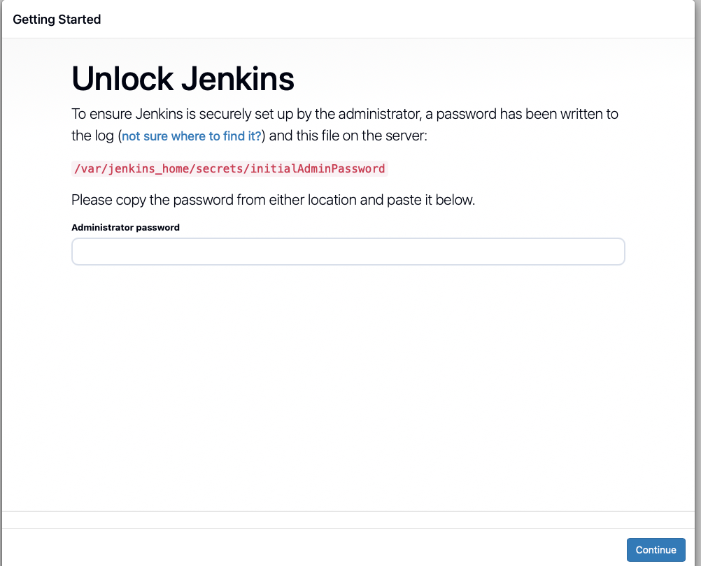

two options to find the password:

a) Docker Desktop logs

1. open docker desktop and find install jenkins, which has two containers, click on install jenkins:
   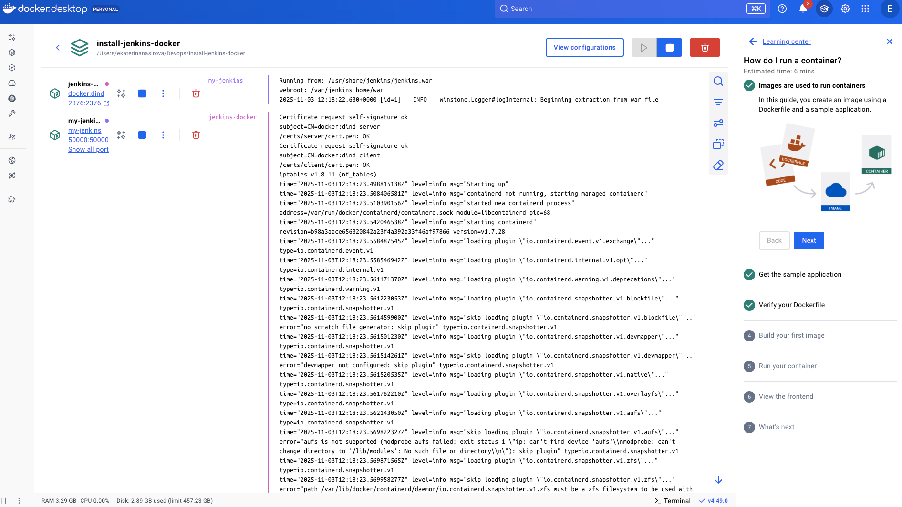

2. click on the container **my_jenkins**, where Jenkins is actually running. On the logs there is password available: 5b6cf50d02504a708cf7a1f5c67d6021
   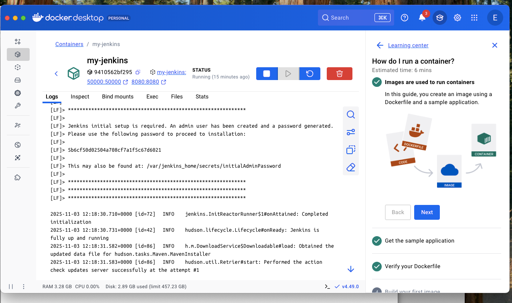

b) Docker Desktop Exec + cat
go to Exec column in your container and run cat command for the path specified in your unlock jenkins page
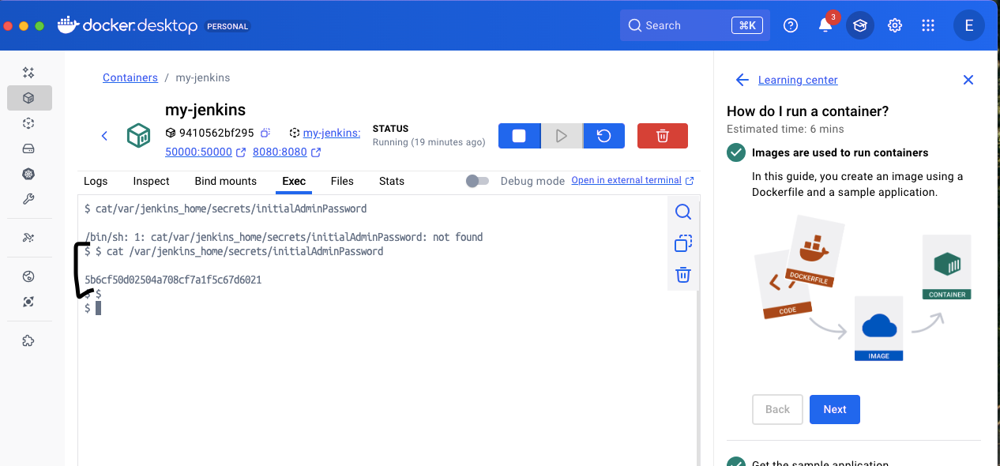

```bash
cat /var/jenkins_home/secrets/initialAdminPassword
```

Paste the password to your Unlock page

## 6) Install plugins in GUI

- Jenkins is a platform; plugins make it “Jenkins”

- Choose Install suggested plugins

## 7) Create admin user in GUI

- username: Eka

- password: JKatushka2025!

## 8) Local address to access Jenkins:


## 9) Stop/start containers

```bash
docker compose down # will stop al the containers (then local host browswer page will not display anything and there will be no running containers in desktop docker)
```

then we can pause desktop docker (inside docker app) or quit it to make computer running faster

to start containers again:

```bash
docker compose up -d
```

## 10) Extra plugin: Pipeline Stage View

- Visual stage boxes (status + duration)

- Easier to see what failed and where

- Shows history across runs

After installing: restart Jenkins.

## 11) Jenkins job: Freestyle vs Pipeline

- New Item -> Freestyle job

* Build Steps -> Execute shell. Write a command:

```bash
echo "Hello from Jenkins"
```

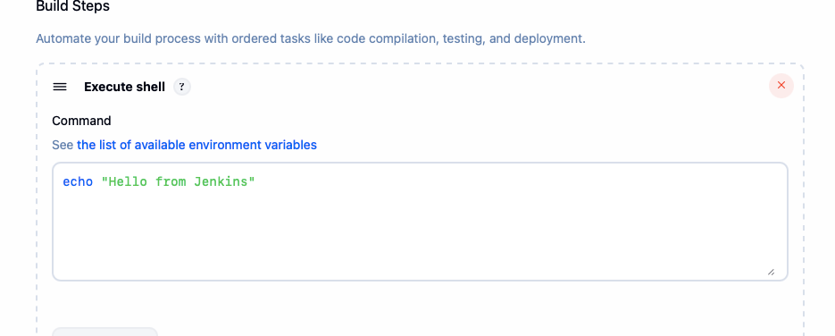

**Pipeline basics**

- Controller (server): schedules/coordinates runs, stores results

- Agent (node): executes stages/commands

- In my learning setup: controller + agent are the same instance (Jenkins in one container)

- In production: controller and agents are often separated for performance/security

## 12) Exit codes

- 0 = success

- 1..255 = failure
  If a command returns non-zero, Jenkins marks the step/pipeline as failed and stops

## 13) Sample pipeline

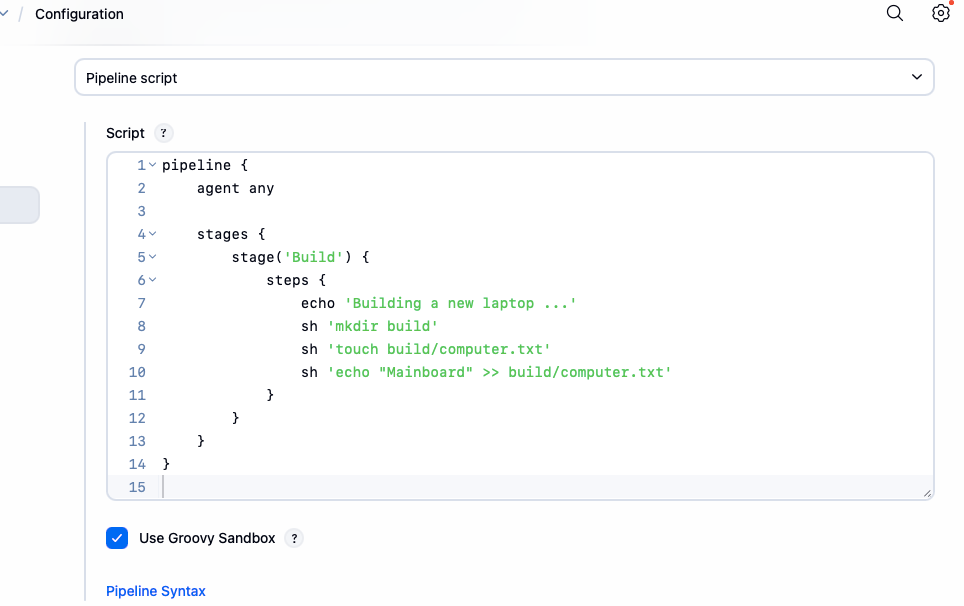

```groovy
pipeline {
  agent any

  stages {
    stage('Build') {
      steps {
        echo 'Building a new laptop...'
        sh 'mkdir build'
        sh 'touch build/computer.txt'
        sh 'echo "Mainboard" >> build/computer.txt
      }
    }
  }
}

```

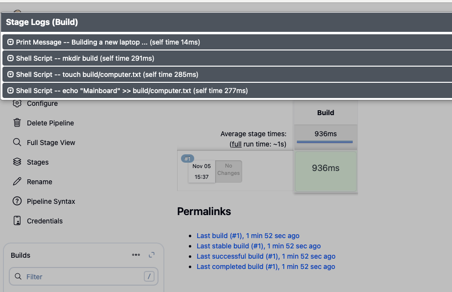

Multiple Mainboard lines appeared because you ran the job multiple times and appended content

Workspaces are visible in logs; Jenkins stores job files in its workspace folder.

when I run job I might encounter error, that this directory already exists:
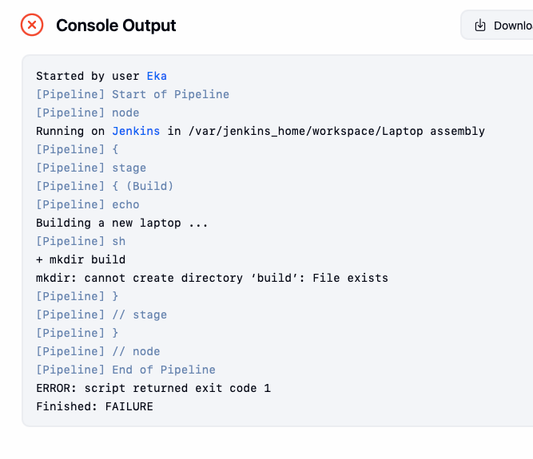

we added extra parameter -p,so we create directory, if its not already created

## 14) Worspace clean up + artifacts

Why clean workspace

- Workspaces can accumulate many files

- Best practice: start builds in a clean workspace

**_POST_ we use for POST build actions:**

- **post** is at the same level as stages

- **always** runs regardless of success/failure

```groovy
pipeline {
  agent any

  stages {
    stage('Build') {
      steps {
        echo 'Building a new laptop...'
        sh 'mkdir build'
        sh 'touch build/computer.txt'
        sh 'echo "Mainboard" >> build/computer.txt'
        sh 'cat build/computer.txt'
      }
    }
  }

  post {
    always {
      cleanWs()
    }
  }
}

```

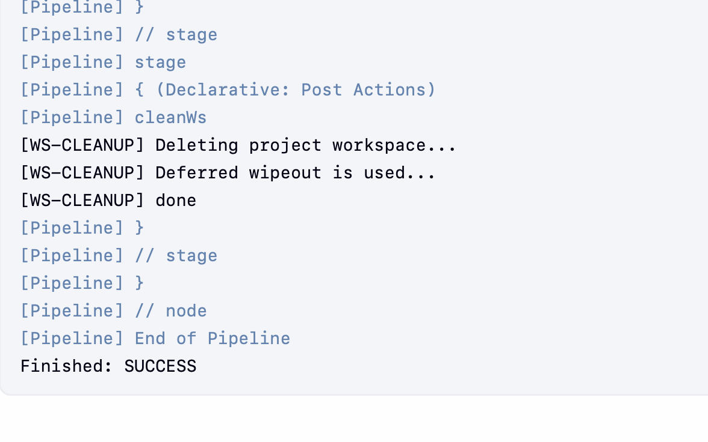

now if we go to workspace we will see that there is nothing in workspace

**Artifacts**

- Artifact = output you want to keep (human-usable result), e.g. build/computer.txt

- Artifacts are archived before workspace cleanup so they remain available in Jenkins UI

Archive example:

```groovy
archiveArtifacts artifacts: 'build/**'
```

we only want to save artifacts for successful builds and we decided to cleanup ws in the beginning:

```groovy
pipeline {
  agent any

  stages {
    stage('Build') {
      steps {
        cleanWs()
        echo 'Building a new laptop...'
        sh 'mkdir build'
        sh 'touch build/computer.txt'
        sh 'echo "Mainboard" >> build/computer.txt'
        sh 'cat build/computer.txt'
      }
    }
  }

  post {
    success {
      archiveArtifacts artifacts: 'build/**'
    }
  }
}

```

**Recursive wildcard:**

- \* matches within one directory level

- \*\* matches across any number of subdirectories
  So build/\*\* archives everything under build/ recursively.

**Where artifacts live**

- Artifacts are stored separately from the workspace (Jenkins keeps them per build), e.g. under:

/var/jenkins_home/jobs/[JOB]/builds/[BUILD]/archive/

- Access via Jenkins UI in the build page on the left sidebar (“Artifacts”).

- Persistent storage: Artifacts remain available even after multiple builds and workspace cleanups
