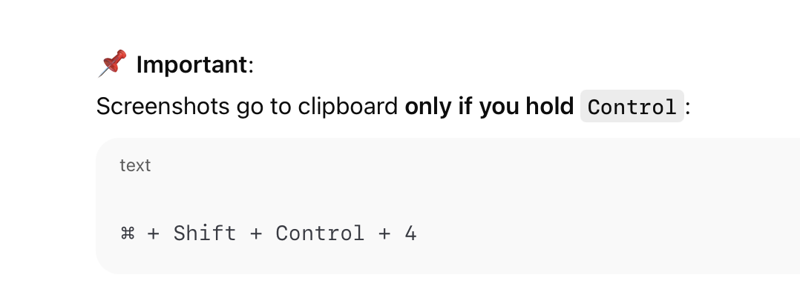

# OpenShift – Local CLI Setup (Day 1)

## Goal
Prepare local Mac (Apple Silicon) for working with OpenShift via `oc` CLI.

---

## 1. What OpenShift CLI is

- `oc` = OpenShift Command Line Interface
- Used to:
  - log into OpenShift clusters
  - work with projects (namespaces)
  - inspect pods, builds, deployments
  - debug CI/CD (Jenkins agents, pipelines)

OpenShift Web UI = visualization  
`oc` CLI = real DevOps work

---

## 2. Architecture & OS context

- Machine: macOS (Apple Silicon M4)
- Architecture: `arm64`
- Shell: `zsh`

---

## 3. Downloading `oc` CLI

Source:
- OpenShift Web Console
- Section: **Command Line Tools**

Downloaded:
- **OpenShift Client for macOS (ARM64)**

Important:
- `x86_64` = Intel (NOT for this Mac)
- `arm64` = Apple Silicon (correct)

---

## 4. Understanding PATH (critical concept)

- Terminal looks for commands in directories listed in `$PATH`
- Checked PATH with:

```bash
echo $PATH
```

it will output:

```bash
naseka@CZMB94D536 Downloads % echo $PATH
/opt/homebrew/bin:/opt/homebrew/sbin:/usr/local/bin:/System/Cryptexes/App/usr/bin:/usr/bin:/bin:/usr/sbin:/sbin:/var/run/com.apple.security.cryptexd/codex.system/bootstrap/usr/local/bin:/var/run/com.apple.security.cryptexd/codex.system/bootstrap/usr/bin:/var/run/com.apple.security.cryptexd/codex.system/bootstrap/usr/appleinternal/bin:/opt/pmk/env/global/bin
naseka@CZMB94D536 Downloads % 
```

## 5. Moving OC from Downloads to PATH directory: /usr/local/bin

```bash
sudo mv ~/Downloads/oc /usr/local/bin
```

## 6. running oc version

Verifying if shell recognizes oc now

```bash
naseka@CZMB94D536 ~ % oc version 
Client Version: 4.16.0-202507281005.p0.gee354f6.assembly.stream.el9-ee354f6
Kustomize Version: v5.0.4-0.20230601165947-6ce0bf390ce3
naseka@CZMB94D536 ~ % 
```

## 7. Log in to the OpenShift cluster

From OpenShift Web UI:
* Open the OpenShift console in your browser
* Top-right → your username
* Click Copy login command
* Choose Developer token
* Copy the full command



then i login in via copying the command

```bash
naseka@CZMB94D536 ~ % oc login --token=blablabla
Logged into "https://api.ocp01-shared.m.dc1.cz.ipa.ifortuna.cz:6443" as "naseka" using the token provided.

You have access to the following projects and can switch between them with 'oc project <projectname>':

  * isesync
    jenkins
    mw
    netbox
    nexus
    openshift-logging
    prometheus
    quay
    revelio
    shared-images
    sonar
    thanos
    tools
    vault
    wulcan

Using project "isesync".
Welcome! See 'oc help' to get started.
naseka@CZMB94D536 ~ % 
```