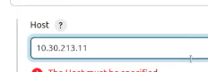
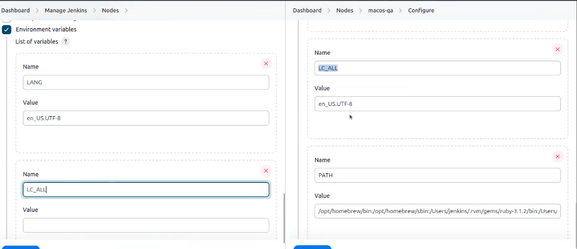
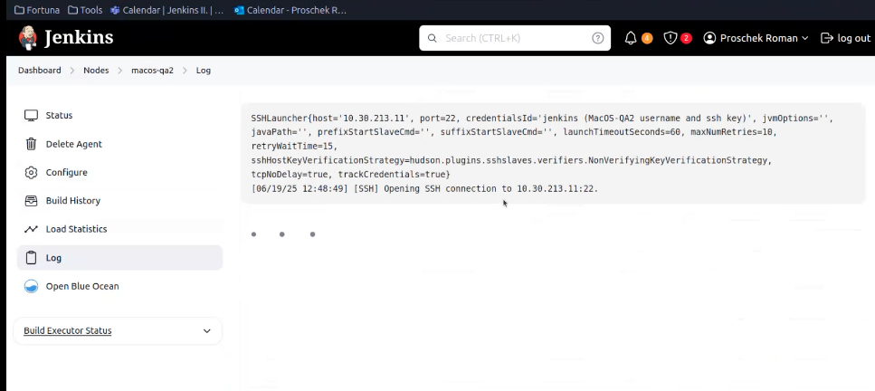
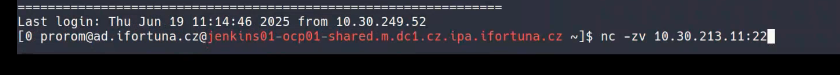
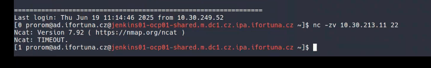
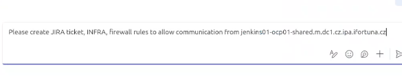
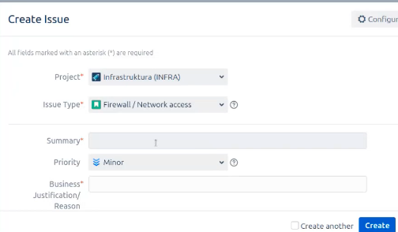
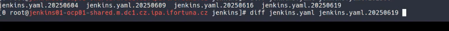

user 

server woruld be macos.2

manage jenkins -> nodes -> macos-qa is configured

## add new node: 
 macos-qa2 -> permanent agent, create. 
number of executors: how many pipelines can run the same time (we can always add more if they want). only build jobs: jenkins doesnt try to run openshift agents for ex. we copy ip address requestor provided:

we need to add certificate (he added private one ). add credenetials -> ssh username with private key. private ssh key provided by requestor. 

we create environmental variables (copy paste from other mac):

then we can see the node -> check log:
trying to connect to that mac:

check if firewall network rules are in place in jenkins server:
`nc -zv 10.30.213.11.22`

and it is not:

the connection timeout -> they are missing firewall rules

so requestor needs to request firewall rules to allow jenkins server

we can do it ourselves:

source host is jenkins server

to check ip this command: `ip a`
destination is that computer 
port:22
protocol:both

you can theck ticket example:

we need to add this into permanent config:

manage jenkins -> configuration as code -> view configuration and ctl f for macos-qa2

we create a backup of jenkins yaml
then we edit the yaml file. -> check back up file for that day to see what exactly was changed:

