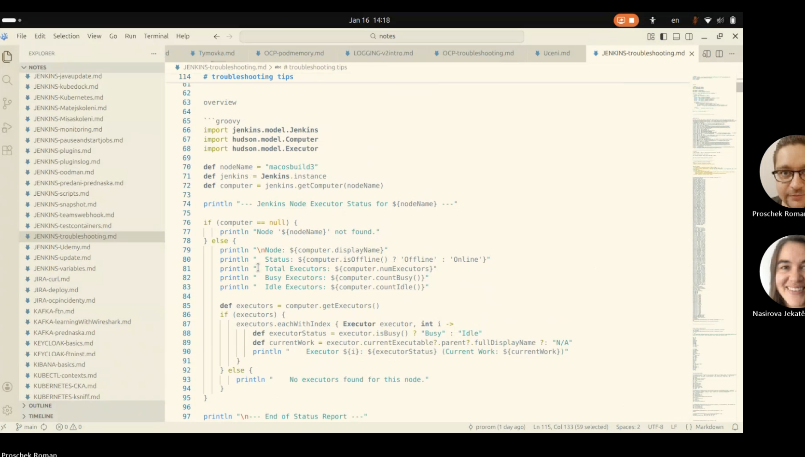
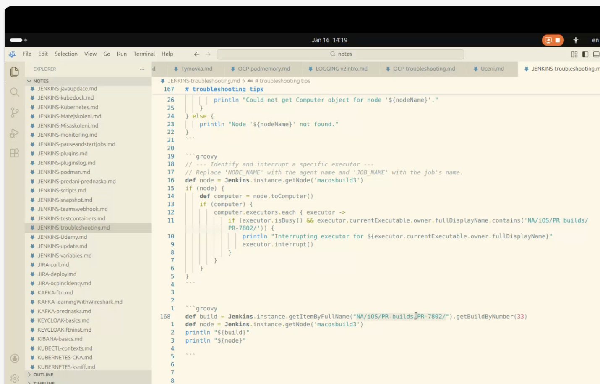

We tried to do it temporary: mark temporary offline

we tried to delete agent and put back -> didnt work (cause pipelines remember the label)

we enlarged number of executors -> to quickly fix. it fixe, but we still need to troubleshoot

grooby script: what the executor is blocked by. just a list

urls are different: 

# from 4:03 -> continue. check jenkins. learn how to debug now
