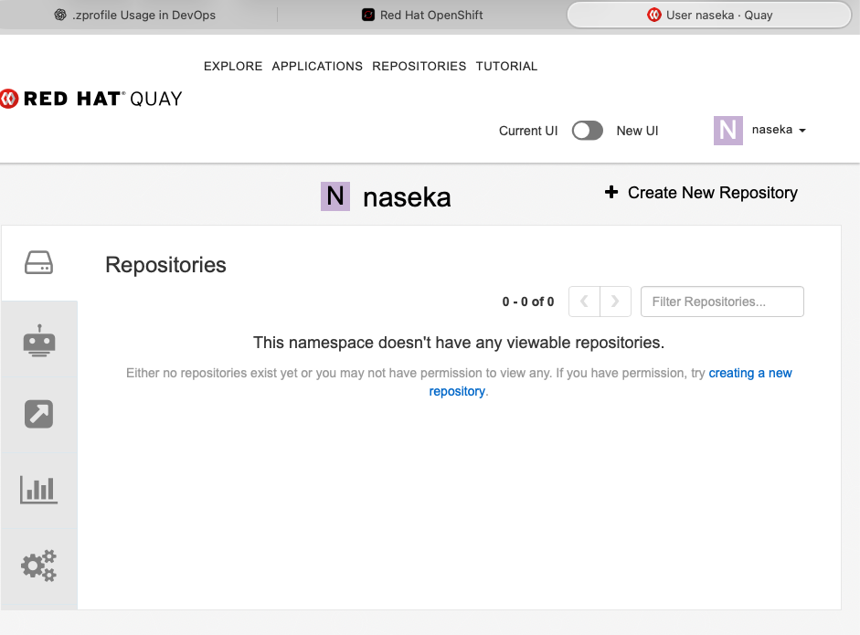

# cannot connect

```bash
naseka@CZMB94D536 ~ % ssh naseka@jenkins01-ocp01-shared.m.dc1.cz.ipa.ifortuna.cz

(naseka@jenkins01-ocp01-shared.m.dc1.cz.ipa.ifortuna.cz) Password: 
(naseka@jenkins01-ocp01-shared.m.dc1.cz.ipa.ifortuna.cz) Password: 

naseka@CZMB94D536 ~ % ssh -l ${USER}@ad.ifortuna.cz jenkins01-ocp01-shared.m.dc1.cz.ipa.ifortuna.cz
(naseka@ad.ifortuna.cz@jenkins01-ocp01-shared.m.dc1.cz.ipa.ifortuna.cz) Password: 
(naseka@ad.ifortuna.cz@jenkins01-ocp01-shared.m.dc1.cz.ipa.ifortuna.cz) Password: 
```

same for test jenkins

```bash
naseka@CZMB94D536 ~ % ssh -l ${USER}@ad.ifortuna.cz el8builder01-ocp01-shared.m.dc1.cz.ipa.ifortuna.cz
The authenticity of host 'el8builder01-ocp01-shared.m.dc1.cz.ipa.ifortuna.cz (10.0.172.14)' can't be established.
ED25519 key fingerprint is SHA256:wRfQ9RwSN74qTCaMg+s1VFqdga3HHIM7L+XcwzAi8lk.
This key is not known by any other names.
Are you sure you want to continue connecting (yes/no/[fingerprint])? yes
Warning: Permanently added 'el8builder01-ocp01-shared.m.dc1.cz.ipa.ifortuna.cz' (ED25519) to the list of known hosts.
(naseka@ad.ifortuna.cz@el8builder01-ocp01-shared.m.dc1.cz.ipa.ifortuna.cz) Password: 
(naseka@ad.ifortuna.cz@el8builder01-ocp01-shared.m.dc1.cz.ipa.ifortuna.cz) Password: 
```

# Quay UI: no repositories



# Nexus - no access:


# vmware no access

usersupport -> 


# ssh
my public ssh: 
ssh-ed25519 AAAAC3NzaC1lZDI1NTE5AAAAIFRrVb7wSXduduu9Pq+RzyHcTGSd+ET/LL7/e/7VguWw nasirova.jekaterina@feg.eu

fegtools -> 

