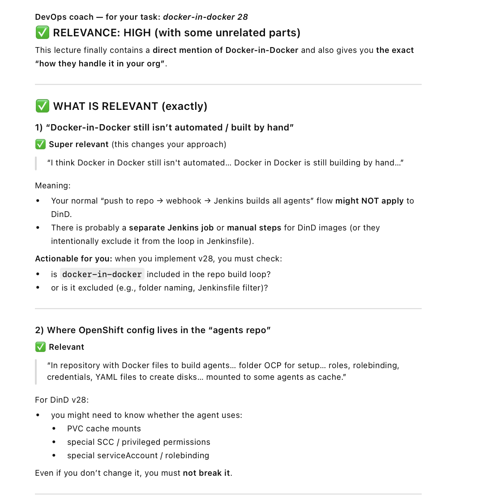
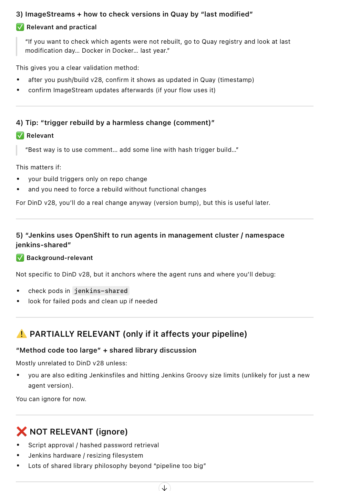
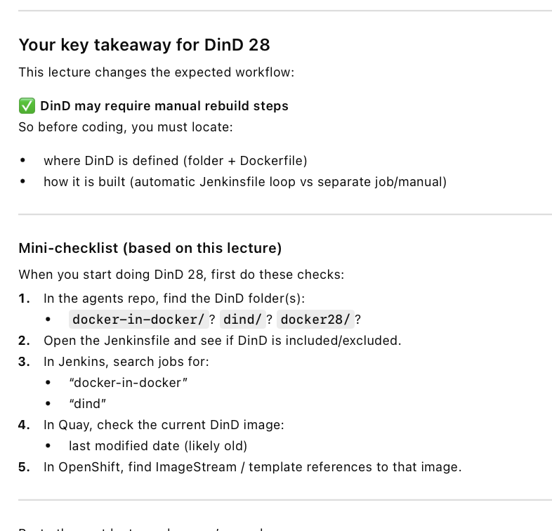

# video Jenkins ||| -> relevant
check chat gpt recap:

Agent version change =
copy existing agent
→ change tool version
→ build image
→ push to Quay
→ update Jenkins YAML
→ new agent appears in Jenkins

DevOps coach — analysis for your task: “create new version: docker-in-docker 28”
I’ll be very strict and filter only what matters 👇
✅ RELEVANCE: PARTIALLY RELEVANT
Most of this lecture is about creating a new Jenkins agent (Gradle/Java).
Your task is Docker-in-Docker 28, not Gradle or Java — so 90% is noise.
But there are important transferable parts you must understand.
✅ WHAT IS RELEVANT FOR YOU
1️⃣ Pattern: how a new agent version is created
✅ VERY relevant
Even though the example is Gradle 8 / Java 21, the process is identical for:
docker-in-docker → version 28
The pattern is:
Create new Dockerfile folder
docker-in-docker-28/
Modify Dockerfile
change tool version (here Docker 28 instead of Gradle/Java)
Push to Bitbucket
webhook triggers Jenkins job
Jenkins pipeline builds image
podman/buildah build
podman push
Image is pushed to Quay
ImageStream is created/updated in OpenShift
Jenkins pod template is added
so Jenkins can use the new agent
👉 THIS FLOW IS 100% RELEVANT
Different tool → same pipeline.
2️⃣ “Copy existing agent and change version”
✅ VERY important
Instructor says:
it’s better to copy existing one
because variables, CPU, memory are same
This applies EXACTLY to your task.
For you:
copy:
docker-in-docker-27
create:
docker-in-docker-28
Then change only:
Docker version
image name
tag
⚠️ You do not invent new structure.
3️⃣ Jenkins YAML modification on server
✅ IMPORTANT
This part matters:
easier to modify Jenkins YAML directly on server
Meaning:
Jenkins agents are defined in Configuration as Code
not only UI
You will likely need to:
copy existing docker-in-docker agent block
rename it
update image reference
Example logic (conceptual):
- name: docker-in-docker-28
  image: quay/.../docker-in-docker:28
👉 This WILL be part of your task.
4️⃣ ImageStream caching explanation
✅ Relevant
This part is useful:
first run is slower
next runs are faster
Because:
OpenShift caches image locally
later Jenkins jobs pull from internal registry
Not something you implement — but good to understand why first build feels slow.
❌ WHAT IS NOT RELEVANT (IGNORE)
You can safely ignore all of this for your task:
❌ Gradle
❌ Java versions
❌ Maven
❌ Nexus discussion
❌ Jenkins Script Console
❌ decrypting passwords
❌ HTML report plugin
❌ CSP / Java options
❌ Jenkins certificates
❌ Jenkins server disks
❌ LVM resizing
❌ VMware
❌ systemctl Jenkins
❌ hardware info
These are administrator topics, not agent creation.
🧠 YOUR TAKEAWAY (very important)
From this lecture you need to remember ONLY THIS mental model:
Agent version change =
copy existing agent
→ change tool version
→ build image
→ push to Quay
→ update Jenkins YAML
→ new agent appears in Jenkins
That’s it.
✅ SUMMARY
Relevant?
⚠️ Partially — but with key structural value
What matters for docker-in-docker 28?
✔ process of creating new agent
✔ copy existing version
✔ Jenkins pipeline auto-build
✔ Quay push
✔ ImageStream
✔ Jenkins YAML agent template
What does NOT matter?
70% of lecture (admin, Java, plugins, passwords, disks)
Paste the next lecture 👇
I’ll continue filtering only what helps you finish docker-in-docker 28.

# video jenkins 4 part 1

# video jenkins 4 part 2
Why it is NOT relevant
This lecture focuses on:
Jenkins controller
Jenkins plugins
Bitbucket plugin compatibility
Blue Ocean downgrade
Jenkins reboot
Jenkins backup & snapshots
Jenkins filesystem
Jenkins disaster recovery
👉 All of this is controller-side administration.

# video jenkins 4 part 3

addin a new mac jenkins node. it was already documented and its not relevant for this task

# video jenkins 4 part 4
This video is almost entirely unrelated to creating or upgrading a Docker-in-Docker agent.
It focuses on:
Jenkins integrations overview
Bitbucket plugin deprecation
CSP (Content Security Policy) issues
Jenkins controller arguments
Jenkins plugins & upgrades
Mac nodes (again)
Homebrew, Ruby, SSH problems
All of this lives on the Jenkins controller / external node side, not on container agents.