1) git clone the repo (jenkins-docker slaves) with all necessary agent folders
2) copy agent folder
3) change name of folder accordingly
4) modify docker file: 
        1) modify path FROM registry... to 28?? check the problem with latest described in docker in docker roman ppt
        2) we run the command to test it and investigate in terminal:

  
            podman run -it <image-from-FROM> bash
            after we are done with it -> exit shell process (only shell process stops):

            exit

            podman run = start a container from an image -i = keep STDIN open (so you can type) -t = allocate a TTY (interactive terminal)

            podman run -it registry.../java21:latest

            he’s basically opening a shell-like session inside that image.

            Sometimes you need to specify a shell explicitly, depending on the image: podman run -it  bash or podman run -it  sh

            then we check inside
5) if we miss smth we need to download it and uppload to nexus (gradle case. not sure for docker). check readme

        not sure if i have nexus access already???

6) then change variables related to it in the docker file. for ex. if there is exact version of gradle in arguments -> modify it to current one. check readme


7) edit jenkins file, so it knows it needs to rebiuld something
    he added an extra stage 

8) in quay we created repository (created a place where to save our image)

9) we add oc import image command to read me file. this command will be ran later

10) he pushes changes to bitbucket -> webhook -> it will trigger build in jenkins

11) we check the logs of the jobL ocp4 slaves master (our agent building job in jenkins)

12) it takes time. then in the end of the log we can see that pipeline pushes image to quay

13) we can open quay and see the image there (at the destination we created earlier)
14) we run oc import-image ... in our terminal -> it creates the link


## read readme 
## find out changes on docker in docker in the past. i have access to bitbucket, maybe i can verify??? i think he said once a year we change
## understand the point of roman test repo (practice biuld new agent part) -> check the repo and its history
## check transcripts of new videos from yazdan


# problem: 

upgrade to 29 was automatic due to the tag: latest -> always latest version. its a problem.

??? what would be quick way to verify on which exact version we are now?


# postup

problem with 29 version -> so downgrade

oficial release notes of docker: https://docs.docker.com/engine/release-notes/28/


so lastest is 28.5.2

1. get latest docker version from source code in github
 done: cloned to Devops folder

2. check git log


search for latest 28 version:


checkout to that commit:


1) Docker CLI = those are commands. a binary program, it doesnt run containers, it just talks to Docker daemon. thats our source
2) Docker daemon (dind)


version is composed of 3 parts:

DOCKER_VERSION, DOCKER_BUILDX_VERSION and DOCKER_COMPOSE_VERSION

env docker_version 28.5.2
env docker_buildx_version 0.29.1
env docker_compose_version 2.40.3


then we open our docker file in our repo and paste "working combination" of versions there -> so our internal CLI image will behave exactly like official Docker 28.5.2:


then cd to that cli folder with docker file containing versions we need:


prior running podman .. i have mac -> so i need vm:


for that i use 2 commands:

```bash
podman machine init   # once
podman machine start  # every time after reboot
```
useful: 

`podman machine list`


mac by default builds ARM image

but we always just run on x86-64:

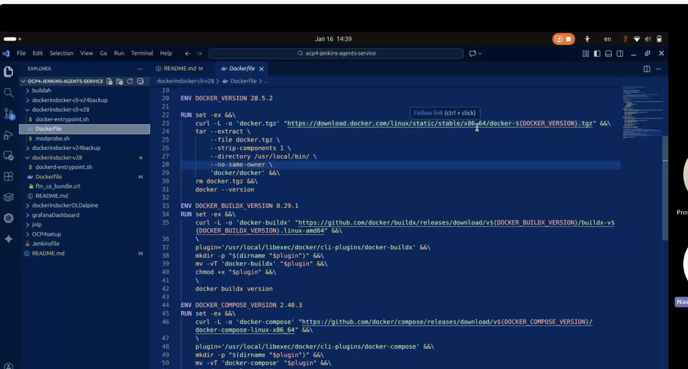


## make sure you are in the correct place:
you see dockerfile, entry point and modprobe.sh
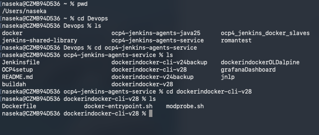


## podman build commmand explanation

podman build -t registry.svc.ifortuna.cz/ocp4-jenkins-slaves/dockerindocker-cli:v28$(date +%d%m%Y) .

* . = current directory -> means "use the files from THIS folder to build image"
* registry.svc.ifortuna.cz/ocp4-jenkins-slaves/dockerindocker-cli:v28$(date +%d%m%Y) -> this is just a lable. if we called it "naseka:slow" it will behave the same

Specifically:

Podman looks for a file named Dockerfile in the current directory

* command says: Podman, please take the Dockerfile that is in this folder,
follow its instructions line by line,
and create a new container image on my computer.
Name that image with this long name and tag.


Step-by-step what happens internally
Podman opens your Dockerfile
Reads it from top to bottom:
FROM ...
RUN ...
COPY ...

For each instruction:
it creates a layer
When finished:
a new image exists locally
📦 Think of it like:
compiling source code into a binary
You haven’t uploaded it anywhere yet.


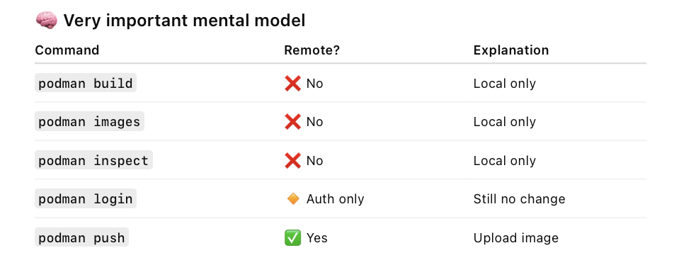

## Docker file explanation

```css
Jenkins pod
│
├── container A: dockerindocker-daemon
│     → runs dockerd
│
└── container B: dockerindocker-cli
      → runs docker commands
```

DOCKER CLI tooling only and the upgrade is only for that! 

docker command
docker buildx plugin
docker compose plugin
plus some helper scripts

So: it does not run Docker daemon itself, it installs the CLI tools.


### Header comment
autogenerated from template. 
we dont edit it, we just change version variables


### Base image (FROM)
`FROM registry.svc.ifortuna.cz/build-images/ubi9`
UBI 9 = Red Hat Universal Base Image (enterprise Linux base)
Hosted in fortuna internal registry

### Install ssh client
RUN dnf instal..
dnf = package manager on RHEL/UBI
```bash
RUN dnf install -y --setopt=tsflags=nodocs \
# DOCKER_HOST=ssh://... -- https://github.com/docker/cli/pull/1014
		openssh-clients

# ensure that nsswitch.conf is set up for Go's "netgo" implementation (which Docker explicitly uses)
# - https://github.com/moby/moby/blob/v24.0.6/hack/make.sh#L111
# - https://github.com/golang/go/blob/go1.19.13/src/net/conf.go#L227-L303
# - docker run --rm debian:stretch grep '^hosts:' /etc/nsswitch.conf
###splneno
###RUN [ -e /etc/nsswitch.conf ] && grep '^hosts: files dns' /etc/nsswitch.conf
```
### docker cli version 
`docker` command
 * we set a variable version

```bash
ENV DOCKER_VERSION 28.5.2

RUN set -ex &&\
	curl -L -o 'docker.tgz' "https://download.docker.com/linux/static/stable/x86_64/docker-${DOCKER_VERSION}.tgz" &&\
	tar --extract \
		--file docker.tgz \
		--strip-components 1 \
		--directory /usr/local/bin/ \
		--no-same-owner \
		'docker/docker' &&\
	rm docker.tgz &&\
	docker --version
```
downloads official Docker CLI binary bundle for x86_64
extracts only the docker binary into /usr/local/bin/
removes the downloaded archive to keep image clean
runs docker --version as a build-time check

**So this Dockerfile assumes the result will be amd64-compatible.** 

### Buildx plugin
bulder tool of docker

```bash
ENV DOCKER_BUILDX_VERSION 0.29.1
RUN set -ex &&\
	curl -L -o 'docker-buildx' "https://github.com/docker/buildx/releases/download/v${DOCKER_BUILDX_VERSION}/buildx-v${DOCKER_BUILDX_VERSION}.linux-amd64" &&\
	\
	plugin='/usr/local/libexec/docker/cli-plugins/docker-buildx' &&\
	mkdir -p "$(dirname "$plugin")" &&\
	mv -vT 'docker-buildx' "$plugin" &&\
	chmod +x "$plugin" &&\
	\
	docker buildx version
```

### Compose plugin
so we can use docker compose command

```bash
ENV DOCKER_COMPOSE_VERSION 2.40.3
RUN set -ex &&\
	curl -L -o 'docker-compose' "https://github.com/docker/compose/releases/download/v${DOCKER_COMPOSE_VERSION}/docker-compose-linux-x86_64" &&\
	\
	plugin='/usr/local/libexec/docker/cli-plugins/docker-compose' &&\
	mkdir -p "$(dirname "$plugin")" &&\
	mv -vT 'docker-compose' "$plugin" &&\
	chmod +x "$plugin" &&\
	\
	ln -sv "$plugin" /usr/local/bin/ &&\
	docker-compose --version &&\
	docker compose version
```

### helper scripts
```bash
COPY modprobe.sh /usr/local/bin/modprobe
COPY docker-entrypoint.sh /usr/local/bin/
```

### TLS cert directory

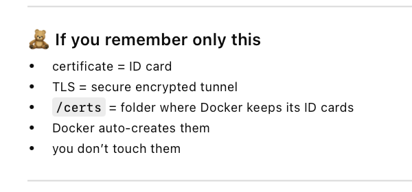

```bash
# https://github.com/docker-library/docker/pull/166
#   dockerd-entrypoint.sh uses DOCKER_TLS_CERTDIR for auto-generating TLS certificates
#   docker-entrypoint.sh uses DOCKER_TLS_CERTDIR for auto-setting DOCKER_TLS_VERIFY and DOCKER_CERT_PATH
# (For this to work, at least the "client" subdirectory of this path needs to be shared between the client and server containers via a volume, "docker cp", or other means of data sharing.)
ENV DOCKER_TLS_CERTDIR=/certs
# also, ensure the directory pre-exists and has wide enough permissions for "dockerd-entrypoint.sh" to create subdirectories, even when run in "rootless" mode
RUN mkdir /certs /certs/client && chmod 1777 /certs /certs/client
# (doing both /certs and /certs/client so that if Docker does a "copy-up" into a volume defined on /certs/client, it will "do the right thing" by default in a way that still works for rootless users)
```

### Entry point and default command
```bash
ENTRYPOINT ["docker-entrypoint.sh"]
CMD ["sh"]
```
When this container starts, it will always run: docker-entrypoint.sh first
If you don’t specify anything else, it will then run sh (a shell)


### Summary of docker file

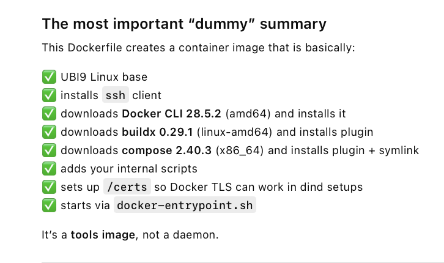


## linux/amd64
!!! important -> specify linux-amd64 while building: 

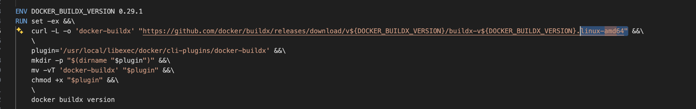

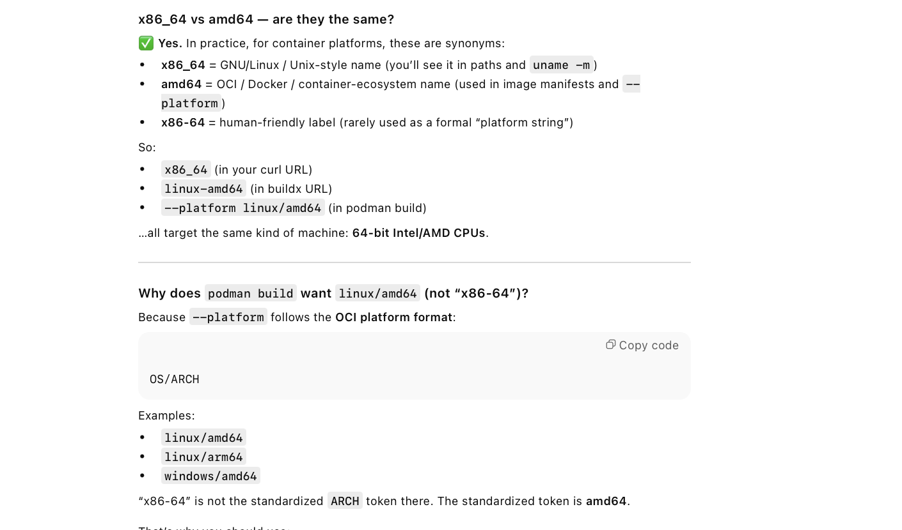

                x86_64 = GNU/Linux / Unix-style name (you’ll see it in paths and uname -m)
                amd64 = OCI / Docker / container-ecosystem name (used in image manifests and --platform)
                x86-64 = human-friendly label (rarely used as a formal “platform string”)
                So:
                x86_64 (in your curl URL)
                linux-amd64 (in buildx URL)
                --platform linux/amd64 (in podman build)
                …all target the same kind of machine: 64-bit Intel/AMD CPUs.


redhat docs:

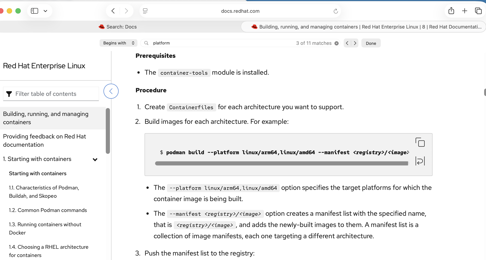


## Build the image for OC
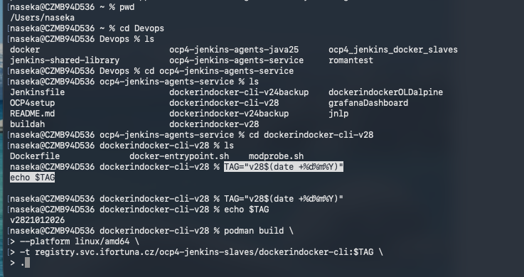

```bash
naseka@CZMB94D536 dockerindocker-cli-v28 % TAG="v28$(date +%d%m%Y)"
echo $TAG

naseka@CZMB94D536 dockerindocker-cli-v28 % TAG="v28$(date +%d%m%Y)"
naseka@CZMB94D536 dockerindocker-cli-v28 % echo $TAG
v2821012026
naseka@CZMB94D536 dockerindocker-cli-v28 % podman build \                        
> --platform linux/amd64 \
> -t registry.svc.ifortuna.cz/ocp4-jenkins-slaves/dockerindocker-cli:$TAG \
> .
```

### troubleshoot
I got error: cannot copy from source base image

```bash
STEP 1/14: FROM registry.svc.ifortuna.cz/build-images/ubi9
Trying to pull registry.svc.ifortuna.cz/build-images/ubi9:latest...
Error: creating build container: unable to copy from source docker://registry.svc.ifortuna.cz/build-images/ubi9:latest: initializing source docker://registry.svc.ifortuna.cz/build-images/ubi9:latest: pinging container registry registry.svc.ifortuna.cz: Get "https://registry.svc.ifortuna.cz/v2/": tls: failed to verify certificate: x509: certificate signed by unknown authority

naseka@CZMB94D536 dockerindocker-cli-v28 % 
```

Will try podman pull

```bash
naseka@CZMB94D536 dockerindocker-cli-v28 % podman pull registry.svc.ifortuna.cz/build-images/ubi9
Trying to pull registry.svc.ifortuna.cz/build-images/ubi9:latest...
Error: unable to copy from source docker://registry.svc.ifortuna.cz/build-images/ubi9:latest: initializing source docker://registry.svc.ifortuna.cz/build-images/ubi9:latest: pinging container registry registry.svc.ifortuna.cz: Get "https://registry.svc.ifortuna.cz/v2/": tls: failed to verify certificate: x509: certificate signed by unknown authority
naseka@CZMB94D536 dockerindocker-cli-v28 % 
```

my vm doesnt konw my company certificate

!!! add company cert into the podman machine

probably fastest is to download orbstack


## Orbstack
downloaded
Docker
terminal

```bash
naseka@CZMB94D536 dockerindocker-cli-v28 % docker version
Client:
 Version:           28.5.2
 API version:       1.51
 Go version:        go1.25.3
 Git commit:        ecc6942
 Built:             Wed Nov  5 14:42:30 2025
 OS/Arch:           darwin/arm64
 Context:           orbstack

Server: Docker Engine - Community
 Engine:
  Version:          28.5.2
  API version:      1.51 (minimum version 1.24)
  Go version:       go1.24.9
  Git commit:       89c5e8f
  Built:            Wed Nov  5 14:43:35 2025
  OS/Arch:          linux/arm64
  Experimental:     false
 containerd:
  Version:          v2.2.0
  GitCommit:        1c4457e00facac03ce1d75f7b6777a7a851e5c41
 runc:
  Version:          1.3.3
  GitCommit:        d842d7719497cc3b774fd71620278ac9e17710e0
 docker-init:
  Version:          0.19.0
  GitCommit:        de40ad0
naseka@CZMB94D536 dockerindocker-cli-v28 % 
```

## docker pull locally with Orbstack - works
naseka@CZMB94D536 dockerindocker-cli-v28 % docker pull registry.svc.ifortuna.cz/build-images/ubi9:latest
latest: Pulling from build-images/ubi9
ff45be1b2cf4: Pull complete 
Digest: sha256:071267367d1ace6aec14ad83193f4c398370a2bed393e9b5eb7cfcf7aa2baad6
Status: Downloaded newer image for registry.svc.ifortuna.cz/build-images/ubi9:latest
registry.svc.ifortuna.cz/build-images/ubi9:latest
naseka@CZMB94D536 dockerindocker-cli-v28 % 

## back to buildling image locally, but with docker

success:

```bash
naseka@CZMB94D536 dockerindocker-cli-v28 % TAG="v28$(date +%d%m%Y)"
naseka@CZMB94D536 dockerindocker-cli-v28 % echo $TAG
v2821012026
naseka@CZMB94D536 dockerindocker-cli-v28 % docker build \ 
> --platform linux/amd64 \
> -t registry.svc.ifortuna.cz/ocp4-jenkins-slaves/dockerindocker-cli:$TAG \
> .
[+] Building 18.5s (13/13) FINISHED                                                                                                                                                  docker:orbstack
 => [internal] load build definition from Dockerfile                                                                                                                                            0.0s
 => => transferring dockerfile: 2.93kB                                                                                                                                                          0.0s
 => WARN: LegacyKeyValueFormat: "ENV key=value" should be used instead of legacy "ENV key value" format (line 20)                                                                               0.0s
 => WARN: LegacyKeyValueFormat: "ENV key=value" should be used instead of legacy "ENV key value" format (line 33)                                                                               0.0s
 => WARN: LegacyKeyValueFormat: "ENV key=value" should be used instead of legacy "ENV key value" format (line 44)                                                                               0.0s
 => [internal] load metadata for registry.svc.ifortuna.cz/build-images/ubi9:latest                                                                                                              0.0s
 => [internal] load .dockerignore                                                                                                                                                               0.0s
 => => transferring context: 2B                                                                                                                                                                 0.0s
 => [1/8] FROM registry.svc.ifortuna.cz/build-images/ubi9:latest                                                                                                                                0.0s
 => [internal] load build context                                                                                                                                                               0.0s
 => => transferring context: 2.53kB                                                                                                                                                             0.0s
 => [2/8] RUN dnf install -y --setopt=tsflags=nodocs   openssh-clients                                                                                                                          4.7s
 => [3/8] RUN set -ex && curl -L -o 'docker.tgz' "https://download.docker.com/linux/static/stable/x86_64/docker-28.5.2.tgz" && tar --extract   --file docker.tgz   --strip-components 1   --di  4.5s 
 => [4/8] RUN set -ex && curl -L -o 'docker-buildx' "https://github.com/docker/buildx/releases/download/v0.29.1/buildx-v0.29.1.linux-amd64" &&  plugin='/usr/local/libexec/docker/cli-plugins/  4.7s 
 => [5/8] RUN set -ex && curl -L -o 'docker-compose' "https://github.com/docker/compose/releases/download/v2.40.3/docker-compose-linux-x86_64" &&  plugin='/usr/local/libexec/docker/cli-plugi  4.3s 
 => [6/8] COPY modprobe.sh /usr/local/bin/modprobe                                                                                                                                              0.0s 
 => [7/8] COPY docker-entrypoint.sh /usr/local/bin/                                                                                                                                             0.0s 
 => [8/8] RUN mkdir /certs /certs/client && chmod 1777 /certs /certs/client                                                                                                                     0.1s 
 => exporting to image                                                                                                                                                                          0.1s 
 => => exporting layers                                                                                                                                                                         0.1s 
 => => writing image sha256:4abb83a6ece42262b1782f396957caeab6fd1a212d83c5ebad117238d6d1b565                                                                                                    0.0s 
 => => naming to registry.svc.ifortuna.cz/ocp4-jenkins-slaves/dockerindocker-cli:v2821012026                                                                                                    0.0s

 3 warnings found (use docker --debug to expand):
 - LegacyKeyValueFormat: "ENV key=value" should be used instead of legacy "ENV key value" format (line 20)
 - LegacyKeyValueFormat: "ENV key=value" should be used instead of legacy "ENV key value" format (line 33)
 - LegacyKeyValueFormat: "ENV key=value" should be used instead of legacy "ENV key value" format (line 44)
naseka@CZMB94D536 dockerindocker-cli-v28 % 
```


## image is stored locally inside OrbStack's Docker vm.

i can see the images (ubi 9 pulled base image and new tagged image of docker indocker) in Orbstack:
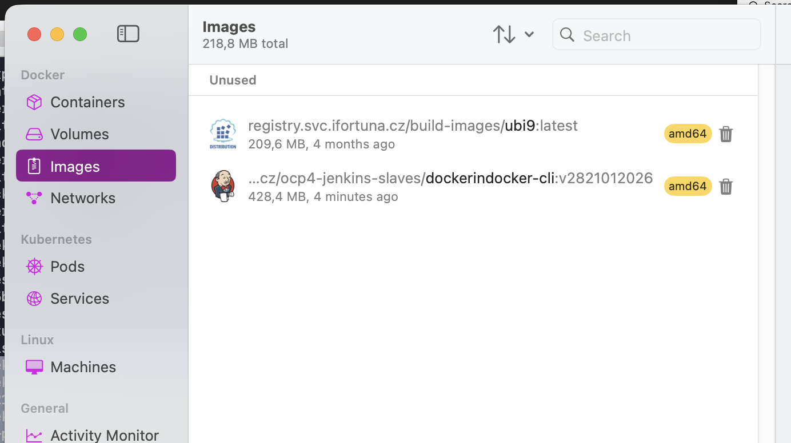


`docker images`

```bash
naseka@CZMB94D536 dockerindocker-cli-v28 % docker images
REPOSITORY                                                        TAG           IMAGE ID       CREATED         SIZE
registry.svc.ifortuna.cz/ocp4-jenkins-slaves/dockerindocker-cli   v2821012026   4abb83a6ece4   6 minutes ago   428MB
registry.svc.ifortuna.cz/build-images/ubi9                        latest        a169546264dd   4 months ago    210MB
naseka@CZMB94D536 dockerindocker-cli-v28 % 
```


## image inspection prior pushing it

### 1) image exists
`docker images | grep dockerindocker-cli`


```bash
naseka@CZMB94D536 dockerindocker-cli-v28 % docker images | grep dockerindocker-cli
registry.svc.ifortuna.cz/ocp4-jenkins-slaves/dockerindocker-cli   v2821012026   4abb83a6ece4   15 minutes ago   428MB
naseka@CZMB94D536 dockerindocker-cli-v28 % 
```

### 2) inspect the metadata
`docker inspect imagerepository:tag`

i can see creation date, architecture and os there. 

```bash
naseka@CZMB94D536 dockerindocker-cli-v28 % docker inspect registry.svc.ifortuna.cz/ocp4-jenkins-slaves/dockerindocker-cli:v2821012026  
[
    {
        "Id": "sha256:4abb83a6ece42262b1782f396957caeab6fd1a212d83c5ebad117238d6d1b565",
        "RepoTags": [
            "registry.svc.ifortuna.cz/ocp4-jenkins-slaves/dockerindocker-cli:v2821012026"
        ],
        "RepoDigests": [],
        "Parent": "",
        "Comment": "buildkit.dockerfile.v0",
        "Created": "2026-01-21T11:48:11.679668541+01:00",
        "DockerVersion": "",
        "Author": "",
        "Architecture": "amd64",
        "Os": "linux",
        "Size": 428404450,
        "GraphDriver": {
            "Data": {
                "LowerDir": "/var/lib/docker/overlay2/djy3p5jn37rpiz5nqfzb2z0no/diff:/var/lib/docker/overlay2/d6ymbsp3364p5q18q43ixc0wv/diff:/var/lib/docker/overlay2/r0vr55wx5cp4lsn4kseliyd4p/diff:/var/lib/docker/overlay2/9allrdy9ffe1hz225xnc8vkhg/diff:/var/lib/docker/overlay2/j9wzvv5jejs4x9u8spm02xkyr/diff:/var/lib/docker/overlay2/nwnis0v61zld11qpn5gvyydds/diff:/var/lib/docker/overlay2/2c102bc5ee2172c6c6d293feed94b2ac38343d37f4e6fa88c3dcfa8da3a2e95c/diff",
                "MergedDir": "/var/lib/docker/overlay2/rh0mv1w4xtpo1x4izrexjg3t2/merged",
                "UpperDir": "/var/lib/docker/overlay2/rh0mv1w4xtpo1x4izrexjg3t2/diff",
                "WorkDir": "/var/lib/docker/overlay2/rh0mv1w4xtpo1x4izrexjg3t2/work"
            },
            "Name": "overlay2"
        },
        "RootFS": {
            "Type": "layers",
            "Layers": [
                "sha256:70bccdb16279fab744edcf78bf4ef42ca06cddc350ad437cfd1d0a0f1702d3b8",
                "sha256:8850b877f66b6a533561347322495ffbd35784bcbbd4bcd387b5a071ac250373",
                "sha256:28a9b5226da7b41d2a32109efc6923bd4c71c747ca2179dbe05b583b4e52d258",
                "sha256:54d26bd5f78ce57316798a9f6052d8d048aaca93edf683f27c0b9ff0c1fd4106",
                "sha256:fbe81f33d3a603c02fca9b14d36d6fe0d6ac2c69f9607cbc2923b3a0c9d01309",
                "sha256:298c0bb62e6e77f15d09c7e0b42837bba2b8d7582bf896e2fbef7e85336bd787",
                "sha256:516f219429ef5be442e94833c77302931ac25ca0abfd5a32a5d38581065dd6a1",
                "sha256:64445b704757a0c363b66f9a4d1d4256b7cecbe1252519a381d01ef89979e6c3"
            ]
        },
        "Metadata": {
            "LastTagTime": "2026-01-21T11:48:11.80812506+01:00"
        },
        "Config": {
            "ArgsEscaped": true,
            "Cmd": [
                "sh"
            ],
            "Entrypoint": [
                "docker-entrypoint.sh"
            ],
            "Env": [
                "PATH=/usr/local/sbin:/usr/local/bin:/usr/sbin:/usr/bin:/sbin:/bin",
                "container=oci",
                "DOCKER_VERSION=28.5.2",
                "DOCKER_BUILDX_VERSION=0.29.1",
                "DOCKER_COMPOSE_VERSION=2.40.3",
                "DOCKER_TLS_CERTDIR=/certs"
            ],
            "Labels": {
                "architecture": "x86_64",
                "build-date": "2025-09-18T08:46:43Z",
                "com.redhat.component": "ubi9-container",
                "com.redhat.license_terms": "https://www.redhat.com/en/about/red-hat-end-user-license-agreements#UBI",
                "description": "The Universal Base Image is designed and engineered to be the base layer for all of your containerized applications, middleware and utilities. This base image is freely redistributable, but Red Hat only supports Red Hat technologies through subscriptions for Red Hat products. This image is maintained by Red Hat and updated regularly.",
                "distribution-scope": "public",
                "io.buildah.version": "1.40.1",
                "io.k8s.description": "The Universal Base Image is designed and engineered to be the base layer for all of your containerized applications, middleware and utilities. This base image is freely redistributable, but Red Hat only supports Red Hat technologies through subscriptions for Red Hat products. This image is maintained by Red Hat and updated regularly.",
                "io.k8s.display-name": "Red Hat Universal Base Image 9",
                "io.openshift.expose-services": "",
                "io.openshift.tags": "base rhel9",
                "maintainer": "Red Hat, Inc.",
                "name": "ubi9",
                "org.opencontainers.image.revision": "a467c5c3b658cb31bf21105b08df3cffa0f60ca7",
                "release": "1758184894",
                "summary": "Provides the latest release of Red Hat Universal Base Image 9.",
                "url": "https://catalog.redhat.com/en/search?searchType=containers",
                "vcs-ref": "a467c5c3b658cb31bf21105b08df3cffa0f60ca7",
                "vcs-type": "git",
                "vendor": "Red Hat, Inc.",
                "version": "9.6"
            },
            "OnBuild": null,
            "User": "",
            "Volumes": null,
            "WorkingDir": "/"
        }
    }
]
naseka@CZMB94D536 dockerindocker-cli-v28 % 
```


then we create image with today date + dmy:

`podman build...`

podman build == docker build

Podman does NOT automatically talk to Jenkins
Podman does NOT automatically deploy
Podman does NOT automatically affect OpenShift

podman build runs locally on my machine


i dont need to create repos, cause they already exist:

if i open the repositories i can see those: 


podman pull registry.svc.ifortuna.cz/ocp4-jenkins-slaves/dockerindocker


podman pull registry.svc.ifortuna.cz/ocp4-jenkins-slaves/dockerindocker-cli

so i only need to add new tags


i login to openshift `oc login ..token`

### 3) run the image and ask binary for version
`docker run --rm -it \
  registry.svc.ifortuna.cz/ocp4-jenkins-slaves/dockerindocker-cli:v2821012026 \
  sh`


-i = interactive
Keeps STDIN open (you can type)
-t = tty
Gives you a terminal
Together:
“Let me interact with the container like with a normal shell.”
Without -it, you wouldn’t be able to type commands.

--rm “Delete the container automatically when I exit.”

this warning is great, so all correct. cause i need amd 64

```bash
> registry.svc.ifortuna.cz/ocp4-jenkins-slaves/dockerindocker-cli:v2821012026 \
> sh
WARNING: The requested image's platform (linux/amd64) does not match the detected host platform (linux/arm64/v8) and no specific platform was requested
sh-5.1# 
```

```bash
> sh
WARNING: The requested image's platform (linux/amd64) does not match the detected host platform (linux/arm64/v8) and no specific platform was requested
sh-5.1# docker --version
Docker version 28.5.2, build ecc6942
sh-5.1# docker buildx version
github.com/docker/buildx v0.29.1 a32761aeb3debd39be1eca514af3693af0db334b
sh-5.1# docker compose version
Docker Compose version v2.40.3
sh-5.1# 
```

### kill container
`exit`

```bash
sh-5.1# exit
exit
naseka@CZMB94D536 dockerindocker-cli-v28 % 
```

## push image to registry

### docker login

`docker login..`

```bash
docker login registry.svc.ifortuna.cz \
  -u="$app" \
  -p="APPLICATION_TOKEN"
```

$app is a username

but this path doesnt work for me (Login token (or whole command) generated on registry.svc.ifortuna.cz - Account Settings - Gears icon - Create Application Token button)

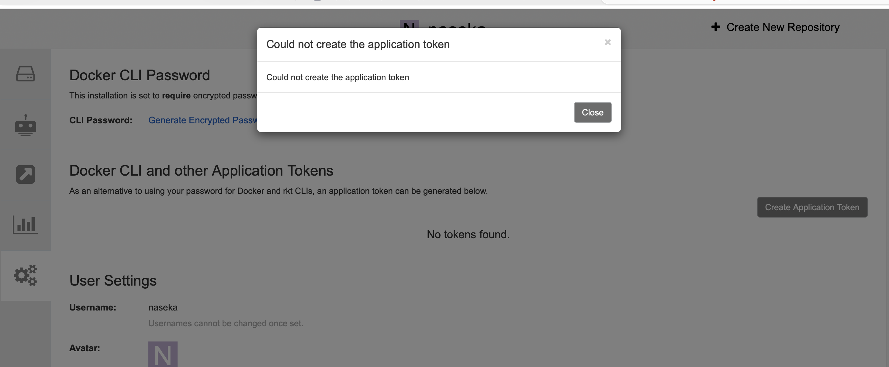


## after buliding cli version build final version

### back to directory

```bash
naseka@CZMB94D536 dockerindocker-cli-v28 % cd ..
naseka@CZMB94D536 ocp4-jenkins-agents-service % ls
Jenkinsfile			README.md			dockerindocker-cli-v24backup	dockerindocker-v24backup	dockerindockerOLDalpine		jnlp
OCP4setup			buildah				dockerindocker-cli-v28		dockerindocker-v28		grafanaDashboard
naseka@CZMB94D536 ocp4-jenkins-agents-service % cd dockerindocker-v28
naseka@CZMB94D536 dockerindocker-v28 % 
```

### modify from -> use our new tag as per pushed image (i dont have it yet pushed):

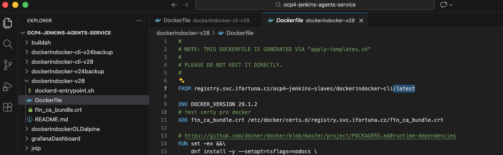

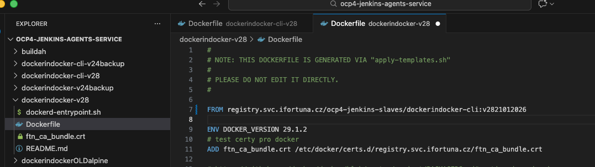

### modify version as per docker file in cli

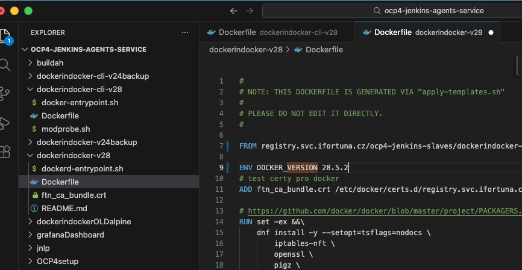

### build image locally

same as before, just different file location

```bash
naseka@CZMB94D536 dockerindocker-v28% TAG="v28$(date +%d%m%Y)"
naseka@CZMB94D536 dockerindocker-v28 % echo $TAG
v2821012026
naseka@CZMB94D536 dockerindocker-v28 % docker build \ 
> --platform linux/amd64 \
> -t registry.svc.ifortuna.cz/ocp4-jenkins-slaves/dockerindocker:$TAG \
> .
```

### verify images

`docker images`

### incpect image

`docker inspect`

### run container out of that image

`docker run --rm -it \
  registry.svc.ifortuna.cz/ocp4-jenkins-slaves/dockerindocker:v2821012026 \
  sh`

### test commands

```bash
> sh
WARNING: The requested image's platform (linux/amd64) does not match the detected host platform (linux/arm64/v8) and no specific platform was requested
sh-5.1# docker --version
Docker version 28.5.2, build ecc6942
sh-5.1# docker buildx version
github.com/docker/buildx v0.29.1 a32761aeb3debd39be1eca514af3693af0db334b
sh-5.1# docker compose version
Docker Compose version v2.40.3
sh-5.1# 
```

* crucial for docker in docker. this contaienr has to be allowed to be privileged!!! so test this command


```docker run -d --privileged \
  registry.svc.ifortuna.cz/ocp4-jenkins-slaves/dockerindocker:v2820012026```


* “Open a terminal inside the running dockerindocker container.”

`docker exec -it <container>`


then we do the following: 

4) OpenShift: create/update ImageStream for your tag
Because your environment uses ImageStreams as cache/indirection:
oc import-image dockerindocker:<TAG> \
  --from=registry.svc.ifortuna.cz/ocp4-jenkins-slaves/dockerindocker:<TAG> \
  --reference-policy=local --scheduled=true --confirm \
  -n shared-images
✅ Outcome: OpenShift can pull it via ImageStream/cache reliably.
5) Jenkins: update pod template (THIS makes pipelines use it)
Update Jenkins configuration (UI or jenkins.yaml on server) for the DinD agent:
either create a new template like dockerindocker-v28
or update existing template to point to <TAG> (safer to create a new one first)
Only this step changes what Jenkins runs.
✅ Outcome: next job using that label starts pods from the new image.
6) Jenkins test job (must-do)
Run a tiny job on the new label/template:
docker --version
docker info
docker run --rm hello-world (or a small Testcontainers repo)
✅ Outcome: proof in the real place that matters (Jenkins+OpenShift).
