1) git clone the repo (jenkins-docker slaves) with all necessary agent folders
2) copy agent folder
3) change name of folder accordingly
4) modify docker file: 
        1) modify path FROM registry... to 28?? check the problem with latest described in docker in docker roman ppt
        2) we run the command to test it and investigate in terminal:

  
            podman run -it <image-from-FROM> bash
            after we are done with it -> exit shell process (only shell process stops):

            exit

            podman run = start a container from an image -i = keep STDIN open (so you can type) -t = allocate a TTY (interactive terminal)

            podman run -it registry.../java21:latest

            he’s basically opening a shell-like session inside that image.

            Sometimes you need to specify a shell explicitly, depending on the image: podman run -it  bash or podman run -it  sh

            then we check inside
5) if we miss smth we need to download it and uppload to nexus (gradle case. not sure for docker). check readme

        not sure if i have nexus access already???

6) then change variables related to it in the docker file. for ex. if there is exact version of gradle in arguments -> modify it to current one. check readme


7) edit jenkins file, so it knows it needs to rebiuld something
    he added an extra stage 

8) in quay we created repository (created a place where to save our image)

9) we add oc import image command to read me file. this command will be ran later

10) he pushes changes to bitbucket -> webhook -> it will trigger build in jenkins

11) we check the logs of the jobL ocp4 slaves master (our agent building job in jenkins)

12) it takes time. then in the end of the log we can see that pipeline pushes image to quay

13) we can open quay and see the image there (at the destination we created earlier)
14) we run oc import-image ... in our terminal -> it creates the link


## read readme 
## find out changes on docker in docker in the past. i have access to bitbucket, maybe i can verify??? i think he said once a year we change
## understand the point of roman test repo (practice biuld new agent part) -> check the repo and its history
## check transcripts of new videos from yazdan


# problem: 

upgrade to 29 was automatic due to the tag: latest -> always latest version. its a problem.

??? what would be quick way to verify on which exact version we are now?

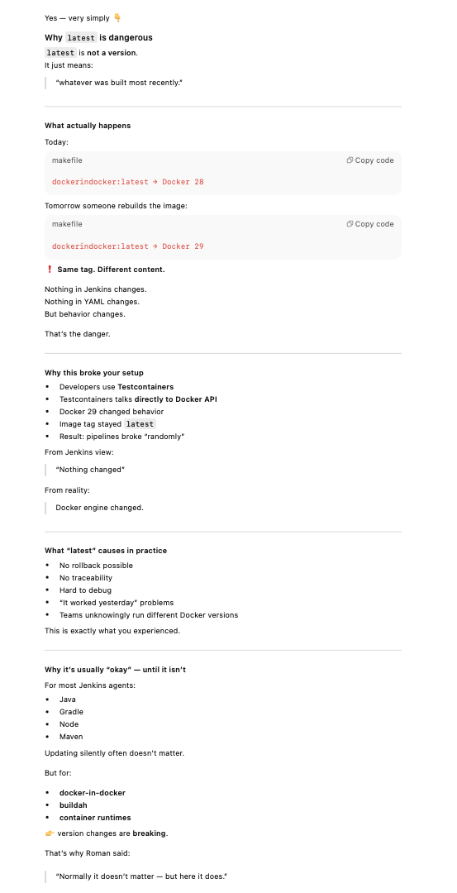

# postup

problem with 29 version -> so downgrade

oficial release notes of docker: https://docs.docker.com/engine/release-notes/28/
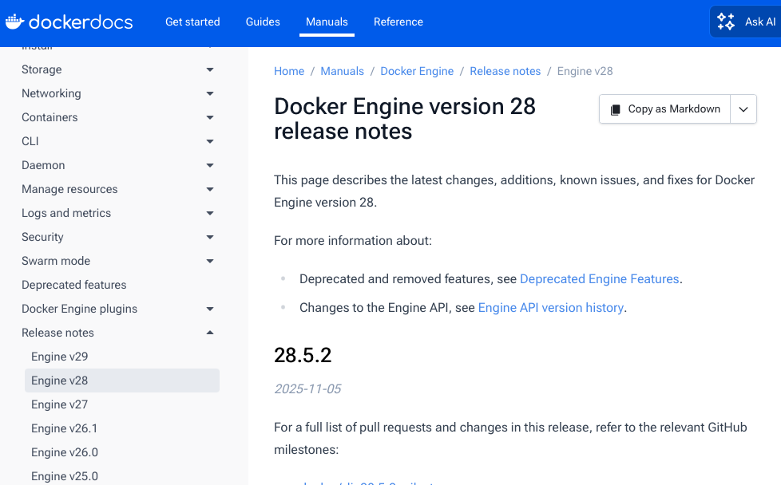

so lastest is 28.5.2

1. get latest docker version from source code in github
 done: cloned to Devops folder

2. check git log

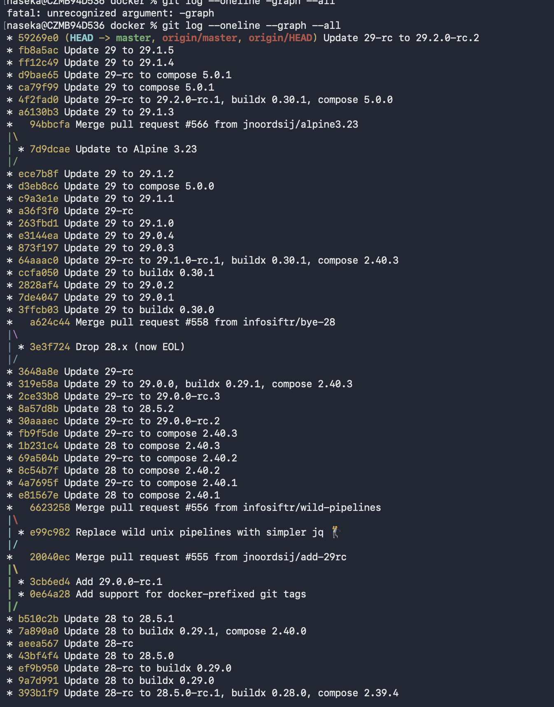


search for latest 28 version:

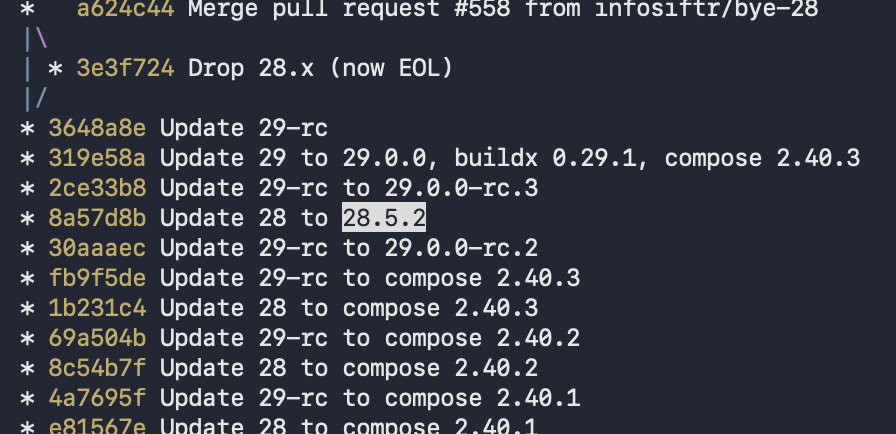


checkout to that commit:

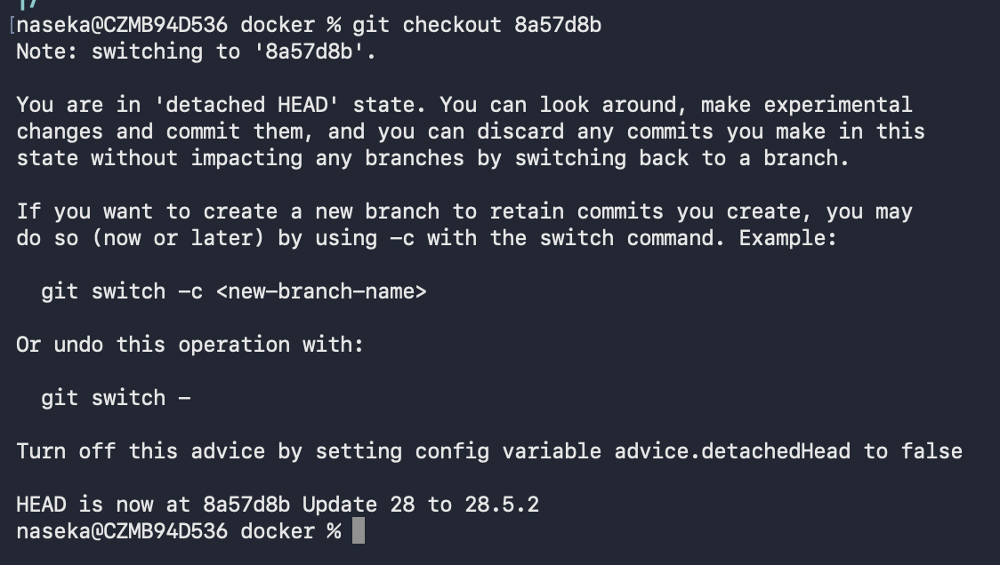

1) Docker CLI = those are commands. a binary program, it doesnt run containers, it just talks to Docker daemon. thats our source
2) Docker daemon (dind)


version is composed of 3 parts:

DOCKER_VERSION, DOCKER_BUILDX_VERSION and DOCKER_COMPOSE_VERSION

env docker_version 28.5.2
env docker_buildx_version 0.29.1
env docker_compose_version 2.40.3


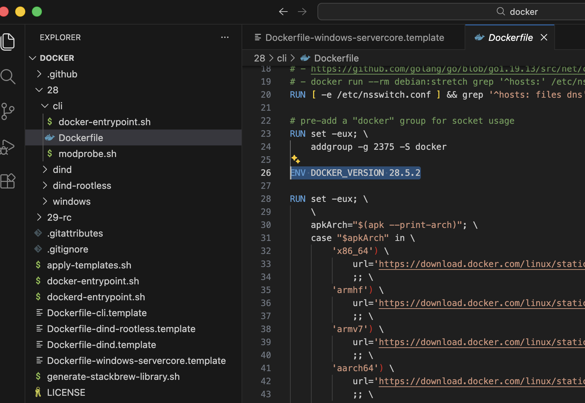

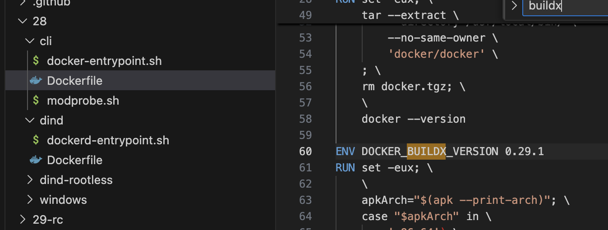

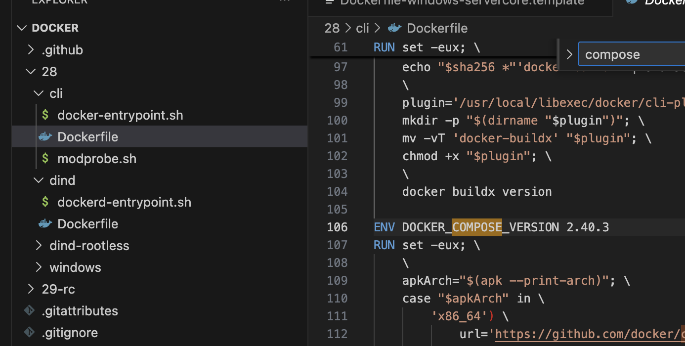


then we open our docker file in our repo and paste "working combination" of versions there -> so our internal CLI image will behave exactly like official Docker 28.5.2:

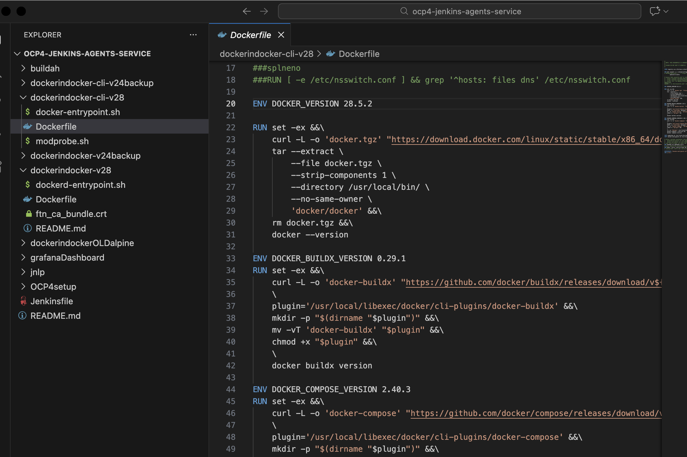

then cd to that cli folder with docker file containing versions we need:

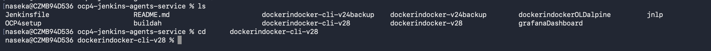


prior running podman .. i have mac -> so i need vm:

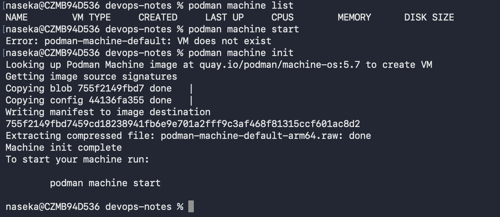

for that i use 2 commands:

```bash
podman machine init   # once
podman machine start  # every time after reboot
```
useful: 

`podman machine list`

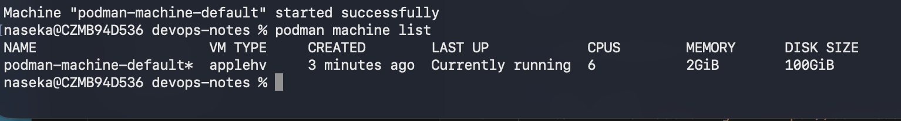


then we create image with today date + dmy:

`podman build...`

podman build == docker build

Podman does NOT automatically talk to Jenkins
Podman does NOT automatically deploy
Podman does NOT automatically affect OpenShift

podman build runs locally on my machine


i dont need to create repos, cause they already exist:

if i open the repositories i can see those: 
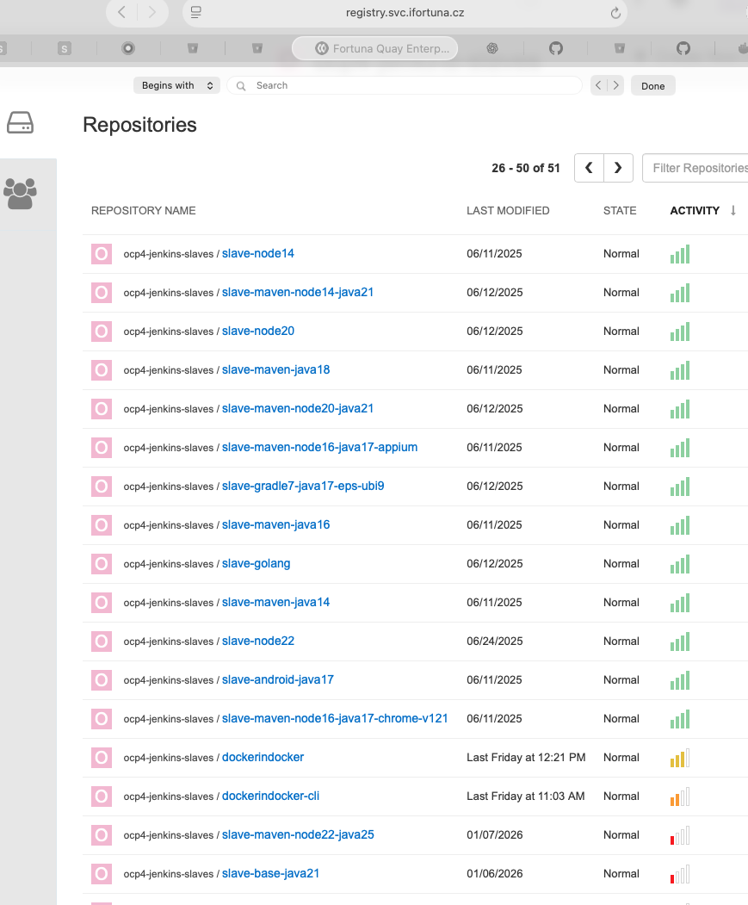

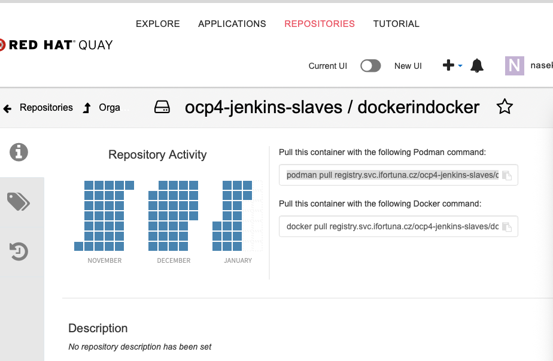

podman pull registry.svc.ifortuna.cz/ocp4-jenkins-slaves/dockerindocker


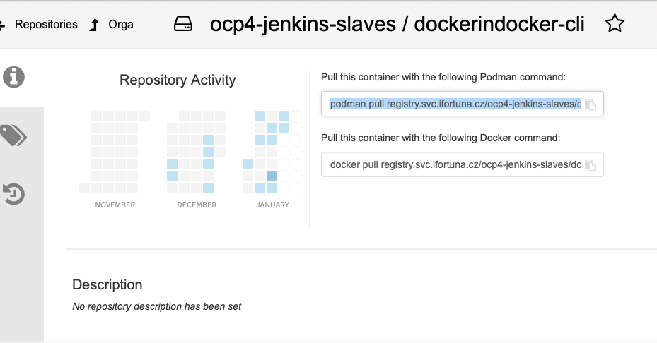

podman pull registry.svc.ifortuna.cz/ocp4-jenkins-slaves/dockerindocker-cli

so i only need to add new tags

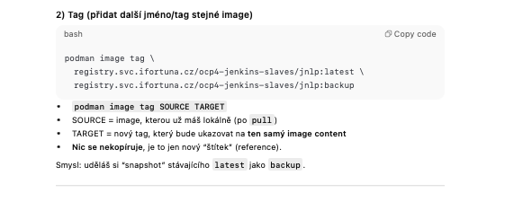

i login to openshift `oc login ..token`
