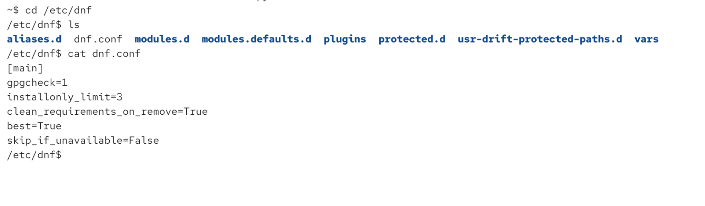

# DNF Removing Packages And Autoremove

## What This Is About

This note explains what happens when you remove packages with DNF.

Important idea:

```text
DNF may remove dependencies automatically if it thinks they are no longer needed.
```

This can be dangerous on production servers if an application still needs one of those dependency packages.

## Why It Matters

Imagine you install package A.

Package A needs package B, so DNF installs B automatically.

Later you remove package A.

DNF may also remove package B because it thinks:

```text
B was only installed for A.
A is gone.
So B is no longer needed.
```

But your application may still use package B directly.

Then removing A can accidentally break your application.

## Example: Matplotlib And NumPy

`python3-matplotlib` is a Python plotting/graphics library.

It can be used for:

- graphs
- bar charts
- pie charts
- visualizations

It depends on other Python packages. One example is:

```text
python3-numpy
```

`numpy` is used for numerical programming.

Dependency relationship:

```text
python3-matplotlib needs python3-numpy
```

## Check Before Installing

Try importing NumPy before it exists:

```bash
python3 -c "import numpy as np" #1.starts python3 2.-c means "the next thing is Python code as text" 3."import numpy as np" - its a code to run, meaning load numpy library and give it a short name np.
```

Expected error:

```text
No module named numpy
```

Meaning:

```text
The Python NumPy module is not installed.
```

## Install Matplotlib

Install:

```bash
sudo dnf install python3-matplotlib
```

DNF will install `python3-matplotlib` and many dependencies, including:

```text
python3-numpy
```

After installation, this works:

```bash
python3 -c "import numpy as np"
```

No output means success.

## Removing Packages Can Remove Dependencies

Now remove Matplotlib:

```bash
sudo dnf remove python3-matplotlib
```

DNF may also remove packages that were installed only as dependencies.

That can include:

```text
python3-numpy
```

After removal, this may fail again:

```bash
python3 -c "import numpy as np"
```

Possible error:

```text
No module named numpy
```

## Production Risk

This is the dangerous case:

```text
Old application used matplotlib and numpy.
Later you remove matplotlib.
Application still needs numpy.
DNF removes numpy automatically.
Application breaks.
```

So package removal is not always harmless.

Before confirming `dnf remove`, carefully read the list of packages DNF wants to remove.

## Disabling Automatic Dependency Removal

DNF has configuration in:

```text
/etc/dnf/dnf.conf
```
/etc contains system configuration files, examples:

```text
/etc/passwd        user account info
/etc/group         groups
/etc/shadow        encrypted password info
/etc/sudoers       sudo/admin rules
/etc/ssh/          SSH server/client config
/etc/hosts         local hostname/IP mappings
/etc/fstab         filesystems mounted at boot
/etc/dnf/          DNF package manager config
/etc/yum.repos.d/  repository definitions
/etc/systemd/      systemd service config
```

There is an option that controls automatic removal of dependencies:



Disabling automatic dependency removal can prevent DNF from removing old dependencies immediately.

But this is not a perfect fix.

Why:

```text
Unused dependencies will accumulate over time.
Later, if you run dnf autoremove, they may still be removed.
```

So disabling automatic removal often only moves the problem to a later date.

## Remove Package Without Autoremoving Dependencies

You can remove one package while keeping dependencies:

```bash
sudo dnf remove --noautoremove python3-matplotlib
```

Meaning:

```text
Remove python3-matplotlib, but do not automatically remove dependencies that were installed for it.
```

After this, `python3-numpy` may remain installed.

But there is still a risk:

```bash
sudo dnf autoremove #this will remove the packages that are marked as intalled only as dependancies and no longer required by any user-installed package. so it will also remove numpy with this command
```

If NumPy is still marked as dependency-only, `dnf autoremove` may remove it later.

## Best Solution: Mark Important Packages As User Installed

If your application needs a package directly, mark it as manually installed.

Example:

```bash
sudo dnf mark install python3-numpy
```

DNF output may say:

```text
python3-numpy marked as user installed
```

Meaning:

```text
DNF now treats python3-numpy as something you intentionally installed.
It should not be removed just because another package was removed.
```

Then removing Matplotlib should not remove NumPy:

```bash
sudo dnf remove python3-matplotlib
```

## Important DNF Nuance

This is very important:

```bash
sudo dnf install python3-numpy
```

does **not always** mark `python3-numpy` as manually installed if it is already installed as a dependency.

Example flow:

```bash
sudo dnf install python3-matplotlib
```

This installs:

```text
python3-matplotlib = user installed
python3-numpy = dependency installed
```

Now running:

```bash
sudo dnf install python3-numpy
```

may only say it is already installed.

It may **not** change its reason from dependency-installed to user-installed.

To explicitly change the reason, use:

```bash
sudo dnf mark install python3-numpy
```

## Difference From APT

On Debian/Ubuntu systems, using `apt install` on an already installed dependency may mark it as manually installed.

With DNF, do not rely on that behavior.

Use:

```bash
sudo dnf mark install PACKAGE
```

when you want to protect an already installed dependency from future autoremove.

## Main Commands

Install package:

```bash
sudo dnf install python3-matplotlib
```

Remove package:

```bash
sudo dnf remove python3-matplotlib
```

Remove package but keep dependency packages:

```bash
sudo dnf remove --noautoremove python3-matplotlib
```

Remove packages DNF thinks are no longer needed:

```bash
sudo dnf autoremove
```

Mark dependency as manually installed:

```bash
sudo dnf mark install python3-numpy
```

Test whether NumPy is importable:

```bash
python3 -c "import numpy as np"
```

## How To Read DNF Remove Output

When running:

```bash
sudo dnf remove PACKAGE
```

Always inspect the package list before pressing `y`.

Ask:

```text
Do I really want all of these packages removed?
Could any application still depend on one of these?
Should I mark some of them as user installed first?
```

If unsure, stop and investigate.

## Practice Lab

Run on a test machine only:

```bash
python3 -c "import numpy as np"
```

Install Matplotlib:

```bash
sudo dnf install python3-matplotlib
```

Test NumPy:

```bash
python3 -c "import numpy as np"
```

Mark NumPy as manually installed:

```bash
sudo dnf mark install python3-numpy
```

Remove Matplotlib:

```bash
sudo dnf remove python3-matplotlib
```

Test NumPy again:

```bash
python3 -c "import numpy as np"
```

Expected:

```text
NumPy still works because it was marked as user installed.
```

## Summary

```text
DNF tracks why packages were installed.
```

A package can be installed because:

- user explicitly installed it
- it was pulled in as a dependency

When removing packages, DNF may remove dependency-only packages automatically.

This can break applications if they still need those packages.

Best protection:

```bash
sudo dnf mark install PACKAGE
```

Most important habit:

```text
Always read the full package removal list before confirming dnf remove.
```
