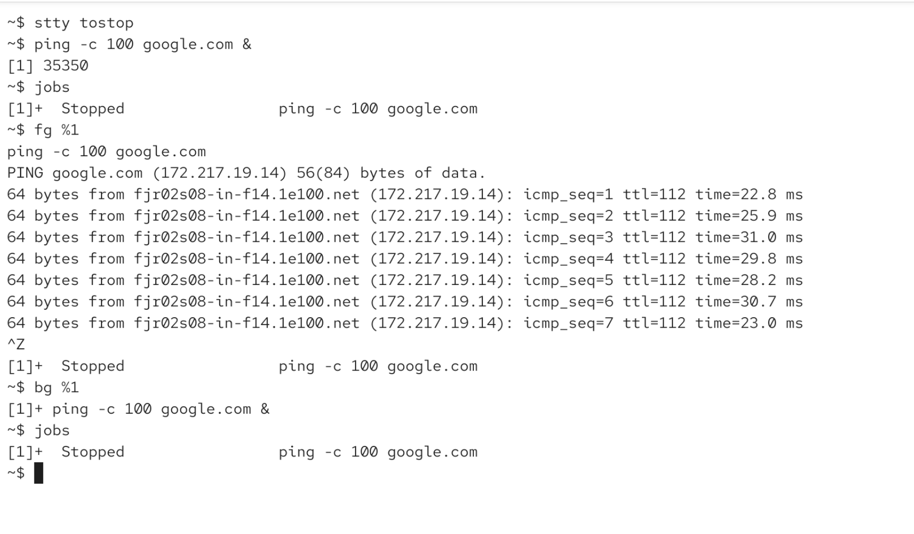
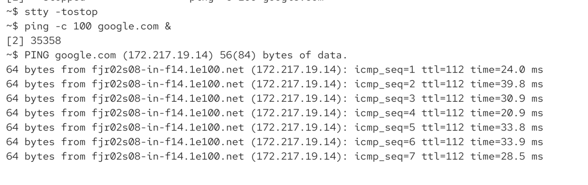

if we did 

`ping -c 100 google.com > /dev/null &`

`stty tostop` 

* stty = tool to change/print the terminal line settings

* tostop option tells to suspend the job if it clreates any output -> so 

* when we now start a background job it will only run until it creates any output
* once it writes any output, the job will be suspended immediately

to disable the feature

`stty -tostop`

so ping created some line and immediately got stopped:

now we disabled the option:

