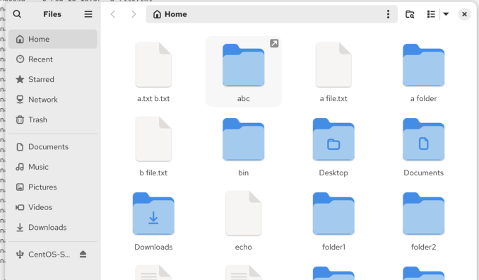

Symlink = special kind of file on unix

purpose: serves as a reference to another file or directory. special way of shortcut to another destination

the idea: we create a special file, that contains a reference to the destination path

# how to create a symlink

`ln -s target link` = ln = tool to make links between files

```bash
~$ ln -s Desktop/ abc
~$ ls
 abc          'a folder'     'b file.txt'   Desktop     Downloads   folder1   foler1_contentx.txt   Music      Public      Videos
'a file.txt'  'a.txt b.txt'   bin           Documents   echo        folder2   foler2_contentx.tx    Pictures   Templates
~$ 
```


it gets resolved at a runtime: if i create a folder inside abc -> it will immediately created on desktop

we can also see if a file is a symlink: ls -l:


why its useful: 

for ex. we had a big application with a lot of source code and executable files. then we got a folder in our application with images. i can create this folder somewhere else in my laptop. and create a simlink in my application, which will take me to the directory in my laptop. we can then use symlink in teriminal as real folder (like cd command etc). even if it looks like we store pics there, it will be actually stored in the original folder, not in simlink

simlink can just reference file as a simlink as well. so if you do any changes in one file, it will also affect the file in simlink. 

symlinks are calculated when ever we access them. 

for ex.: we plugged in a usb card. in our file path we can see Parent folder /media/janniss/SD-Karte. 


