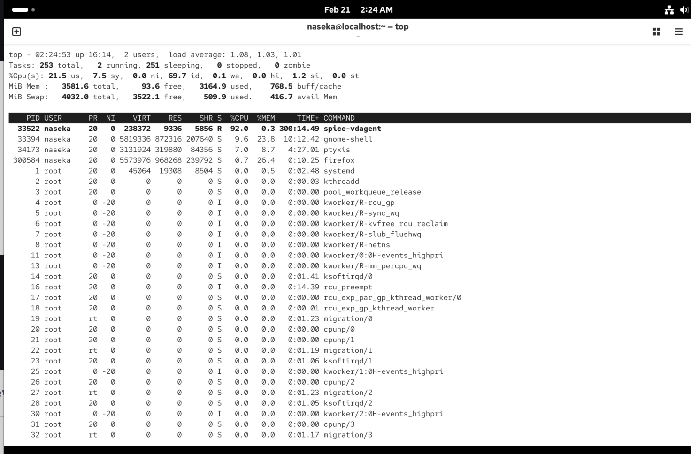
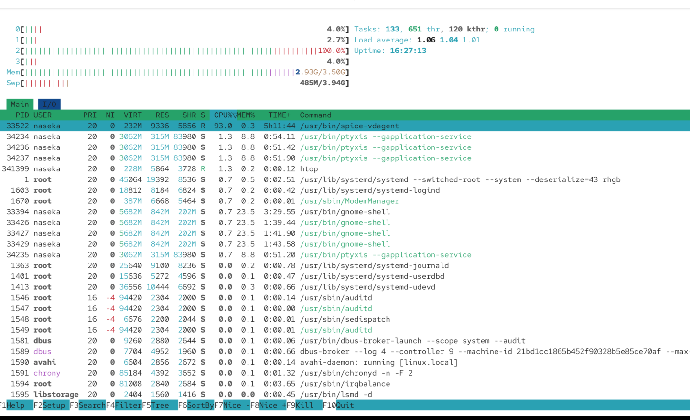

# top program

allows to display all ps in our system. its like a system monitor in terminal:

`top`

to quit: `q` key or ctrl c

internally top is looking into the folder:

`/proc/processid/infoonthatprocessindifferentfiles` for ex. `cat /proc/3729/io` -> will show if there is some inputoutput of files happinging

`sudo top` might have more processes

whats the outupt of top:

we can see current time, load averate (how much processing power we used in the last minute, how much in the last 5 min, how much is used in hte last 15 min. for ex. 0.37 cpu cores in the last 1 minute - number might be bigger than one if you have more than one core); percentage cpu in total: 3/4 userspace, 0.8 sy, 0,0 ni etc..; we can see how much memory we have. buff/cache (could be freed if there is some memory bottleneck)

# top vs htop

htop is even better

