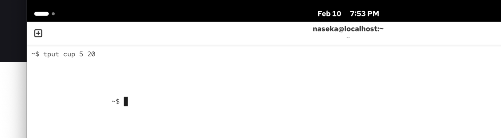
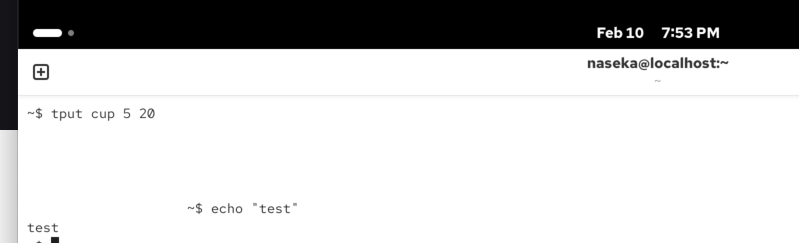
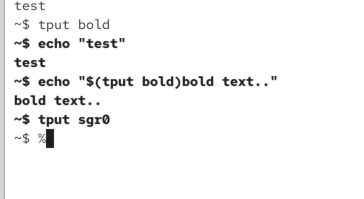
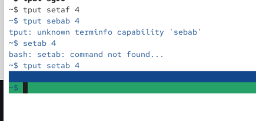
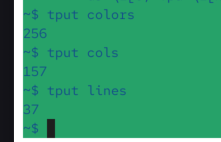
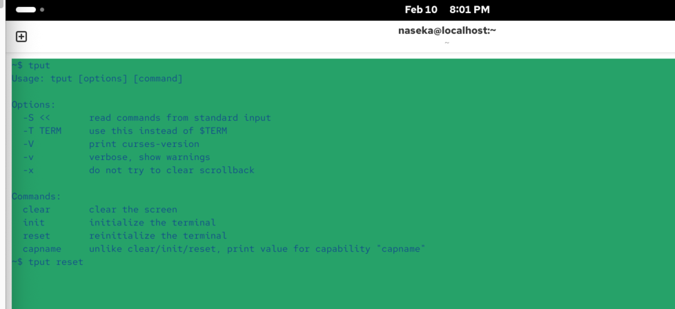
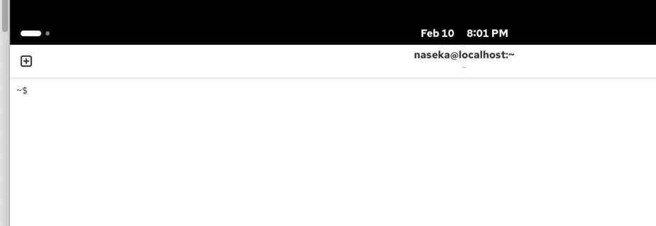
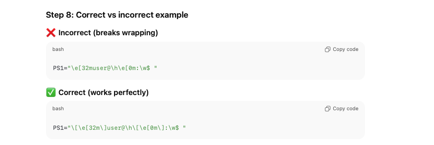

with infocmp we could generate easier with tput

tput clear: clears terminal

tput: generates escape sequence.

it moved my coursor:

then when i type anything it goes back:

its just escape sequesnces generation and it terminal turn them into actions:

`setaf` : front color
`setab`: background color

here we will see how many colors, columns (how many characters, depending on the zooming) and lines our terminal supports:

# extra

bash needs to know how long our PS1 prompt is (calculated 
automatically)

escape characters are the problem to calculate: then the line can be broken - lesss characters can be allowed. line wraps in the wrong places.

our shell can only communicate with our terminal certain way. it needs to konw how long our prompt is, cause by default calculation of characters is off. it leads to inconsistencies.

how we can solve it?

we need to wrap all escape sequences into `\[... \]` -> then escape sequences won't be counted as normal characters

current folder and the arrow. use doublequots
if we use \ -> its escaping, so \$ will be regular dollar sign

you can use all unicode charactesrs what terminal supports (emogies for ex.). google for unicode character error/emoji etc. 

PS1="....$(tput sgr0)"

# tput — simple explanation

## What is `tput`

`tput` is a command that controls how text looks and behaves in the terminal.

---

## Think of it like this

Your terminal = screen  
`tput` = remote control

It can:
- move cursor
- change colors
- clear screen
- format text

---

## Basic examples

### Clear screen

    tput clear

Same as `clear`.

---

### Move cursor

    tput cup 5 10

Moves cursor to:
- row 5
- column 10

---

### Colors

    tput setaf 1
    echo "Hello"
    tput sgr0

Prints red text.

Color numbers:
- 0 → black
- 1 → red
- 2 → green
- 3 → yellow
- 4 → blue

---

### Bold text

    tput bold
    echo "Important"
    tput sgr0

---

### Hide / show cursor

    tput civis
    tput cnorm

---

## Why `tput` exists

Different terminals behave differently.

Instead of hardcoding escape sequences like:

    echo "\033[31m"

You use:

    tput setaf 1

This is:
- portable
- safer

---

## Real DevOps use

Used in scripts for:
- colored logs
- progress bars
- clean CLI output

Example:

    tput setaf 2
    echo "SUCCESS"
    tput sgr0

---

## Key takeaway

`tput` is a tool to control terminal behavior like colors, cursor movement, and formatting in a portable way.