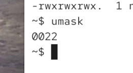
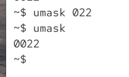
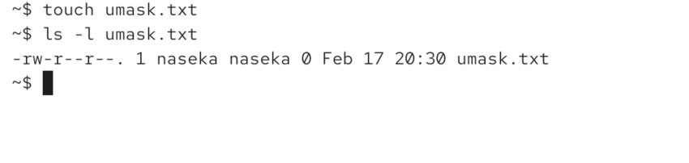
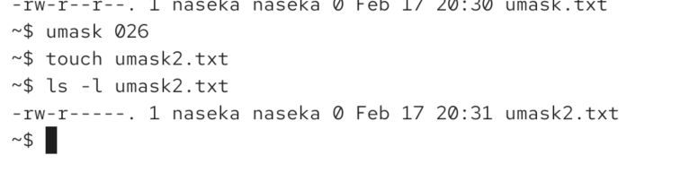
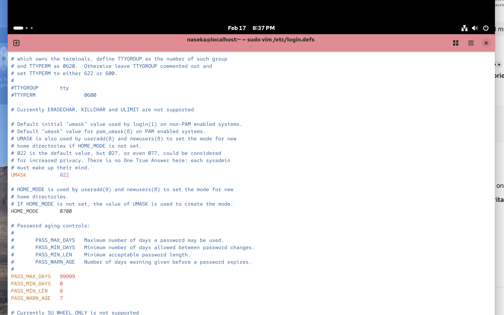

# umask

* = permissions you REMOVE by default, when new files or folders are created. 

* it doesnt add permissoions

# default permissions

```bash
folders → 777  (rwxrwxrwx)
files   → 666  (rw-rw-rw-)
```
* no execute on files, because random files should not be executable by default


# umask removes rights

if umask is `022` -> first number is owner, second number is the group, third number is others

it means:
* we dont do anything with the owner
* we remove 2 from 7 for the group -> meaning it will be number 5 (4 + 1 read and execute) so we removed write from the group
* we remove 2 from 7 for the others -> meaning it will be number 5 (4 + 1 read and execute) so we removed write from others


the idea: we have base permissions and from those we subtract the umask value (technically we apply bitmask)

base permissions usually: 777 for directories and 666 for files

then we set the unmask for ex to 022
then directories will have 755 (owner read write execite) group and others: read + execute (but not write_

files with umask value will be 644 owner read + write. group and others read (but not execute _ write)

so 777 minus umask

current umask:



how to change:
1) temprary change



i can see that owner can read write and group can read only:



change to 026



umask change works only for terminal session, unless i put it to startup file (it will be permanenty change for the shell)

to change for ALL THE PROGRAMS.

usually we can edit the file: /etc/login.defs -> then it will afefct new GUI sessions (in theory)

here is login.defs file where we can edit umask for all the programs:



then i would need to restart the system

but we see that it didnt work, cause my umask changed when i started the terminal (in my umask its 007). there is another parameter for umask in the file. we can see the explanation in the file itself. USERGROUPS_ENAB parameter has to be modified

for all the programs modern systems often override it with:

```sql
pam_umask
systemd user sessions
desktop manager configs
```

