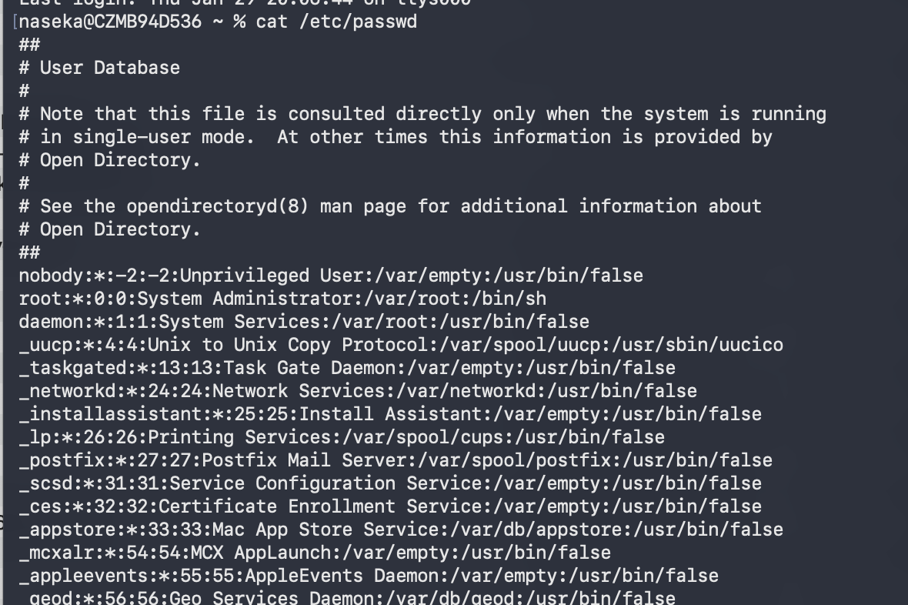
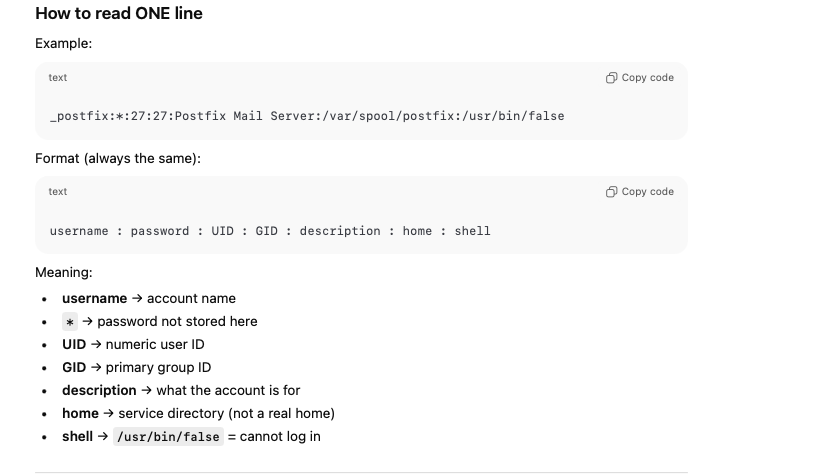
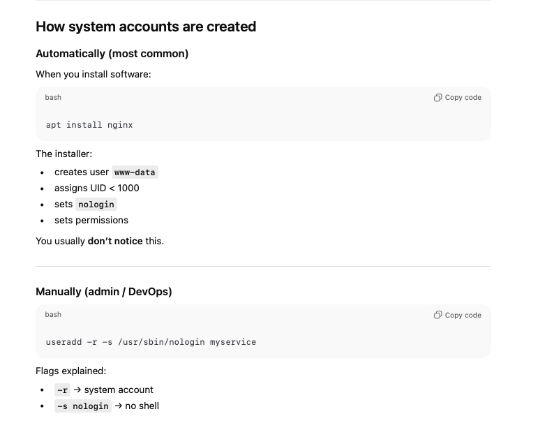
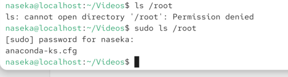
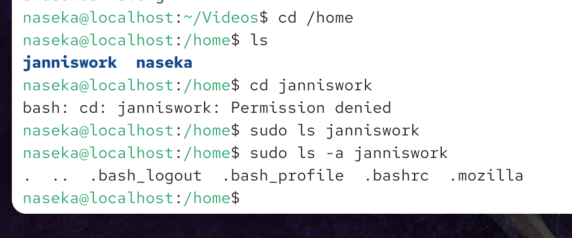

In Linux, users can be categorized into three general categories:

# System accounts:

► They are responsible for running background tasks on your system
(such as: webserver, database,...)

► They don't have a home directory

## definition
System accounts are special Linux users created to run services and background processes safely.
## why

Linux follows a rule called least privilege:
Every program should run with only the permissions it really needs.

So instead of:
running everything as root ❌

Linux does:
web server → www-data
database → mysql
mail → postfix
logging → syslog

If one service is hacked:
attacker only gets that user
not full system control

## how system accounts look

System accounts usually have:

1️⃣ No login shell (you cannot log in as them interactively)

```bash
/usr/sbin/nologin
/bin/false
```
2️⃣ Often no real home directory

many have no home
some have a service directory, e.g.:

```bash
/var/lib/mysql
/var/www
```
This is not a personal home, just data storage.

3️⃣ Low UID number

Linux users have numeric IDs (UIDs):

0	root

1–999	system users

1000+	human users


## Examples of system accounts
run this:

`cat /etc/passwd` : is a list of all user accounts the system knows about — both system users and real users.

You’ll see lines like:

```bash
root:x:0:0:root:/root:/bin/bash
daemon:x:1:1:daemon:/usr/sbin:/usr/sbin/nologin
www-data:x:33:33:www-data:/var/www:/usr/sbin/nologin
mysql:x:112:118:MySQL Server:/var/lib/mysql:/usr/sbin/nologin
```








# Regular users:

► They have access to their own files and directories

► They cannot perform administrative tasks or access other user's files
without permission

# Superuser (root):

► The superuser (root) has unrestricted access to the entire system
(including files in the home directories of regular users)

► Can add / remove users, install software

► Can change the configuration of the system


## Run command as superuser

how we access root directory ()

`sudo ls /root`



# sudo : to temporary elevate priveleges




## if sudo doesnt work:

user doesnt have administrator rights

