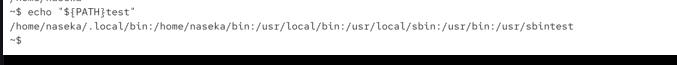
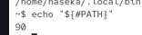
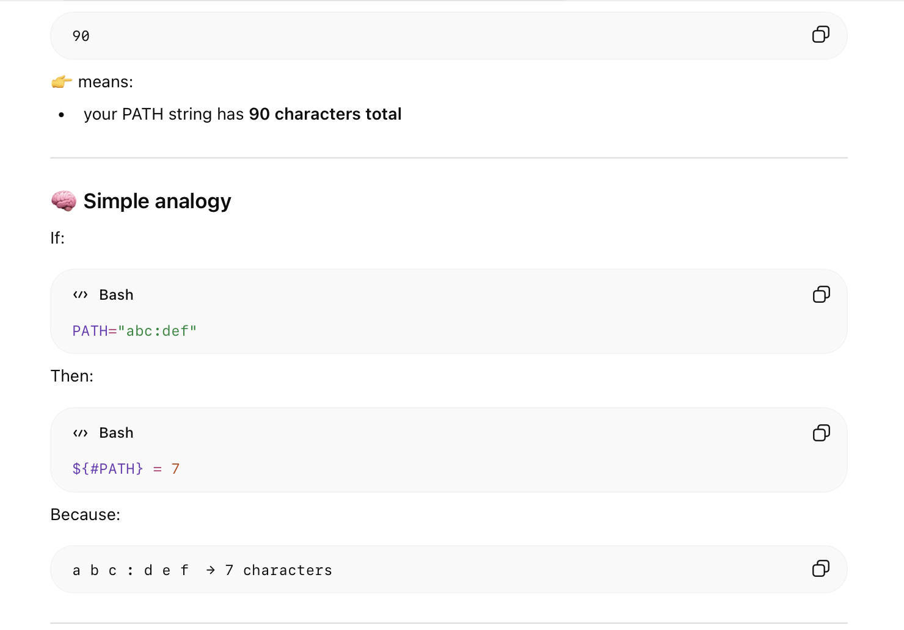
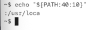

variable expansion allows us to access a variable

`echo "${HOME}"`

bash reqrites the command for us and fills in the variable

its best to use doublequotes

`echo "${HOME}path"` correct

`echo "$HOMEpath"` means something different

in bash variable doesnt contain $ sign. its just used fore expansion. its just indication for our shell that we want to access the variable

shell parameter expansion: allows to work with strings:
* we need to have variable first!

quesry the length of the string `#`:

to cut out the part of the string:

${HOME:start:length}

