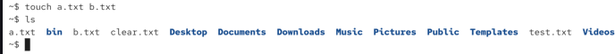
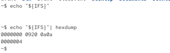
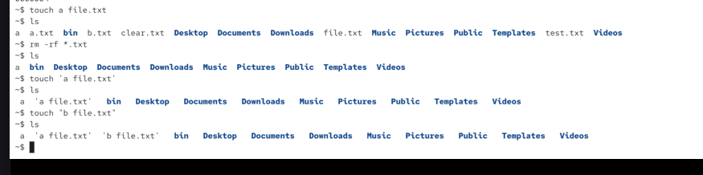
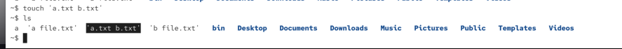

bash performs word splitting on our input

`touch a.txt b.txt`: here this command will be slitted into 3 different words: touch a.txt and b.txt. the first entry is the program. a.txt first parameter/argument and b.xts is the second parameter/argument



any character listed in IFS: tab, new line and space


sequesnces of ifs characters are treated as one delimieter (for ex. two spaces will be united into one)

we can disable word splitting behaviour via wrapping parts of the command into quotes, so we can specify whitespaces in the file names:

touch a file.txt
touch 'a file.txt'
touch "a file.txt"



```bash
~$ touch 'a.txt b.txt'
```



