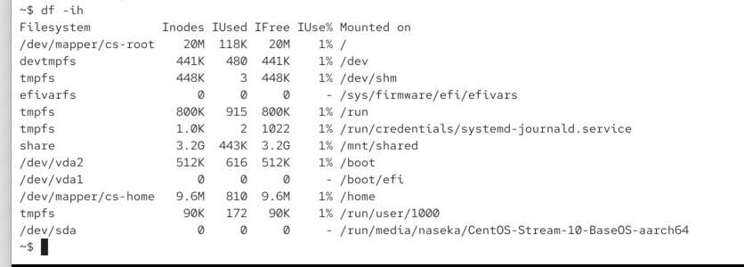

we can show how many inodes are being used

`df -ih` i = inode

during the creation of a filesystem, space is reserved for inodes

how many space for inodes we have available:

theoretically limit can be reached and then the os crashes. 

# To solve this: 

you can remove files that are no longer needed OR you can compress multiple files into an archive (for ex. .tar) OR you can recreate your filesystem with a higher inode limit OR you can store data on additional drives (and mount them)

