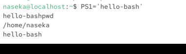
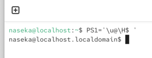
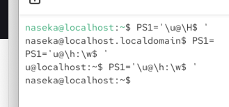
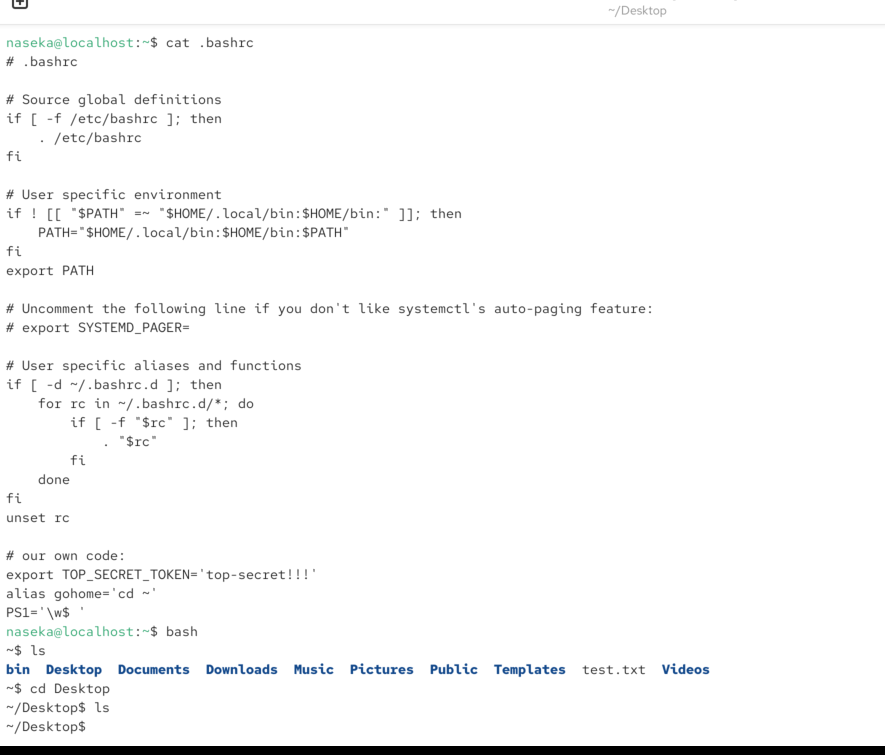

PS1 = prompt string 1. defines the appearance of prompt

prompt is hello-bash:

\u = username
\H: is host

\w: current working directory

\t: is time

`\u@\h:\w$ `

we can make it persistent in bashrc file:

