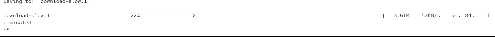
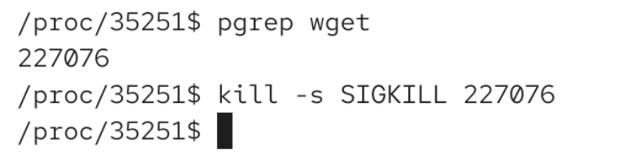
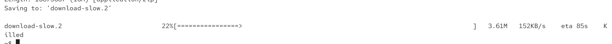

`kill -l` -> will show available signals on the machine


# SIGTERM

used to tell a process "would you please try to come to an end?"

we can say 

```bash
kill [process id]

kill -s SIGTERM [process id] # best way

kill -s 15 [process id]
```




imaging ewe were running database. sigterm will be "please if you can, come to an end". then the database would finish transactions and handle them, so it will make sure that everything will be written to our hard drive. and then it would try to come to an end. 

# difference sigterm and siging

terminate vs SIGINT (ctrl c) -> sigint just says process to terminalte cause we are in a shell and we want to regain controle immediately

# SIGKILL

sigterm and sigint could be ignored 

but if want to terminate no matter what and its forced by kernel (migh cause dataloss). 

it is unique cause its not handled by the process, but its handled by the kernerl. and the program is not even informed that there is SIGKILL event.

kill -s SIGKILL [process id] / kill -SIGKILL [processs id]





# vim cannot be exited with ctrl c. also sigint will not really work. so we can see its ignoring

sigterm works for vim

sometimes killing terminal while having vim on, it will overwrite our terminal config and hten we woudl need to reopen the terminal

