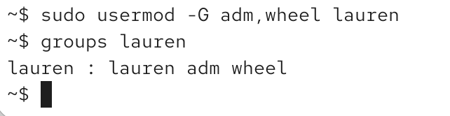
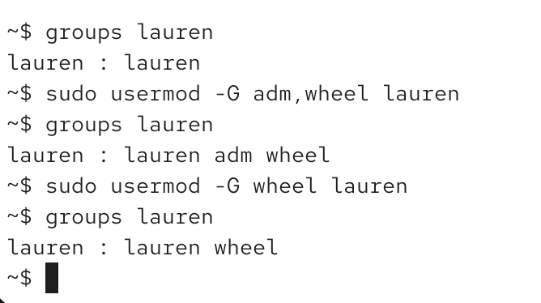

-g change primary group
-G change secondary group
-aG add secondary group

to remove. just list less groups:

# adduser tool - not always availale

`adduser [user] [group]`
`del [user] [group]`

sometimes system needs to be rebooted to apply changes