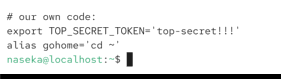

used to shorten commands:

`alias gohome='cd ~'`

```bash
naseka@localhost:~$ cd ~/Desktop/
naseka@localhost:~/Desktop$ alias gohome='cd ~'
naseka@localhost:~/Desktop$ gohome
naseka@localhost:~$ 
```

`alias`: lists all existing aliases

`unalias gohome`: removes the aliase

but if i start bash in bash, there will be no my alias

aliases are only valid within current session

but we could add the alias to bashrc file then it will be valid for every sesion




aliases also support parameters

for ex. if we are tired to put the same parameter over and over, we can create alias with the parameter directly:

`alias ls='ls --color'`


