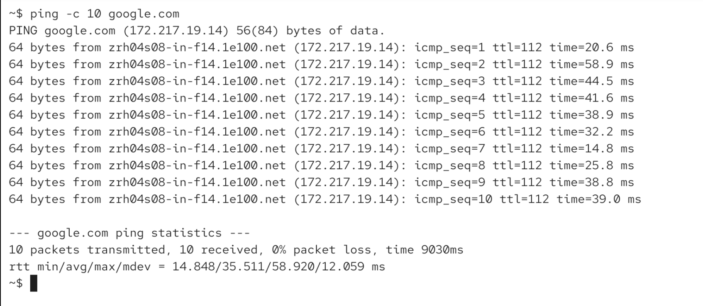
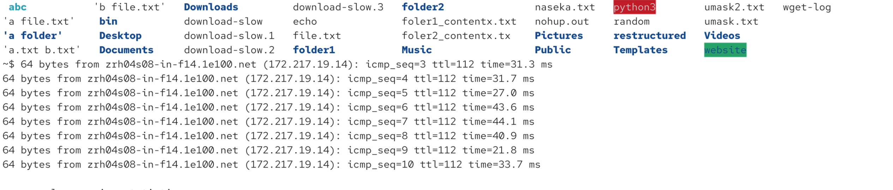
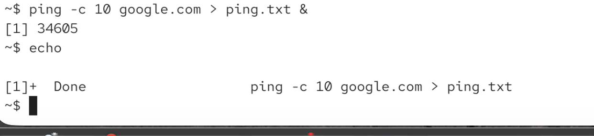
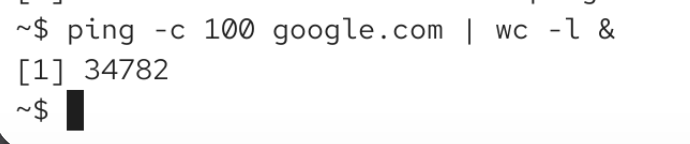

Job = command that is being executed

job vs process: job can consists of multiple programs. here we can see two processes (programs), but one job: `cat file.txt | wc`

# forground jobs: 

they occupuy our shell. bash will wait for its completion before accepting a new command

`ping google.com | wc` -> still occupy my terminal till i ctrl c

# background jobs

`[command] &`

for ex:

`ping -c 10 google.com &` its limited to 10 packets (-c options). output will still be displayed in the shell (unless we redirect it):

here 10 data packets will be sent back and force:

now we turn it into backgound job:

for ex ls was typed in the middle of execution and i got outut:

## redirect output

bash displays process id of hte last command: 

