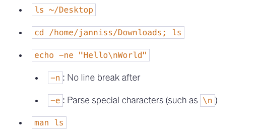
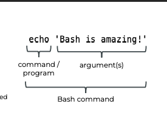
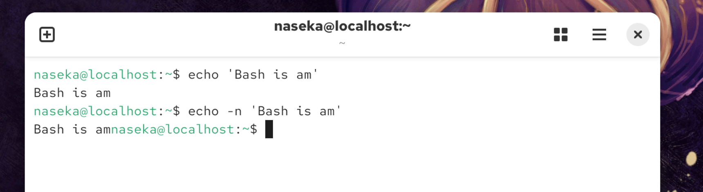
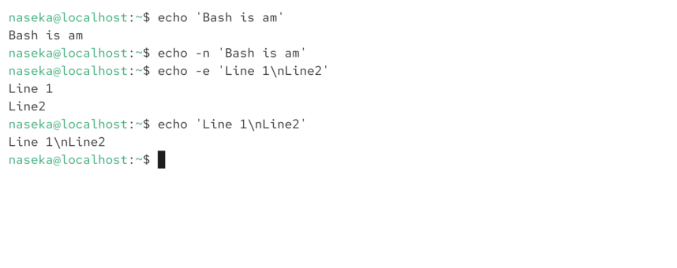
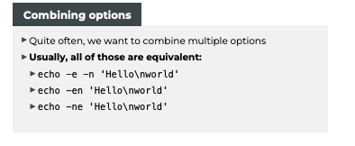
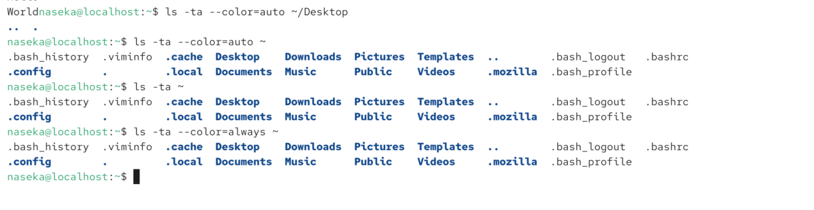

# Echo

`echo`: output text in the terminal



## -n

`-n`: disable default output of line break at the end:



## -e

`-e`: The option -e enables backslash escapes




# Combining options



# pwd

# cd

# ls

## -a

List all entries, including hidden files starting with .

## -r
Reverse order while sorting

## -t
Sort by modification time, newest first

# --color
► Enables colorful output

► --color={always,never,auto}



# Relative vs Absolute path

## Absolute
starts with /

## Relative
according to wokring directory 

```bash
naseka@localhost:~/Desktop$ cd ../Videos #we go to Videos from directory above Desktop. (Desktop and Videos are on the same level)
naseka@localhost:~/Videos$
```


# Executing multiple commands

`;`

```bash
naseka@localhost:~/Desktop$ cd ../Videos
naseka@localhost:~/Videos$ ^C
```

# To get help

## --help/-h

## man


