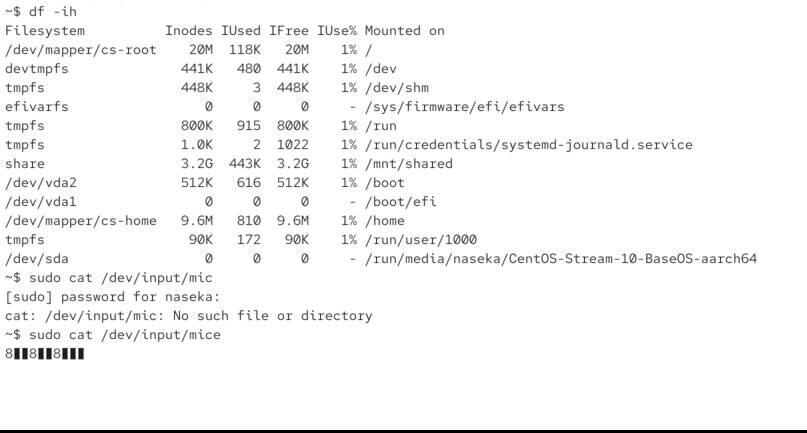

# unbuffered =  

data directly handled between the I/O (input output) device and the program. We can write to network connections, so network connection is also I/O device. 

its real time data - we get immediate access to the data

control: offers great controle

i could read input from my mouce (when i move it, it generates the data):

`sudo cat /dev/input/mice`

# buffered

utilizes a temporary storage area (buffer) to hold data before its being receivd / sent to the I/O device

advantafes: 
efficiency (reduces the number of I/O operations by accumulating data before processing)

performance: enhances speed, especially for disk and network operations

data integrity: simplofes the implememnation of data integrity checks

ideal for large and sequential data transfers (for ex. reading file from the disk, writing data to disk in block)

buffer is not ALWAYS beneficial

for ex. with the mouce we UNbuffered. 

sometimes buffered way to go and sometimes UNbuffered is a way to go