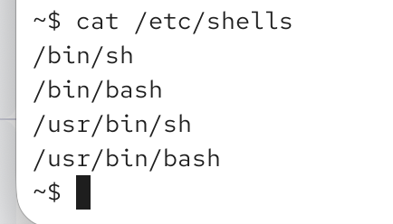

`usermod [options] username`

# most important options

-c: change user description (full name)
-s: change default shell
-d: change home directory (-m to also move existing home directory to the new locations)
-l: change username

! imagine user has some apps installed on home directory and if we change the directory -> all those tools will break 

-g: change primary group
-G: change secondary gorups
-aG add secondary group

here we changed user description and defualt shell:

available shells:

`chsh -s /bin/bash` -> when user wants to change default shaell for themselves

