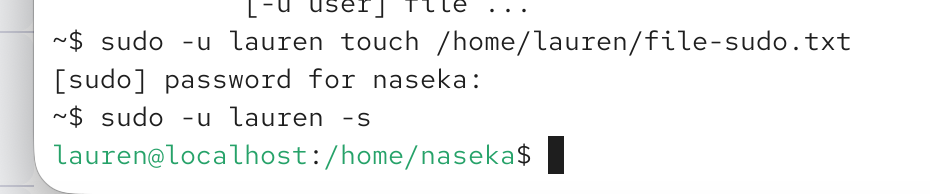

sudo -u [user] -g [group]

we usually dont user -g parameters

fore x.

sudo -u lauren bash : this will start bash program as a user lauren

here i created a file as lauren in her directory and then i also opened a shell as lauren:

