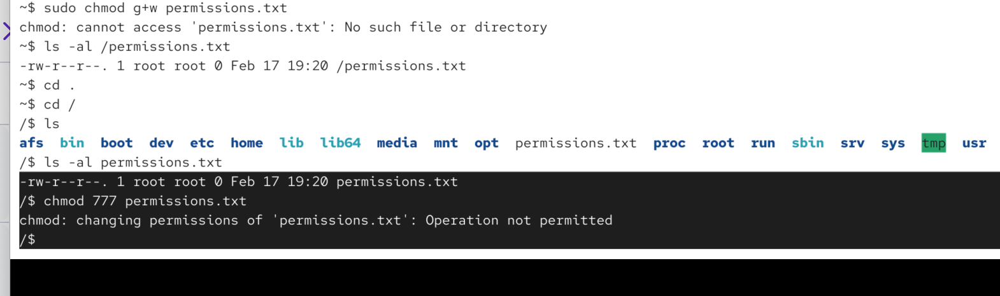
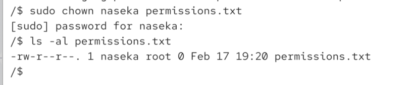
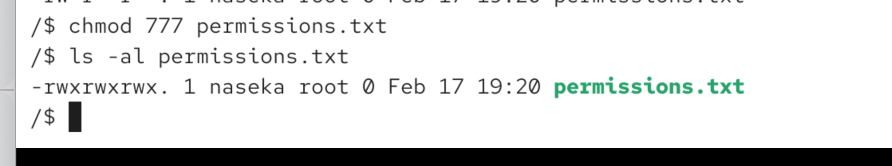

# chmod with numnbers

u
g
o

r/4
w/2
x/1

chmod 754 file.txt 

first digit is for the ownder

7 = 4+2+1 => read write and execute

second digit is the group

5 = 4 + 1 = read, execute

third digit is for all others
4 => read

we cant do it casuse root is the user

now i changed owner:

