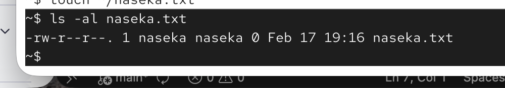
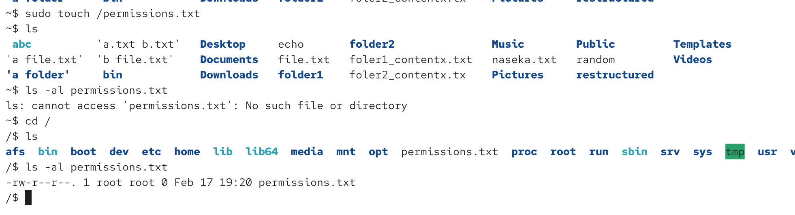

3 levels of permissions:

1) owner (u)
group (g)
others (o)

type of permissions:
read (r/4)
write (w/2)
execute (x/1) those users can run the file as a program

# how to assingn permissions to a file

`chmod u+x file.txt` means we need to give the owner (u) executable rights

chmod g-w file.txt
we are removing write permissions from a group

