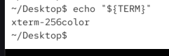
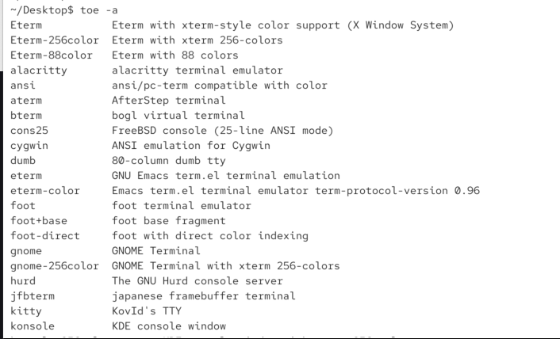
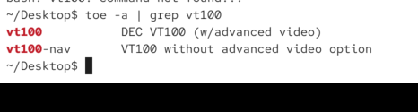
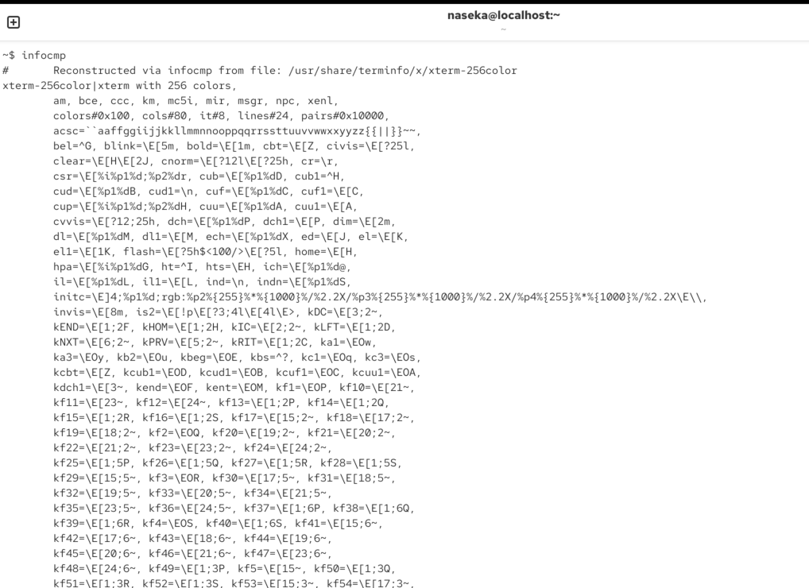
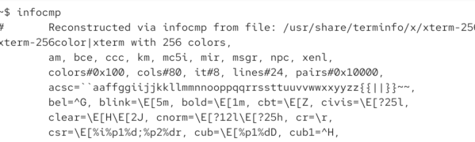
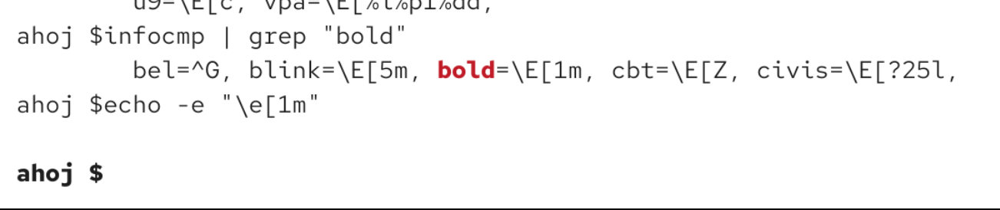
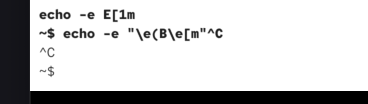
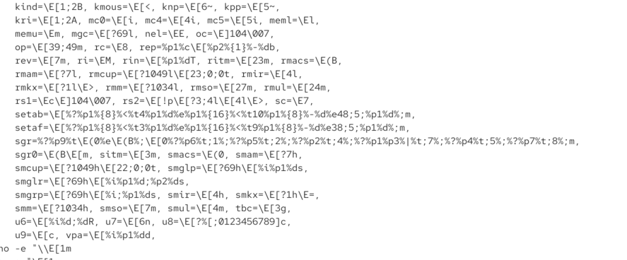

# terminal types

VT100 - AS|| - terminal, produced between 1978 and 1983
actual computer would send text to this terminal and the terminal would just display it. 

so it used to be what terminal is right now.

variable `TERM` -> abilities of bash

there are other terminals:
* text only (no colors)
* etc.
* command `toe -a`to see all of them:

even this old one is there:

# terminal escape sequences

`echo -e "\e[30;40m":`

-e means allow specific or escaped characters for ex.
*  \n :"hello\nbash" with -e it will print it ton different lines
* -e: whats following now its not normal text, its escape secence which will change the behaviour of our terminal

30: black foreground
40: black background
36: cyan foreground
41: red background
there many other colors

`echo -e "\e[36;41m":`

# additional secequeces

`infocmp`: what your terminal supports (but in reality not all of them):

here we can see how bold is:

so we use it in the command:

to reset:

but the sequenes have name, so i can use their names with another program `tput`:

