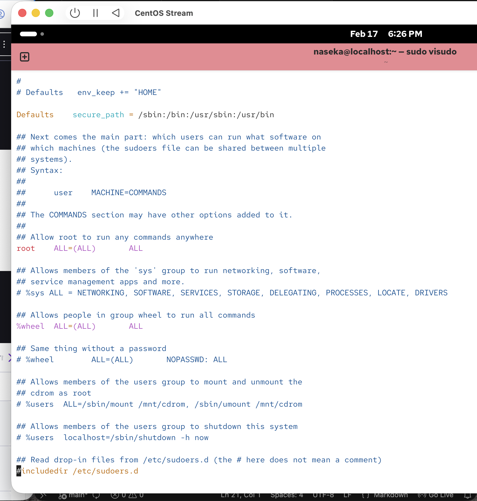

`jannis ALL=(ALL:ALL) ALL`

* jannis = user this rule applies to

* all: = which computers this rule works on. ALL = works everywhere. Usd mainly on servers shared across many hosts

* (ALL:ALL) = user:group -> who jannis can become when using sudo -> jannis can run commands as any user, jannis can run commands with any group. without (ALL:ALL) jannis could onluy become root.

* last ALL: we want to allow any command

sudo without passowrd:

## NOPASSWD:

`jannis ALL=(ALL:ALL) NOPASSWD ALL` -> here no pwd needed for sudo commmands

## allow only one program

`jannis ALL=(ALL:ALL) NOPASSWD: /usr/bin/apt-get`

* jannis can only run apt-get with sudo
* no password required
* everything else still blocked

## Separate file in `/etc/sudoers.d/

instead of editing `/etc/sudoers`, create:

`/etc/sudoers.d/jannis`

example content of the new file:

`jannis ALL=(ALL:ALL) ALL` 

notice sudoers directory at the end:

## if i need to find the path towards the program

`which apt-get`

`chown` = change the owner
`chmod`
