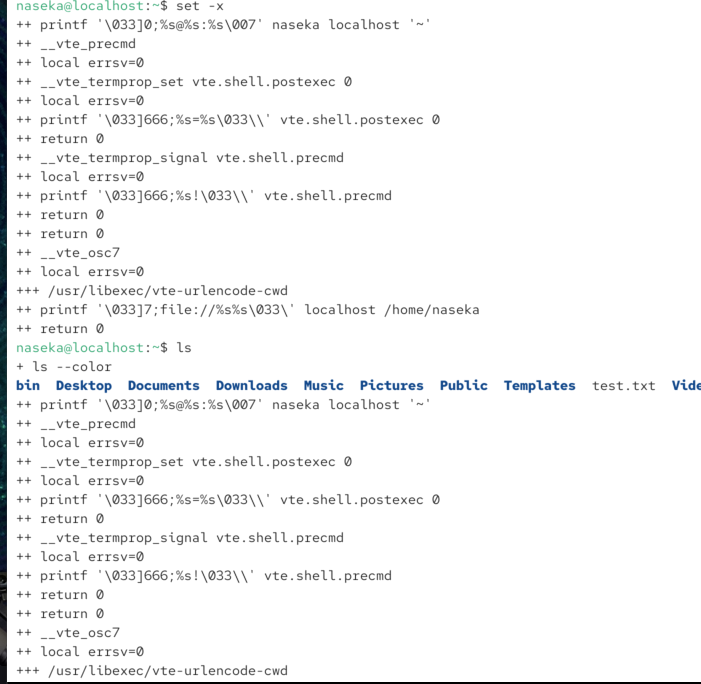
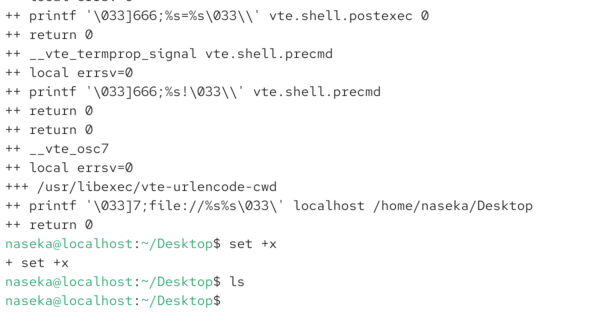
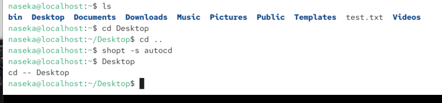
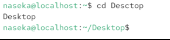

set command: provides pre-defined config options that we can use

to enable: `set -[feature]`

to disable: `set +[feature]`

features:

* set -x: useful for ex. to see whats behind the alias 
    * xtrace: enables that each command that the shell executes will be printed (allows to debug commands)

    

    to disable the feature:

    

# shopt command

* to enable config optoins: 

`shopt -s [optname]`

* to disable config option:

`shopt -u [optname]`

`autocd`:

`cdspell`:

