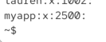

# groupadd - create a group


```bash
sudo groupadd developpers #created a group called developpers with default group id:
```

then you will see the group in `cat /etc/group`


`groupadd [options] groupname`

-g options to set custom group id

ex.: 

```bash
groupadd -g 1005 newgroup
```

if not specified it will be automatic id

```bash
cat /etc/group #all groups are here
```



# to change a group

```bash

sudo groupmod -n devs deveoppers #renames developpers into devs

sudo groupmod -g 1200 devs #changes groupd id of devs
```

when we cjhange a group id be aware that filesowner will not change with that. so that id is really important. so consider whetehr we relaly need to change group id


# how to delete a group

```bash
sudo groupdel devs #removes the group.!files owned by that group will keep the old numeric id.!users won't automatically be removed from it
```


