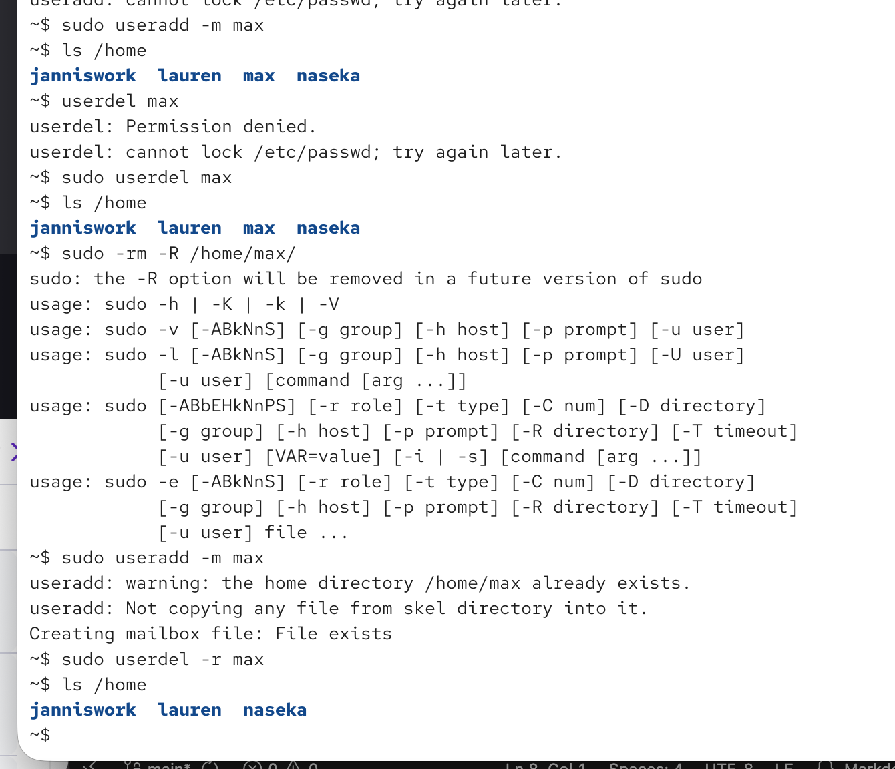

`userdel [options] username`

-r removes the home directory + mails

-f also removes home directory + mails. forces the removal of hte user even if the user is still logged in. might also delete a group with the same name as the user

