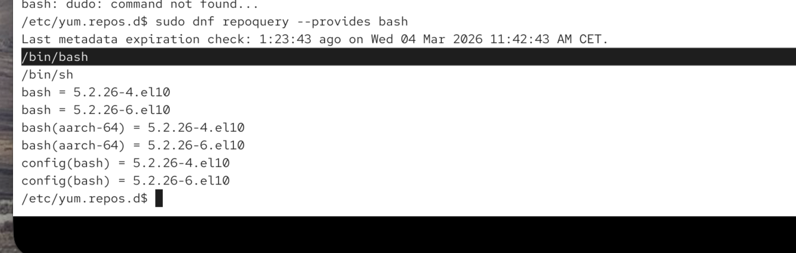
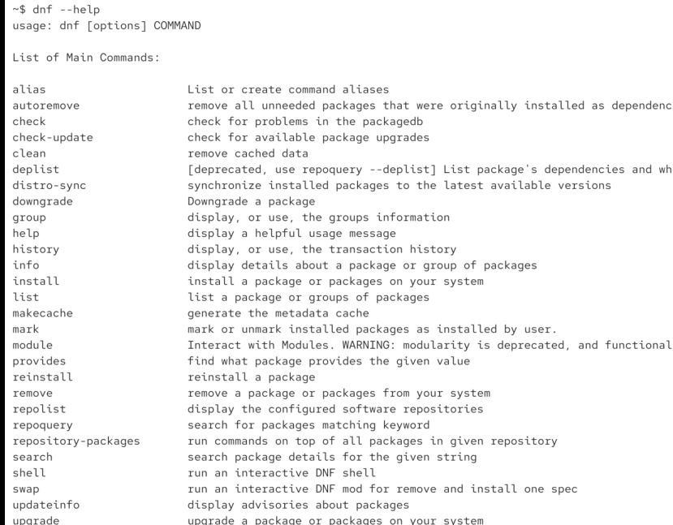
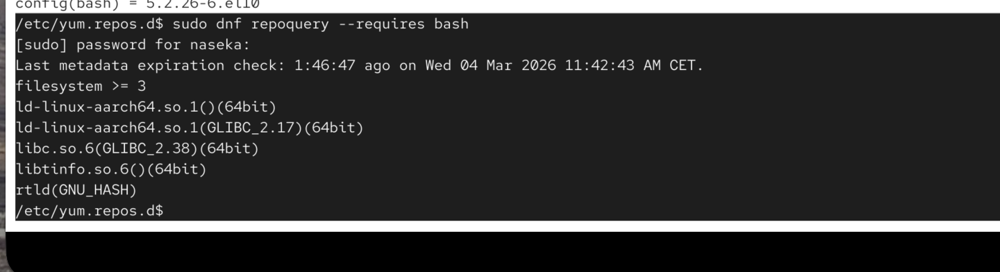
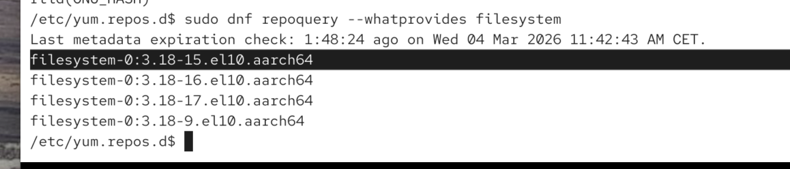
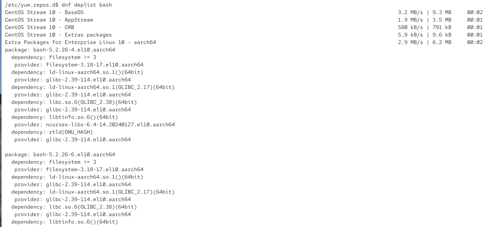

other sotware, libraries or OS features

dnf will handle for us. it happens recursively: dependancies of dependancies will be installed.

dependacies on linux needs to be installed 1x on our system. they can be shared -> it saves the storage

how they work:

each package in our package manager. 

lets have a look at our bash package and what it provides to our system:
`sudo dnf repoquery --provides bash`

it provides the functionality /bin/bash all functionalities under:

we can also see what bash requires:

`sudo dnf repoquery --requires bash`

            dnf repoquery --requires bash
            │   │        │
            │   │        └ option
            │   └ subcommand
            └ main command

for ex. filesystem >= 3 required

we can also list which packages provides a certain feature

`dnf repoquery --whatprovides`

for ex. this package will provide this filesystem functionality and sometimes more packages can provide it:

what other packages needs to be installed:

`sudo dnf repoquery --whatrequires program`

list all dependacies:

`dnf deplist bash`: only goes to one level (not dependacies of depandcies of dependancies)

