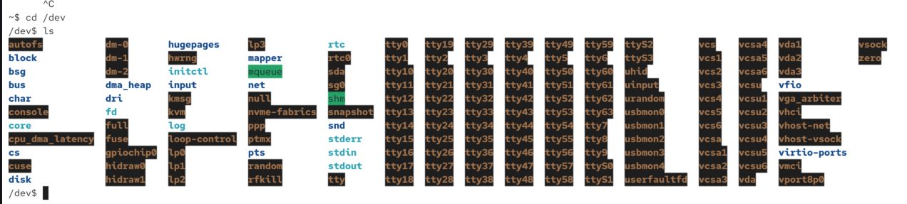
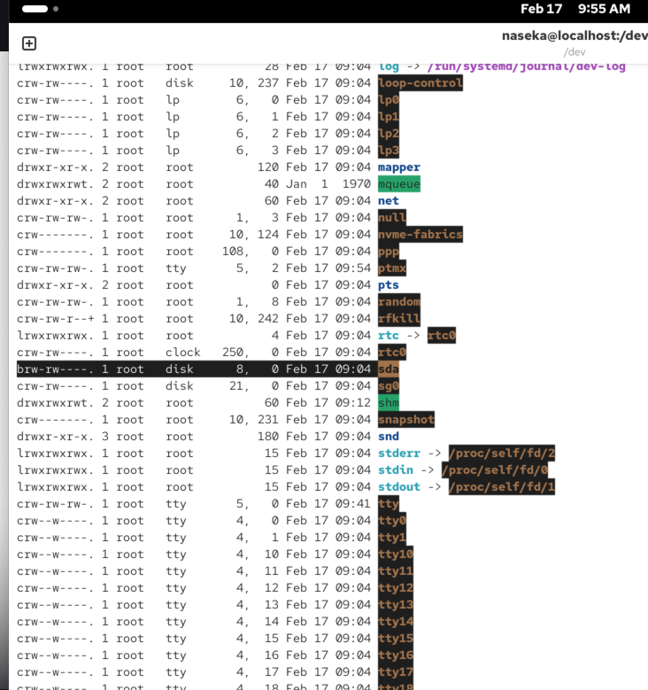
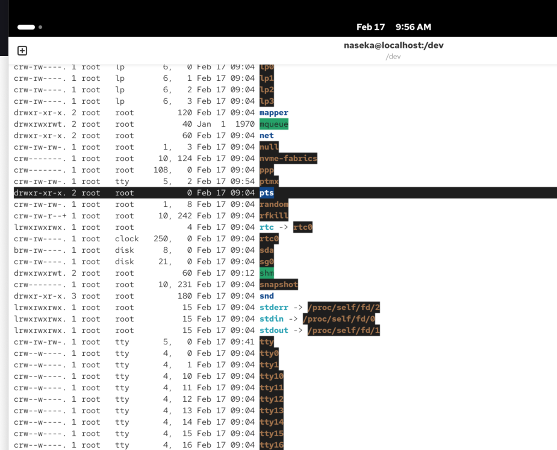
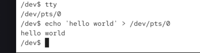

devices are files

idea: everything is a file, everything is a stream of bytes

how it works: (almost) all hardware devices are represented as a "file" (or stream of bytes)

through the file we can ebale access to the underslying hardware without knowing its technical details

what is a device = device refers to a physical or virtual entiry that can be acccessed through a file-like interface

devices in unix serve as the interface between teh OS and various hardware or virtual components

they allow apps and uses to interact with those components

# what is a device?

## what kind of devices does Unix support?

### character devices (c):

we gain unbuffered, direct access to the hardware
usually we can access those decices by reading a byte (character)
there might be additional restrictions/requirments for a certain character devices

### block devices (b):

we gain buffered access to the hardware
multple bytes are bundlesd into block
and we can sccess this device through accesing those blocks

### pseudo devices:

those are devices that dont necessarily refer to a physical device
depending on the type (c or b), they may show up as a block device or a character device
example: the partition of a harddrive could be the pseudo device (cause its not directly hardware or just partition)


A partition of a hard drive is a logical division of the disk into separate sections. Each section behaves like an independent disk.
Think of it like dividing one big cupboard into several drawers.
Example
If you have a 1 TB hard drive, you can split it into partitions like this:
Partition	Size	Purpose
C:	300 GB	Operating system (Windows / Linux / macOS)
D:	500 GB	Files, photos, documents
E:	200 GB	Backups or projects

# to list devices

`cd /dev` -> folder with all devices



i could try to output contents of my drive (the device):

`cat sda1` -> this will be output of binary data. be careful with that. we should not output binaries to terminal, cause they change the behaviour. even though its a real device, we can use it as a normal file.

`ls -l` -> then for all devices we can see whetehr its a character or a block device

`b` as the first letter means it is block device



pts contains ttay (terminals):



here we inputted hello world to pts/p -> hten we can see it in the terminal. `/dev/pts/o` its a pseudo terminal and then the data will be sent to our actual terminal

TTY = originally teletype writer.

Today TTY = terminal session.

```bash

[255 naseka@ad.ifortuna.cz@jenkins01-ocp01-shared.m.dc1.cz.ipa.ifortuna.cz .ssh]$ tty
/dev/pts/0
[0 naseka@ad.ifortuna.cz@jenkins01-ocp01-shared.m.dc1.cz.ipa.ifortuna.cz .ssh]$ echo 'peta' > /dev/pts/0
peta
[0 naseka@ad.ifortuna.cz@jenkins01-ocp01-shared.m.dc1.cz.ipa.ifortuna.cz .ssh]$ 
```



nowadays virtual teminal is represented by device. 

so those devices allow us to easily communicate with the system