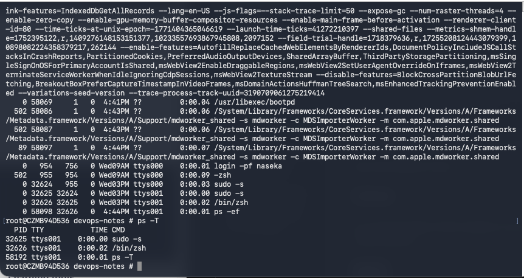

mac os and linux are different flavours of UNIX

they have different output

# Linux

ps command follows POSIX standard: so by default only displays the active processes of the current terminal

# MAC

ps follows BSD standard
ps by default displays all active processes of all users on all terminals

`ps -T` -> use it on the mac, then it behaves like linux

