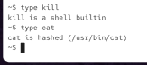
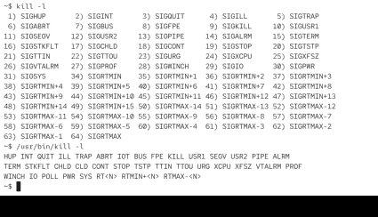

a lot of commands exists twice: 
1) one time as a shell build in
2) one time as an executable file


# type

`type`



kill from bash behaves differenrtly than excutable from the oS

# compairison

executable path:

```bash
~$ which kill
~$ which kill
/usr/bin/kill
~$ 


~$ 
```


kill -l


~$ which kill
/usr/bin/kill
~$ 

which on bash is where on zshell


we can see different output (different format):



so some commands are provided by the shell and some are executables and some a both

if a command is provided by the shell, it depends on the shell which output you get

6. How to run the executable version explicitly
If you want the OS executable, bypass the builtin:
/usr/bin/kill
Example:


`/usr/bin/kill -l`