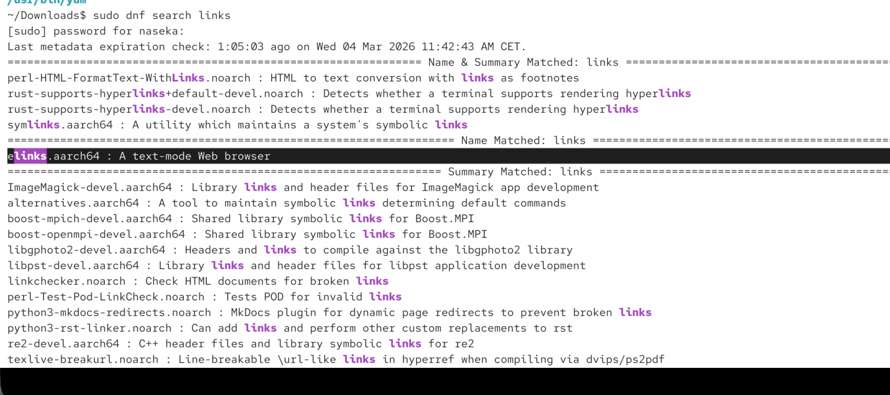
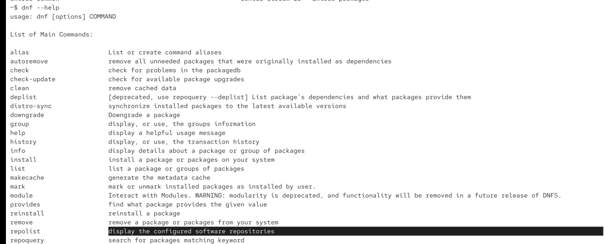
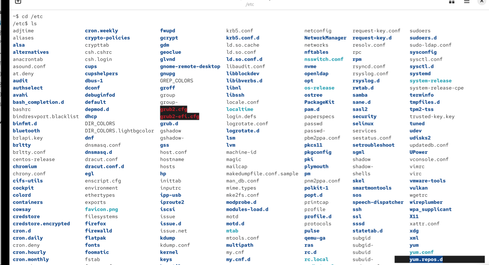
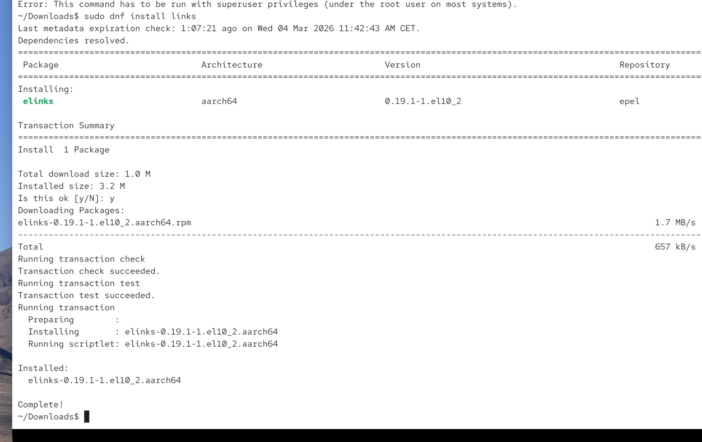

package managment on CentOS uses .rpm packages

RPM = RED HAT PACKAGE MANAGER (but the tool is used far beyond Red Hat)

even if you see rpm package it doesnt always fit your system

DNF = dandified yum. dnf replaced yum.

`yum`
`dnf`

~/Downloads$ which yum
/usr/bin/yum
~/Downloads$ ls /usr/bin/yum
/usr/bin/yum
~/Downloads$ 

# we can use dnf for searhcving:

`sudo dnf search links` -> here we will search for links.  meaning: *search repositories configured on your system for packages whose name or description contains "links".*

dnf searches configured repositories., which are defined in `/etc/yum.repos.d/`

to see repositories which are searched: `dnf repolist`

# dnf install

`dnf install links` -> this command will install also all dependacies requried

links 'http://google.com'

`dnf search links` -> see if the package exists 

`dnf repoquery --requires links` -> see dependacies before insalling

`dnf install links --assumeno` -> see what would be installed. DNF will calculate the installation but won't install anything.

you will see:

            Installing:
            links

            Installing dependencies:
            ncurses
            openssl

## inspecting a package before installing

`dnf info links`

Example output:

            Name         : links
            Version      : 2.28
            Release      : 1.el9
            Architecture : x86_64
            Size         : 1.1 M
            Source       : links-2.28-1.el9.src.rpm
            Repository   : appstream
            Summary      : A text-based web browser
            URL          : http://links.twibright.com
            License      : GPLv2+
            Description  :
            Links is a text-mode web browser.

# uninstall
`sudo dnf remove links'